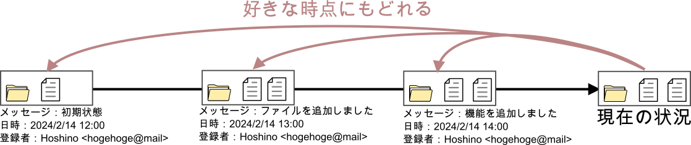
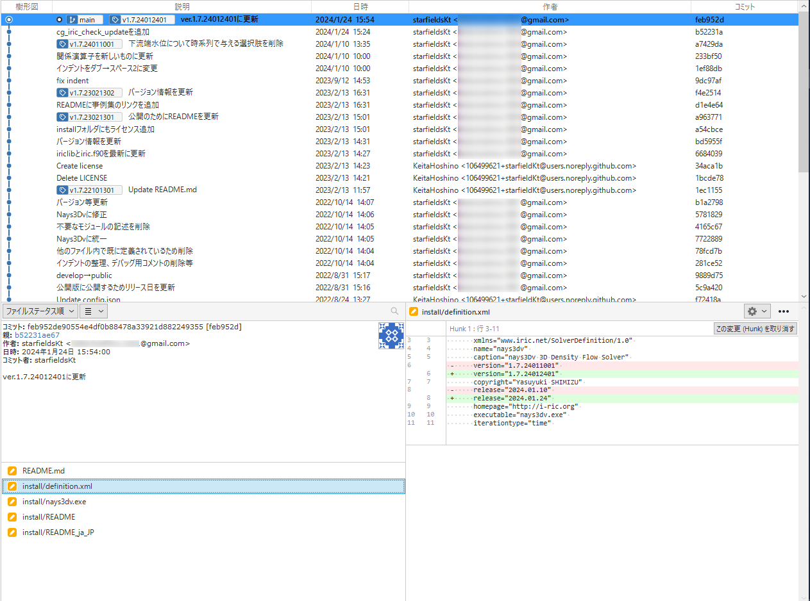
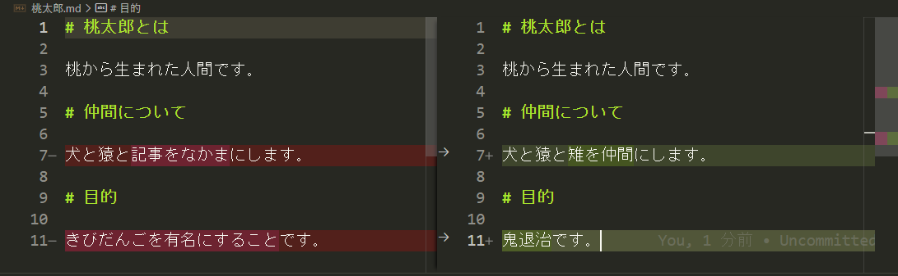
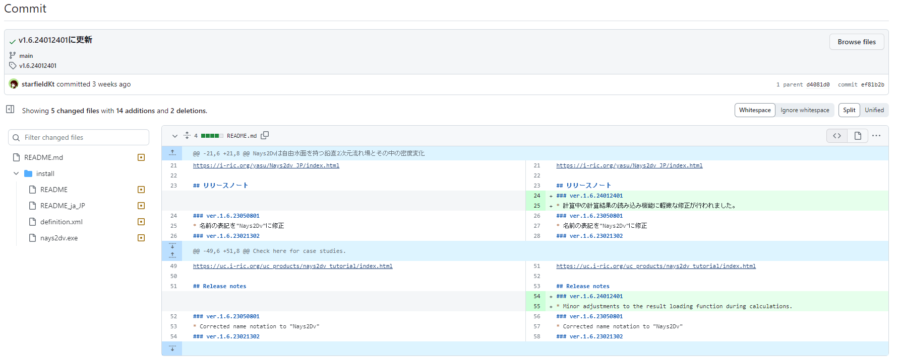
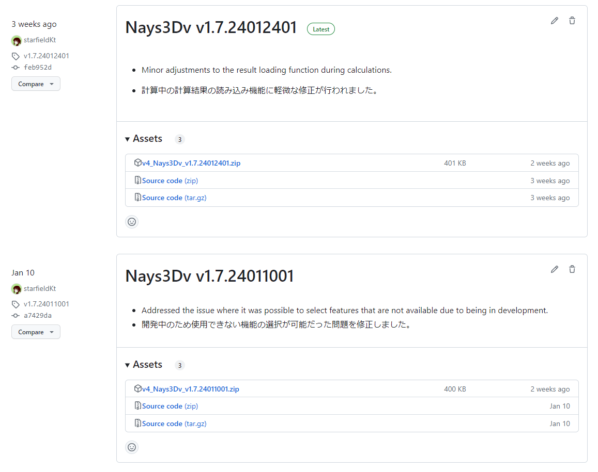
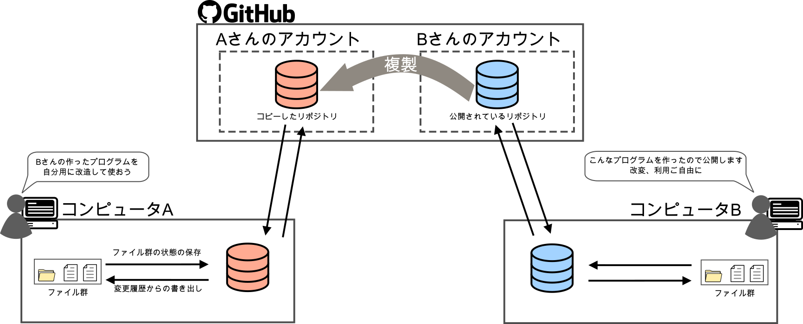
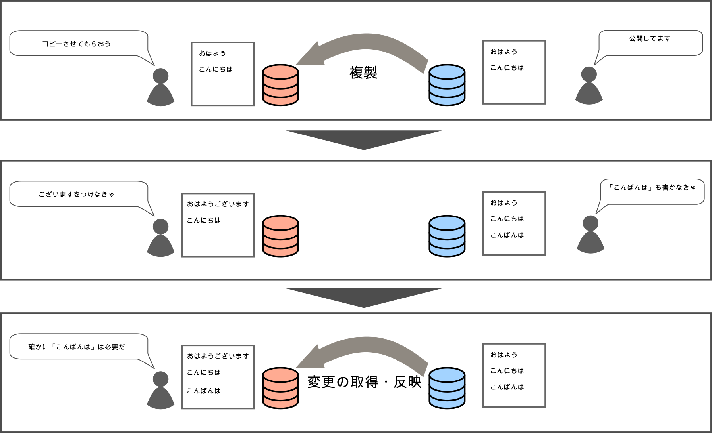

#####################################################################
Git、GitHubを使うとどんなことができるの？
#####################################################################

*********************************************************************
ファイルのバージョン管理ができる
*********************************************************************

| Gitを使うメインの目的はやはりファイルのバージョン管理でしょう。
| Gitでバージョン管理を行うことでこんなことができます。

好きな時点に戻れる
=====================================================================

Gitを使うと任意の時点のファイルの内容をディレクトリの構造ごと保存することが可能で、簡単な操作で任意の状態に戻れます。

    好きな時点に戻るイメージ図

|
|

変更履歴をわかりやすく表示できる
=====================================================================
また、保存された状態それぞれに日付やメッセージを残せるので後からでも変更内容や時系列が一目瞭然です。

    
    Sourcetreeで表示した更新履歴

|
|

ファイルの差分も簡単に見れる
=====================================================================

ファイルの差分も簡単に見ることができます。

    差分表示の例(VScode)

例：https://github.com/iRICsolvers/v4_nays3dv/commits/main/

    差分表示の例(GitHub)

|
|

.. データ容量を節約できる
.. =====================================================================
.. | Gitでは変更を記録する際に、前回から変更のなかったファイルについては新規にデータの保存はおこなわず、指定した変更済みのファイルに関してのみデータを新規に保存します。
.. | 記録時に作業フォルダにあった他の未変更のファイルはについては、変更時に保存されたデータを紐づけしています。

.. このため、変更毎にフォルダごと名前をつけてバックアップをとる方法よりも格段にデータ容量を節約できます。

.. .. figure:: image/01/050.png
..     :width: 100%

..     リポジトリに保存されるデータのイメージ

.. |
.. |

ファイル内の特定の部分の変更だけ登録できる
=====================================================================
| 通常、変更の登録はファイル単位で行うが、Gitの機能をつかえば１つのファイル内で前回の状態から多くの部分を変更してしまった状況でも特定の部分の変更のみを登録することもできます。
| 開発途中で完成した特定の部分のみ記録しておきたい場合に便利です。

|
|

*********************************************************************
プログラムの配布もできる
*********************************************************************
GitHubの機能を使用して簡単にリリースごとのプログラムをリリースノート付きで公開して配布することができます。

例：https://github.com/iRICsolvers/v4_nays3dv/releases

    Release機能によるリリースノートとプログラム配布の例(GitHUb)

|
|

*********************************************************************
他人が公開したプログラム等一式を更新履歴ごとコピーできる
*********************************************************************

GitHubには様々な人が、色々なプログラム等をオープンソースで公開してくれています。
その一式を更新履歴ごとコピーして、その履歴に続けて自分で変更を加えていくこともできます。

|
|

また、コピーした後にコピー元が更新された時にコピー元の変更を自分のリポジトリにもってくることや、逆に自分の変更をコピー元に提案することができます。

|
|

*********************************************************************
Webページの管理もできる
*********************************************************************

色々なサービス、ツールを使用することでGit、GitHubでWebページを管理することもできます。

たとえばこのドキュメントもRead the Docsというサービスを使用してWebページを公開していますが、このwebページのソースはGitHubで管理していて、GitHubでファイルを更新するだけでRead the Docs側でWebページをビルドして更新してくれます。

|
|

#####################################################################
Git、GitHubを使ってもどうにもできないこと
#####################################################################

*********************************************************************
共同開発者とのコミュニケーション
*********************************************************************
GitやGitHubを使用すると格段に多人数での共同開発はしやすくなりますが、あくまでこれらはツールなので開発者間でのコミュニケーションは必要となります。
どんなにいいツールを使っていても結局コミュニケーションは必要となります。コミットメッセージは自分が何をしたかがまわりにもわかるようにしましょう。

|
|

*********************************************************************
保存していないバージョンへの回帰
*********************************************************************
いくら過去の状態に戻せると言っても、状態を保存していなければ戻る先はありません。
こまめな保存を心がけましょう。