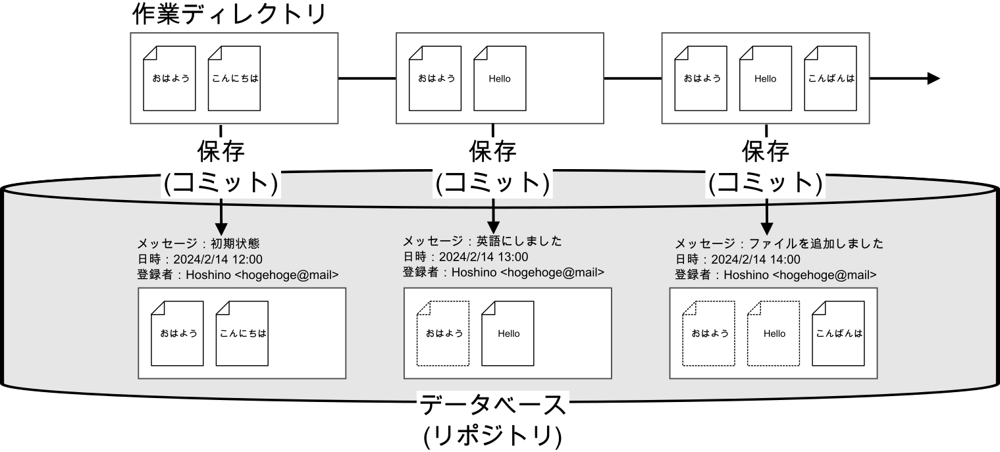

#####################################################################
Gitを使ったファイル管理の流れ
#####################################################################

Gitを使用したファイル管理のやり方は、やりたいことや人により色々あると思いますが、基本的に共通していることはGitで管理しているプロジェクトの作業ディレクトリでのファイルの追加・削除・更新の履歴をデータベースに蓄積していくことです。

ここで、バージョン管理対象のファイル、ディレクトリの保存時の状態(Gitではスナップショットという)や更新履歴などの一群を保存するデータベースを **リポジトリ** (repository)、データベースに変更を記録・保存することを **コミット** (commit)といいます。

    Gitの基本的なバージョン管理のイメージ図

*********************************************************************
ローカルだけで個人で管理する場合
*********************************************************************

| 個人で、しかもローカル環境だけでのバージョン管理として使用したいのであれば難しいことはありません。
| 個人的なプログラムの開発だけならこれでも充分です。リモートとローカル両方で管理したくなった場合あとからリモートの環境を追加することも可能です。

| 管理を始めるには
| :menuselection:`リポジトリを作成 --> 管理したいファイルを追加 --> コミット` 

| 普段の作業は
| :menuselection:`ファイルを編集 --> 区切りのいいところでコミット` 

これだけでも以下のようなことはできます。

- コメント付きで、時系列も明確でキレイなファイルのバージョン管理
- 任意の時点に戻る
- 過去の特定の変更を打ち消す
- 変更履歴を分岐させて複数のバージョンの管理
- 他の分岐での変更を他の分岐に統合

*********************************************************************
ローカルとサーバー（リモート）で管理する場合
*********************************************************************

以下のような場合はリモートにもリポジトリを作成することをおすすめします。

- 自分のPCだけではなくサーバーにもバックアップを残しておきたい場合。
- 他の人と更新履歴を共有したい場合。
- 他の人と共同で開発したい場合。
- 開発したプログラムを公開したい場合。

| リモートとローカルでのやり取りがあるので作業の流れに少し作業が増えます。
| GitHubを使用する想定です。

| 一例として管理開始の流れは
| :menuselection:`GitHubでリモートリポジトリを作成 --> ローカルに複製(clone) --> 管理したいファイルを追加 --> コミット --> リモートに変更履歴を統合(push)` 

| 普段の作業は 
| :menuselection:`ローカルでファイルを編集 --> 区切りのいいところでコミット` の繰り返し

| プログラムをリリースするタイミングや、他人に共有するタイミングで
| :menuselection:`リモートに変更履歴を統合(push)` 

他の人は同じリモートリポジトリから自分のPCに :menuselection:`ローカルに複製(clone)` をして作業を始めてください。

自分以外の人がリモートリポジトリに追加した変更を自分のPCのリポジトリに持ってくるときは :menuselection:`pull` か :menuselection:`fetch --> merge` をつかいます。
