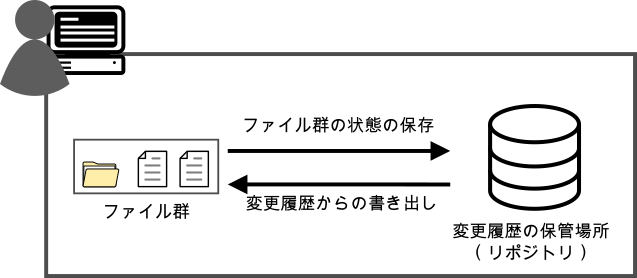
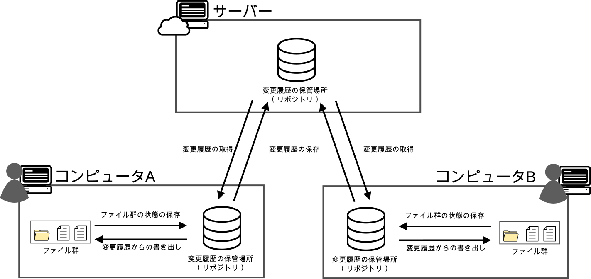
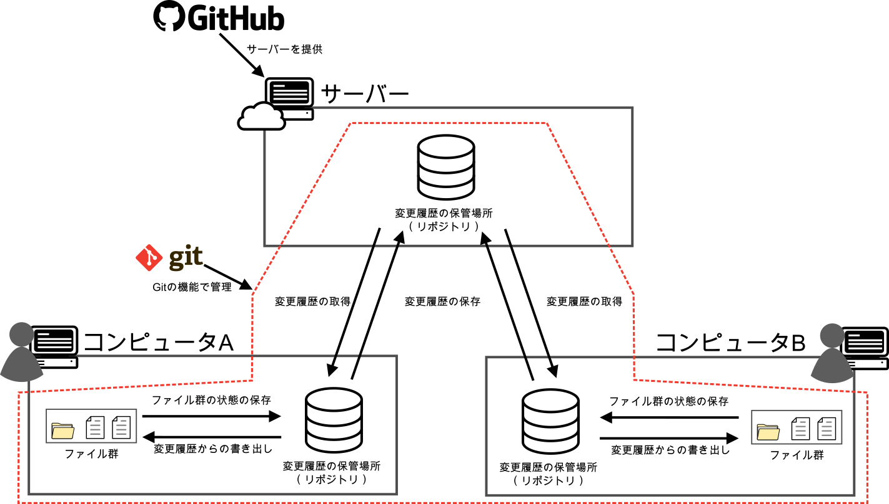
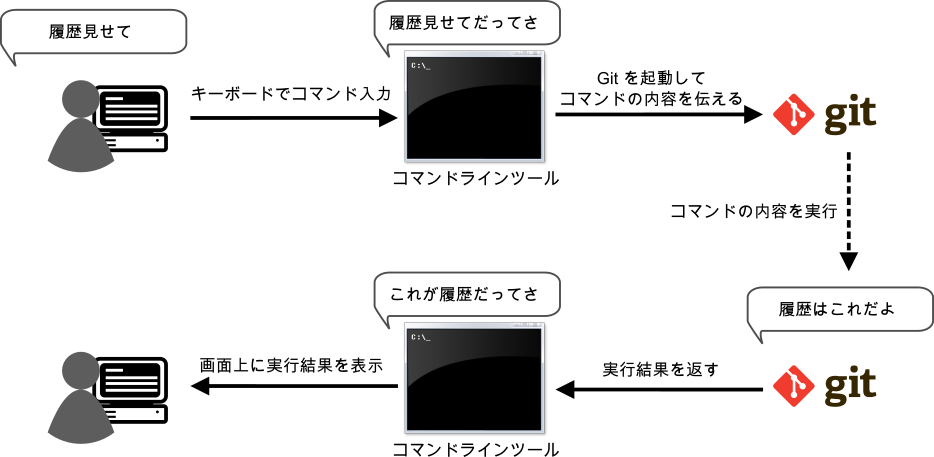
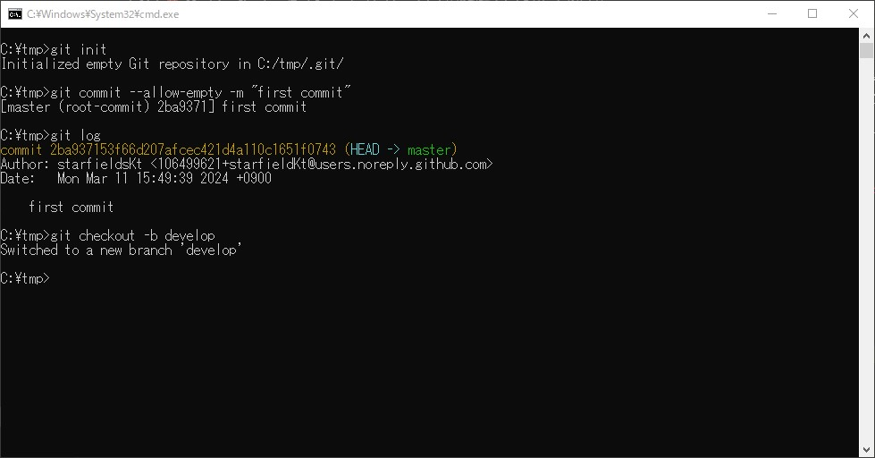
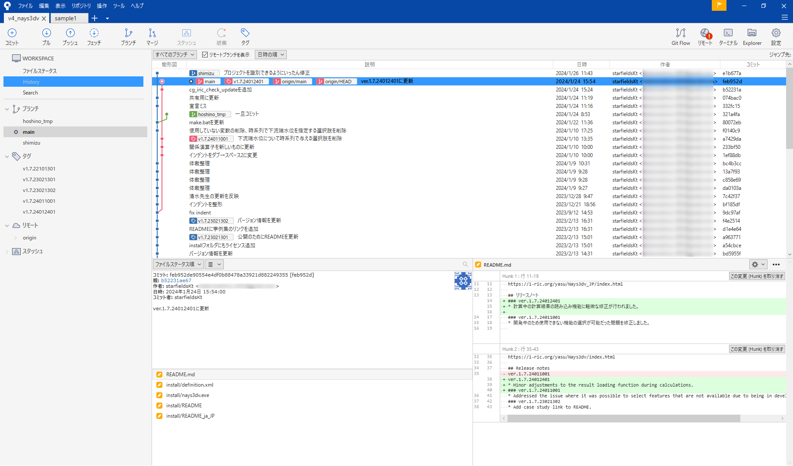

#####################################################################
基礎知識
#####################################################################

*********************************************************************
Git（ギット）とは
*********************************************************************

.. figure:: image/03/Git_logo.png
    :width: 30%
    :target: https://git-scm.com/

.. button-link:: https://git-scm.com/
    :color: primary
    :shadow:
    :expand:

かなりざっくりと言うとGitとは、ある時点の管理対象のテキスト、画像など様々なファイル群の状態（スナップショット）を **リポジトリ（repository）** と呼ばれる保管場所に **いつ** 、 **誰が** 登録したかという情報と共に変更履歴として蓄積し、管理してくれるソフトウェアです。

このようなソフトウェアはバージョン管理システム（ :abbr:`VCS (Version Control System)` ）と呼ばれ、VSCを使用することで以下のような様々なことを行うことができます。

- ファイルを以前の状態まで戻す。
- ファイル群全体を丸ごと以前の状態まで戻す。
- 現在と変更履歴、変更履歴同士の比較。
- 問題が起きた際に誰がいつ変更したかの確認。

|
|

分散型管理システム
=====================================================================

| Gitはバージョン管理システム（ :abbr:`VCS (Version Control System)` ）の中でも **分散型バージョン管理システム** （ :abbr:`DVCS (Distributed Version Control System)` ）と呼ばれるソフトウェアで、変更履歴を保管するリポジトリをサーバー上と各自のPCそれぞれに作成し、変更履歴のやりとりを行います。

リポジトリを分散させることで以下のメリットがあります。

- サーバー上のリポジトリとやり取りをする時以外はオフラインでも個人のリポジトリで作業ができる。
- サーバーやPCがトラブルで故障した際に他のリポジトリから復元できる。

|
|

この時のサーバー上のリポジトリの事を **リモートリポジトリ** 、ユーザーのPC上のリポジトリを **ローカルリポジトリ** と言います。

|
|

*********************************************************************
GitHub（ギットハブ）とは
*********************************************************************

.. button-link:: https://github.com/
    :color: primary
    :shadow:
    :expand:

| ざっくり言うと、先述のリモートリポジトリを置いておく場所を提供してくれるサービスです。
| **Git** の **Hub** （拠点、集まり）なので名前のとおりですね。

| 下の図のサーバー部分にGitHubのサーバーを使わせてもらうかたちになります。

| GitHubは現在Microsoft社が運営しているサービスで、2024年3月現在では個人でも無料（一部機能は有料）で使用することができます。
| このようにサーバーを貸してくれるサービスを **ホスティングサービス** といい、GitHubはGitのホスティングサービスとして世界中で使われおり最大手のサービスです。

| GitHubでは多くのユーザーがソースコードを公開しており、他人のコードを見て勉強したり、公開されたコードを自分用にコピーして使用することなどもできます。（公開されていても、ライセンスには気をつけましょう）
| また、GitHubの提供する機能でプログラムをビルドしたり様々な便利な機能が提供されています。

| 有名なGitのホスティングサービスには他にも「 `Bitbucket <https://bitbucket.org/>`_ 」、「 `GitLab <https://about.gitlab.com/>`_ 」、「 `tracpath <https://tracpath.com/>`_ 」などがあります。
| ご自身の環境や組織に合わせて利用してください。この記事ではGitHubのみを扱います。

*********************************************************************
Gitクライアントとは
*********************************************************************

| Gitの機能を使うためのソフトウェアです。
| Gitをインストールする際に一緒にインストールされる「Git GUI」もGitクライアントのひとつです。

| Gitはコマンドラインツール（Git Bashやコマンドプロンプト、PowerShell）から、コマンドで操作する方法と、Gitクライアントから操作する方法があります。

コマンドラインツールでの操作
=====================================================================

| Gitはコマンドラインツールで操作することを基本としたソフトウェアで、コマンドラインツールを使用することで、すべての機能を使用することができます。
| ですが、コマンドラインツールでの操作は以下のようなもので、コマンドを覚えないといけないですし、いちいちコマンドを打つのもめんどくさいですよね。

    コマンドラインツールでの対話形式のGit操作イメージ

以下は実際にコマンドラインツールでGitの操作を行った例です。文字だけなのでよくわかりませんね。

    コマンドラインツールでのGitの操作例

おそらく多くの人はこの画面を見ただけでGitに苦手意識を持つかもしれません。

|
|

Gitクライアントでの操作
=====================================================================

GUIのGitクライアントを使用することで、いちいちコマンドを打たなくても履歴や差分を表示してくれたり、画面上のアイコンをマウスでクリックして操作したりなど、 **より簡単に** 、 **より視覚的に** Gitの機能を使用することができます。

以下は「Source Tree」というGitクライアントの画面ですが、変更履歴やファイルの差分などが分かりやすく表示されていて、画面上のアイコンから感覚的にGitの機能を使用することができます。

ただし、Gitクライアントでの操作ではGitの全ての機能を使用できるわけではなく、あくまでGitクライアント側で用意してくれた操作しか行えないため、場合によっては複数のGitクライアントを使い分けたりコマンドラインツールから操作をする必要があります。

.. note:: 
    
    | たくさんのGitクライアントが存在し、機能や使い勝手も様々です。
    | :doc:`../03_Environment` でオススメのGitクライアントを紹介していますが、基本的に好みのGitクライアントを使用してください。

    `Gitの公式ドキュメント <https://git-scm.com/download/gui/windows>`_ や `Git のWiki <https://archive.kernel.org/oldwiki/git.wiki.kernel.org/index.php/Interfaces,_frontends,_and_tools.html#Graphical_Interfaces>`_ でもGitクライアントが紹介されています。

