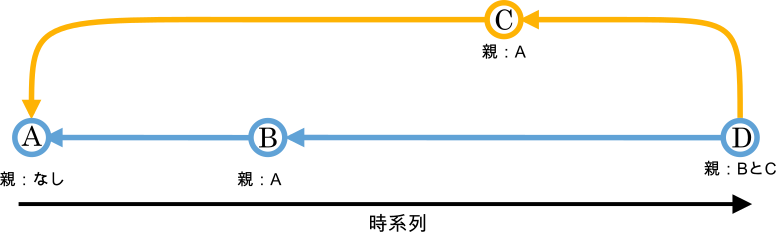

#####################################################################
用語
#####################################################################

*********************************************************************
リポジトリ(repository)
*********************************************************************

リポジトリはGitのバージョン管理の対象になるファイル、ディレクトリ、更新履歴などの一群が保存される場所です。
変更履歴とバックアップの保管場所のことだと思っていれば特に問題ありません。

実態はGitで管理しているディレクトリに作成される :file:`.git` という隠しフォルダです。

.. tip:: リモートリポジトリ(remote repository)とローカルリポジトリ(local repository)

    | サーバー上にあるリポジトリがリモートリポジトリ、自分のPCにあるのがローカルリポジトリです。
    | 基本的にリモートから各自のPCに複製して作業して、公開・共有する変更履歴をリモートに集積し、他人の変更もリモートから持ってきます。(ローカルとローカル間のやり取りも可能です。)

.. tip:: ベアリポジトリ(bare repository)とノンベアリポジトリ(non-bare repository)

    | 作業ディレクトリをもたないのがベアリポジトリ、もつのがノンベアリポジトリ。
    | 一般的にリモートリポジトリはベアリポジトリでローカルリポジトリはノンベアリポジトリ。

*********************************************************************
作業ディレクトリ(working directory)
*********************************************************************

| 実際にファイルが置かれていて、ファイルの追加・変更を行う場所です。
| 作業ディレクトリ、ワークツリー、ワーキングディレクトリなどと呼ばれます。

*********************************************************************
ステージングエリア(staging Area)
*********************************************************************

| 作業ディレクトリで変更したファイルをリポジトリに登録する前に一時的に登録する場所です。
| ここに登録することをステージングといい、ステージングされたファイルのみリポジトリへの登録の対象となります。
| 実態は :file:`.git` に含まれる :file:`index` というファイル。
| ステージングエリア、インデックスなどと呼ばれます。

*********************************************************************
コミット(commit)
*********************************************************************

| ステージングエリアエリアに登録された変更をリポジトリに登録する操作のこと。
| また、リポジトリに登録された変更履歴自体を **コミット** （または **リビジョン** ）と呼ぶ。
| コミットは親となる（変更元）のコミットの情報を保持しており、コミットの履歴は以下のようにコミットを丸、親と子の関係を線で示すことが多い。

    コミット履歴のイメージ

.. note:: 
    わかりやすくするために各コミットをA~Dで示しているが、実際にはコミットはハッシュという40桁の値で識別される。

*********************************************************************
スナップショット(snapshots)
*********************************************************************
| リポジトリに保存されるコミット時の作業ディレクトリの状況。
| Gitはこの作業ディレクトリのスナップショットを保存して、そのスナップショットに対してタグをつけたり、任意のスナップショットに戻ったり、比較したりするシステムと考えればよい。

    スナップショット

*********************************************************************
ブランチ(branch)
*********************************************************************

| 開発の流れを分岐させてメインの流れに影響を与えずに開発するための機能。
| また、その開発の枝分かれした流れを示す名前としてもつかわれる。（ただしブランチの実態はただ特定のコミットを指すだけのポインタであり、繋がりの情報はコミットが保持している。）
| Gitでの管理を始めると、そのプロジェクトは最初からブランチを1つ持っている。(一般的に :file:`main` や :file:`master` という名前で作られます。)
| 新たにブランチを作成することを「ブランチを切る」といいます。

    ブランチのイメージ

.. note:: 
    | 上の図でいうとブランチはコミットDを指している :file:`main` とコミットCを指している :file:`develop` のふたつ。
    | たとえばブランチ :file:`develop` についての変更の履歴はA→C、 :file:`develop` ではA→B→C→Dとなるが、ブランチ自体はこの情報を持たず、ただコミットCとDをそれぞれを指しているだけである。指されたコミットが親の情報をもっているためそれを辿っていくことで各ブランチの変更の履歴を把握できる。
    | ざっくりとしたイメージで言えば分岐した作業の履歴の先頭を指すだけのものと考えていい。

*********************************************************************
ヘッド(HEAD)
*********************************************************************

| 基本的に今作業しているブランチを指すポインタ。
| HEADのおかげでGitはどのブランチで作業をしているかを把握できます。
| HEADは直接コミットを指しているわけではなく、ブランチを指し、ブランチがコミットを指しているので間接的にコミットを指している。

    HEADのイメージ

.. note:: 
    | HEADは基本的にブランチを指すが、コミットを直接指すことができる。この状態を **detached HEAD** という。 
    | 一時的に過去のコミット時のファイルを見たり、試験的に編集する際に意図的にこの状態にするが、この状態で変更をコミットしてしまうとどのブランチにも属していないコミットが生成され、違うブランチに移動してしまうとそのコミットの履歴を追跡できなくなってしまうので注意。また、この状態だとリモートリポジトリににプッシュできない。
    | detached HEADの状態でコミットしたい場合はコミットする前でも後でもブランチを移動する前にブランチを新しく切っておけばよい。

*********************************************************************
ハンク(hunk)
*********************************************************************

| 変更のかたまり。
| Gitでは変更はファイル単位ではなくファイル内の変更箇所単位で認識している。
| ハンク単位でコミットすることも可能。

