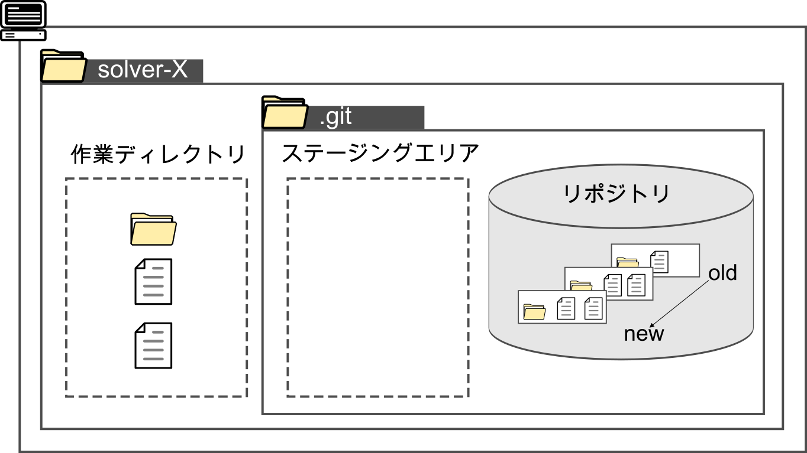

#####################################################################
構造
#####################################################################

*********************************************************************
Gitで管理しているプロジェクトの構造
*********************************************************************

| 自分のPCで :file:`solver-X` というプロジェクトのフォルダをGitで管理していたとする。

    プロジェクトの構造のイメージ

リポジトリ
=======================
- Gitで管理しているディレクトリ（ :file:`solver-X` ）には :file:`.git` というフォルダが生成される。この :file:`.git` はGitでの管理に必要な情報や作業ディレクトリのスナップショットが保存され、ここが実質 **リポジトリ** である。

作業ディレクトリ
=======================
- :file:`solver-X` の直下( :file:`.git` がある階層)が **作業ディレクトリ** であり、ここでファイルを配置したり編集を行う。Gitは作業ディレクトリのスナップショットをリポジトリに保存したり、リポジトリに保存されているスナップショットを作業ディレクトリに書き出すことができる。

ステージングエリア
=======================
- ステージングエリアは :doc:`/02/01` で解説したとおり、コミットの対象とするファイルをコミット前に登録する領域であり、実態は :file:`.git` の中の :file:`index` である。

:menuselection:`作業ディレクトリでファイルを編集 --> ステージング(add) --> コミット` これがGitの基本であり大部分である。

.. figure:: image/02/020.png
    :width: 100%

    ステージングエリアのイメージ

*********************************************************************
作業ディレクトリ内のファイルの状態
*********************************************************************
作業ディレクトリ内のファイルには大きく分けて「追跡されている」と「追跡されていない」の2つの状態があります。
また、「追跡されていない」は3つの状態に分かれます。
基本的にGitでのファイルの管理は直近のコミットの状況から変更が加えられ、変更されたファイルをステージングしてコミットすることの繰り返しです。

.. figure:: image/02/030.png
    :width: 100%

    ファイルの状態のイメージ

追跡されていない（Untracked）
==============================
Gitで管理されていない状態です。この状態のファイルは直近のスナップショットに存在しておらず、ステージングエリアにも存在していません。
新しく追加したファイルやGitでの管理から除外されているファイルはこの状態になります。

追跡されている（Tracked）
==============================
Gitで管理されている状態です。この状態はさらに以下の状態に分けられます。

ステージされている（Staged）
------------------------------
追跡されていない状態のファイルや変更が加えられたファイルがステージングされた状態です。

変更されていない（Unmodified）
------------------------------
直近のスナップショットの状況から何も変更がされていない状態です。

変更されている（Modified）
------------------------------
直近のスナップショットの状況から内容が変更されている状態です。

