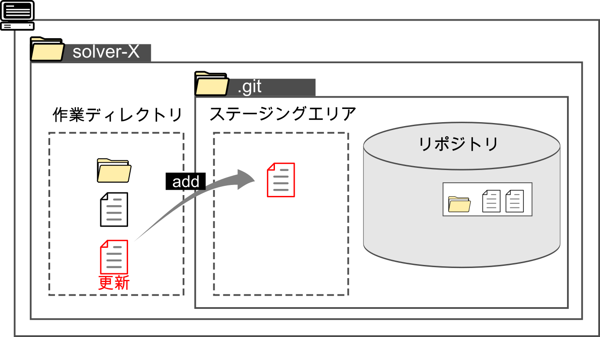

#####################################################################
操作
#####################################################################

基本的なGitの操作を紹介します。
ここで紹介していないコマンドやオプションについては `公式ドキュメント <https://git-scm.com/docs>`_ を参照ください。

Reference: https://git-scm.com/docs

*********************************************************************
init 空のリポジトリを作成
*********************************************************************

空のリポジトリを作成するコマンドです。

.. code-block:: none

   git init 

この操作を実行するとカレントディレクトリに :file:`.git` ディレクトリと中身、デフォルトの名前のブランチが作成されます。
初期のブランチ名を指定したい場合は`-b`オプションで指定します。

.. code-block:: none

   git init -b "ブランチ名"

*********************************************************************
clone クローン 
*********************************************************************

すでに存在するリポジトリをローカル環境に複製する操作です。
複製元となるリポジトリはローカルでもリモートでも問題ありません。

    

    GitHUbのリモートリポジトリからクローンするイメージ

基本のコマンドである以下を実行するとデフォルトではカレントディレクトリに指定されたリポジトリの名前のフォルダが作成され、その中にリポジトリの複製が作成されます。
作業ディレクトリにはデフォルトのブランチの状況のファイル群が書き出されています。

.. code-block:: none

   git clone <リポジトリのパス>

ブランチを指定してクローンしたい場合は`-b`オプションで指定します。

.. code-block:: none

   git clone  -b "ブランチ名" <リポジトリのパス>

*********************************************************************
add  ステージングする
*********************************************************************

追跡されていないファイルや変更されたファイルをステージングエリアに移動する操作です。

    

    addのイメージ

以下のようにステージングしたいファイルまたはフォルダを指定して実行します。

.. code-block:: none

    git add <ファイルまたはフォルダのパス>

`add` はオプションが沢山ありファイル内の変更の一部のみをステージング等もできます。VScode等を使用することで非常に感覚的に使用できます。

*********************************************************************
commit  コミット
*********************************************************************
ステージングされている変更を反映させた状態の作業ディレクトリのスナップショットをログメッセージと共に保存します。
厳密にどのような処理が行われているかは割愛します。

    

    コミットのイメージ

コミットも沢山オプションがありますが、基本的に以下のみでも実行できます。

.. code-block:: none

    git commit

*********************************************************************
branch  ブランチ
*********************************************************************
ブランチの一覧を表示する、ブランチを作成するなどのブランチに対する操作を行う。

ブランチの一覧を表示
==============================
ローカルブランチを表示

.. code-block:: none

    git branch

リモートブランチを表示

.. code-block:: none

    git branch -r

ローカル、リモートすべてのブランチを表示

.. code-block:: none

    git branch -a

ブランチを新たに作成
==============================
HEADのコミットから指定した名前で新しいブランチを作成する。
作成したブランチへは自動で切り替えは行われない。

.. code-block:: none

    git branch "ブランチ名"

.. figure:: image/03/040.png
    :width: 100%
    

    新規ブランチ作成のイメージ

*********************************************************************
checkout チェックアウト
*********************************************************************
ブランチを移動する操作です。ブランチを移動すると作業ディレクトリの中身はブランチが指すコミット時の状態に切り替わります。

ブランチを切り替える
==============================

既存のブランチを指定して切り替えます。

.. code-block:: none

    git checkout "ブランチ名"

    

    ブランチ切り替えのイメージ

ブランチを新たに作成して切り替える
===================================

HEADのコミットから新たにブランチを作成して、作成したブランチに切り替えます。

.. code-block:: none

    git checkout -b "ブランチ名"

    

    ブランチを作成して切り替えるイメージ

ブランチの開始位置を指定して新たにブランチを作成し切り替えることもできます。
`作成するブランチの開始位置` には「コミットを示すハッシュ(40桁の16進数)」、「ブランチ名」「タグ名」「HEAD」を指定する。

.. code-block:: none

    git checkout -b "作成したいブランチ名" <作成するブランチの開始位置>

コミットにチェックアウトする
===================================

チェックアウトはブランチだけではなく任意のコミットを指定してチェックアウトすることも可能です。
一時的に過去のファイルを確認したい場合などに行いますが、detached HEAD状態なのでこの状態でコミットをする際には気をつけまましょう。

.. code-block:: none

    git checkout "コミットのハッシュ"

    

    コミットにチェックアウトするイメージ

*********************************************************************
push プッシュ
*********************************************************************
ローカルリポジトリの変更をリモートリポジトリに反映させる操作です。

オプションが多数あるが、基本のコマンドは以下。

.. code-block:: none

    git push <リモートリポジトリ> <プッシュするブランチ>

    

    pushのイメージ

コマンドで操作するとめんどくさいが、SourcetreeやVScode等を使えば簡単に操作できる。

*********************************************************************
pull プル
*********************************************************************
リモートリポジトリの変更をローカルリポジトリに反映させる操作です。

オプションが多数あるが、基本のコマンドは以下。

.. code-block:: none

    git pull <リモートリポジトリ> <プルするブランチ>

    

    pullのイメージ

コマンドで操作するとめんどくさいが、SourcetreeやVScode等を使えば簡単に操作できる。

*********************************************************************
fetch フェッチ
*********************************************************************
リモートリポジトリの変更履歴をローカルに持ってくるが、変更は反映させない。

オプションが多数あるが、基本のコマンドは以下。

.. code-block:: none

    git detch <リモートリポジトリ> <プルするブランチ>

    
    fetchのイメージ

コマンドで操作するとめんどくさいが、SourcetreeやVScode等を使えば簡単に操作できる。