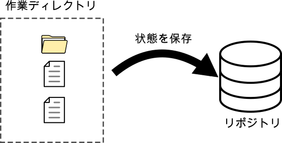
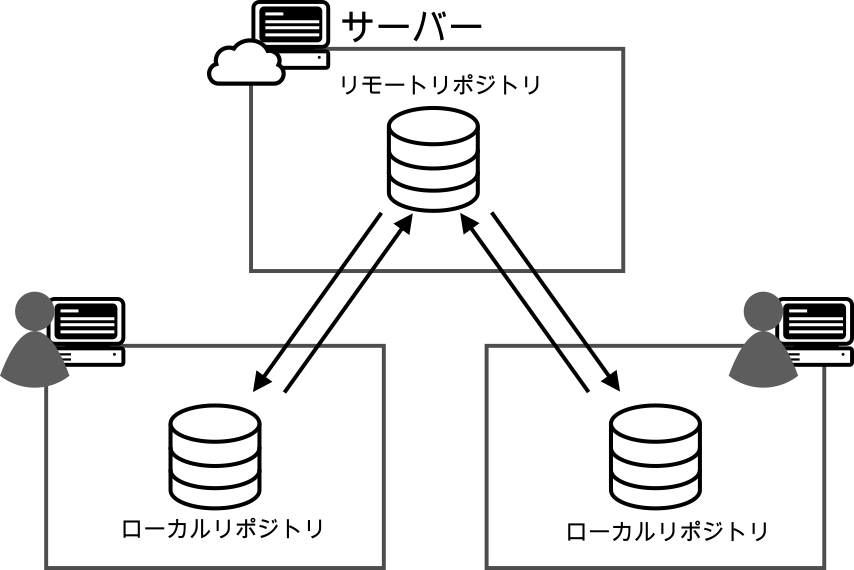
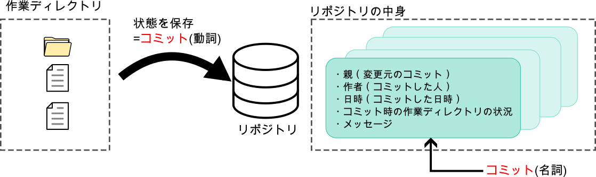
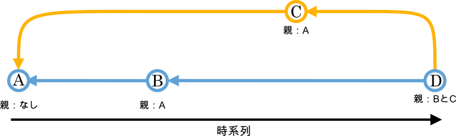
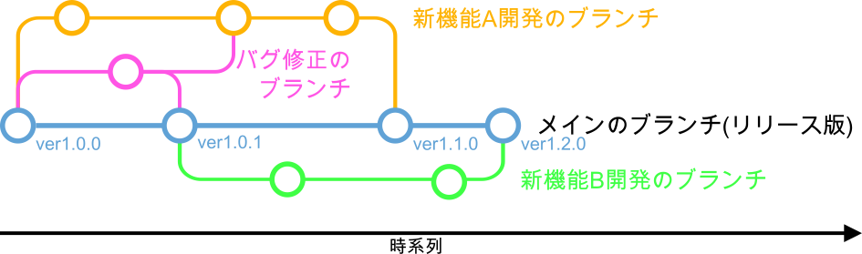

#####################################################################
Gitの基本
#####################################################################

*********************************************************************
リポジトリとは
*********************************************************************

リポジトリはGitのバージョン管理の対象になるファイルの中身、ディレクトリ構造、更新履歴などが保存される場所です。
変更履歴とバックアップの保管場所のことだと思っていれば特に問題ありません。

Gitではこのリポジトリに蓄積された作業ディレクトリの状態を利用して差分を確認したり、過去の状態を復元したりしています。

*********************************************************************
ローカルリポジトリとリモートリポジトリ
*********************************************************************

:doc:`../01/03` でも説明しましたが、Gitは分散型バージョン管理システム （ :abbr:`DVCS (Distributed Version Control System)` ）ですので、サーバー上と作業をする各個人のパソコンそれぞれにリポジトリを持ちます。

このとき、サーバー上にあるリポジトリを **リモートリポジトリ** 、各個人のコンピュータにあるリポジトリを **ローカルリポジトリ** といいます。

Gitではリモートリポジトリとローカルリポジトリ間でリポジトリに蓄積した情報をやり取りして共同開発者間で変更履歴を共有します。このように各環境にリポジトリを作成することで、作業内容を他人と共有したり公開するためにリモートとローカルの情報をやり取りする時以外は、ほとんどの作業をローカルで完結できるという利点があります。

*********************************************************************
コミットとは
*********************************************************************

作業ディレクトリで追加・変更したファイルの中身、ディレクトリ構造をリポジトリに記録することを **コミット** といいます。

コミットを行うとリポジトリには作業ディレクトリの状態を記録したものが作成され、この作成されたものも **コミット** （またはリビジョン、バージョン）といいます。
「コミットするとコミットができる」←紛らわしいですね。

| コミットは「どのコミットからの変更か」、「コミットしたユーザーの名前とメールアドレス」、「コミット日時」、「コミットした時の作業ディレクトリの状況」、「メッセージ（主にコミットの内容を記述）」の情報を持っています。「どのコミットからの変更か」という情報を持っているため、コミットの繋がりを辿っていく事で最新から過去までの変更履歴を辿ることができます。
| このコミット同士の繋がりはコミットを丸、繋がりを線や矢印で以下のように表現することが多く、 **コミットグラフ** などと呼ばれます。

この図ではコミットをA～Dで表していますが、実際のコミットはコミットの内容から **SHA-1** （シャーワン）という関数で生成された英数字40桁のユニークな値を持ちこの値で識別をされています。この値は **ハッシュ** や **SHA-1ハッシュ** またはそのまま **SHA-1** と呼ばれます。

*********************************************************************
ブランチとは
*********************************************************************

| 開発の流れを分岐させて他の流れに影響を与えずに開発するための機能です。また、その開発の枝分かれした流れを示す名前としてもつかわれます。
| リポジトリを作成する段階でメインのブランチが作成され、その他に任意のコミットからブランチを作成することが可能です。新たなブランチを作成することを「 **ブランチを切る** 」といいます。

| リポジトリ作成時に作成されるブランチは設定にもよりますが、デフォルトでは **main** や **master** という名前で作成され、Gitを用いた管理を行う際にはこのブランチに公開版の更新時の変更履歴を記録し、バグ修正や機能追加をする際の作業の履歴はそれ用のブランチを作成して作業を行いデバッグを行ってからメインのブランチに変更を合流させることが一般的です。
| このように履歴を分岐することで他のブランチに影響を与えず同時に安全に複数の開発を行うことが可能です。

ただし、このブランチの切り方は様々な流儀があるので共同開発者内でのルールに従ってください。代表的な流儀には「git-flow」や「GitHub Flow」というものがあります。

.. _ざっくりとしたコミットの構造:

*********************************************************************
ざっくりとしたコミットの構造
*********************************************************************

Gitにおける履歴のファイルの管理方法について説明します。

| リポジトリには各ファイルの各バージョン（変更毎のファイルのスナップショット）が保存されています。
| 例えば以下のようにファイルの変更があったとします。

.. figure:: image/04/010.png
    :width: 100%

----------------------------------------------------------------------

| このとき、リポジトリには各ファイルの各バージョンの内容をそれぞれ圧縮した **ブロブ** というオブジェクトが作成されています。
| また、コミット時には「コミットしたユーザーの名前とメールアドレス」、「どのコミットからの変更か」、「コミット日時」などが記録された **コミットオブジェクト** が生成され、詳しい仕様は割愛しますが参照によりコミット時のファイルの状況に対応したブロブが紐づいています。

.. figure:: image/04/020.png
    :width: 80%

.. attention:: 
    ここではわかりやすさを優先して割愛していますが、実際はコミットオブジェクトが直接ブロブを参照しているのではなく、コミットオブジェクトはツリーオブジェクトという管理ファイルのディレクトリの構造の情報を持つオブジェクトを参照し、ツリーオブジェクトがブロブを参照しています。
    もう少し詳しい説明は :doc:`06` を御覧ください。

----------------------------------------------------------------------

| つまりGitでは参照によりコミットした時点の「管理対象の各ファイルの中身」、「ディレクトリの構造」を丸ごと記録しています。
| このバージョン毎（コミット時）の管理対象ファイルの状況を **スナップショット** と呼び、Gitのファイル管理方法をまとめると「連続したスナップショットの蓄積」と言えます。

.. figure:: image/04/030.png
    :width: 100%

このような管理方法をとっているため、過去のバージョン（スナップショット）の復元、変更差分の表示を簡単に行えます。

.. toctree::
    :hidden:

    06

*********************************************************************
Gitで管理しているプロジェクトの構造イメージ
*********************************************************************

| 自分のPCで :file:`solver-X` というプロジェクトのフォルダをGitで管理していたとすると構造は以下の図のようになります。

.. figure:: image/02/010.png
    :width: 100%

    プロジェクトの構造のイメージ

.. _Git-StructureImage-WorkingDirectory:

.. glossary::

    リポジトリ
        Gitで管理しているディレクトリ（ :file:`solver-X` ）には :file:`.git` というフォルダが生成される。この :file:`.git` はGitでの管理に必要な情報や作業ディレクトリのスナップショットが保存され、ここが実質 **リポジトリ** である。

    作業ディレクトリ
        :file:`solver-X` の直下( :file:`.git` がある階層)が **作業ディレクトリ** であり、ここでファイルを配置したり編集を行う。Gitは作業ディレクトリのスナップショットをリポジトリに保存したり、リポジトリに保存されているスナップショットを作業ディレクトリに書き出すことができる。

    ステージングエリア
        ステージングエリアは :doc:`/02/01` で詳しく解説するが、コミットの対象とするファイルをコミット前に登録する領域であり、実態は :file:`.git` の中の :file:`index` というファイルである。

----------------------------------------------------------------------

:menuselection:`作業ディレクトリでファイルを編集 --> ステージング(add) --> コミット` これがGitの基本であり大部分である。

.. figure:: image/02/020.png
    :width: 100%

    ステージングエリアのイメージ

*********************************************************************
作業ディレクトリ内のファイルの状態
*********************************************************************
作業ディレクトリ内のファイルには大きく分けて「追跡されている」と「追跡されていない」の2つの状態があります。
また、「追跡されていない」は3つの状態に分かれます。
基本的にGitでのファイルの管理は直近のコミットの状況から変更が加えられ、変更されたファイルをステージングしてコミットすることの繰り返しです。

.. figure:: image/02/030.png
    :width: 100%

    ファイルの状態のイメージ

.. glossary::
    追跡されていない（Untracked）
    
        Gitで管理されていない状態です。この状態のファイルは直近のスナップショットに存在しておらず、ステージングエリアにも存在していません。
        新しく追加したファイルやGitでの管理から除外されているファイルはこの状態になります。

    追跡されている（Tracked）

        Gitで管理されている状態です。この状態はさらに以下の状態に分けられます。

        .. glossary::

            ステージされている（Staged）

                追跡されていない状態のファイルや変更が加えられたファイルがステージングされた状態です。

            変更されていない（Unmodified）
            
                直近のスナップショットの状況から何も変更がされていない状態です。

            変更されている（Modified）
        
                直近のスナップショットの状況から内容が変更されている状態です。