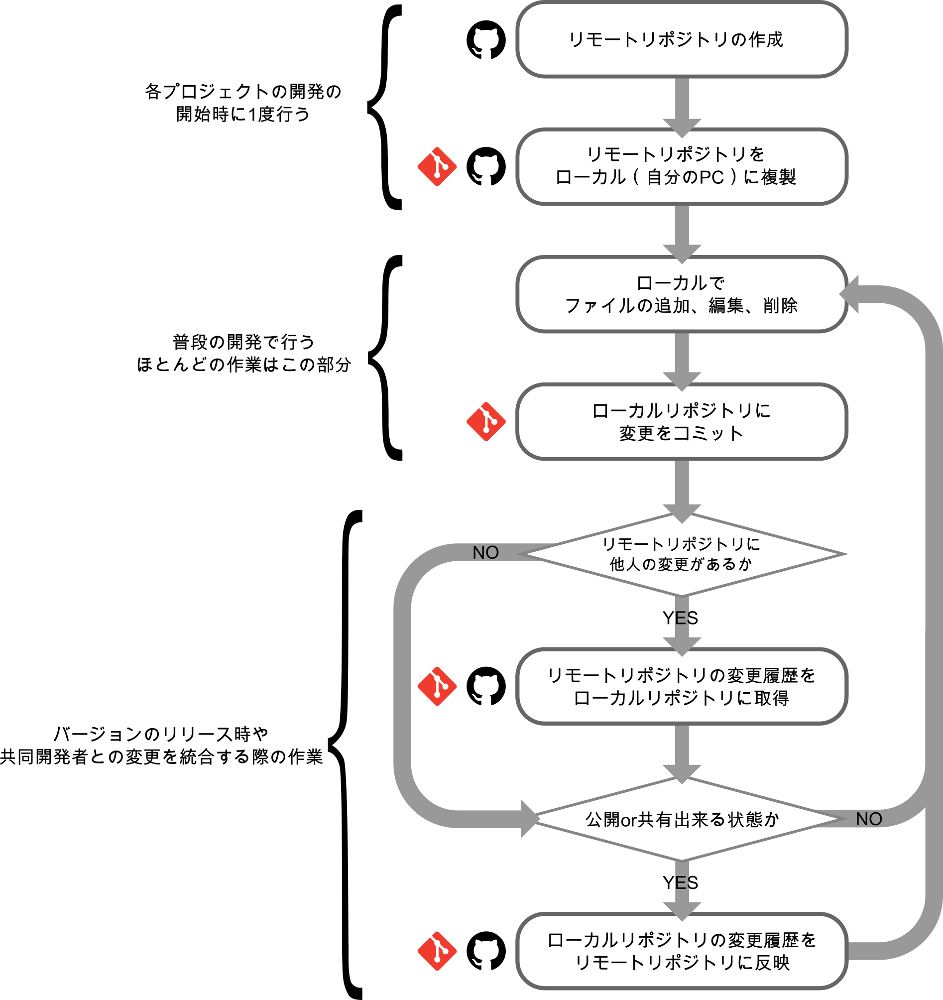

#####################################################################
作業の流れ
#####################################################################

分散型バージョン管理システムであるGitで実際にバージョン管理を行う際の大まかな手順は以下のような作業の繰り返しとなる。

0. 開発するプロジェクトの中心となるリポジトリをリモートサーバー等に作成する。（プロジェクト毎に初回のみ）
1. ステップ0で作成したリポジトリをローカル（自分のPC）に複製する。（ユーザー・PC毎に初回のみ）
2. ファイルの編集・追加・削除
3. ローカルリポジトリに変更内容を記録
4. ローカルの変更内容をリモートのリポジトリに反映させる
5. 他の人の変更内容をリポートからローカルに反映させる

ステップが多く見えるかもしれないが、ステップ0と1に関してはプロジェクトの開始時に1度だけ、4と5のリモートとローカルのやり取りもリリース時や共同開発者との変更内容を統合する時に発生する作業のため、普段行う作業はステップ2とステップ3を繰り返すのみのため作業は至ってシンプルなものとなる。

.. note:: ローカルだけで個人で管理する場合

    | 個人で、しかもローカル環境だけでのバージョン管理として使用したいのであれば難しいことはありません。
    | 個人的なプログラムの開発だけならこれでも充分です。リモートとローカル両方で管理したくなった場合あとからリモートの環境を追加することも可能です。

    | 管理を始めるには
    | :menuselection:`リポジトリを作成``

    | 普段の作業は
    | :menuselection:`ファイルを追加・編集・削除 --> 区切りのいいところでコミット` 

    これだけでも以下のようなことはできます。

    - コメント付きで、時系列も明確でキレイなファイルのバージョン管理
    - 任意の時点に戻る
    - 過去の特定の変更を打ち消す
    - 変更履歴を分岐させて複数のバージョンの管理
    - 他の分岐での変更を他の分岐に統合

