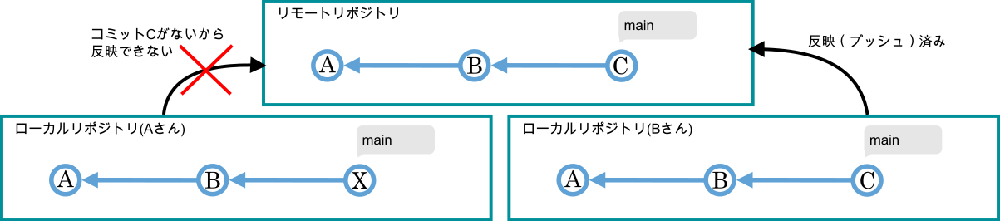

#####################################################################
作業の流れ
#####################################################################

.. note:: 
    リモートリポジトリをGitHubに置く前提で説明します。

分散型バージョン管理システムであるGitで実際にバージョン管理を行う際の大まかな手順は以下のような作業の繰り返しとなります。

1. 開発するプロジェクトの中心となるリポジトリをリモートサーバー等に作成する。（プロジェクト毎に初回のみ）
2. ステップ1で作成したリポジトリをローカル（自分のPC）に複製する。（ユーザー・PC毎に初回のみ）
3. ファイルの編集・追加・削除
4. ローカルリポジトリに変更内容を記録
5. リモートの変更内容をローカルに反映させる
6. ローカルの変更内容をリモートのリポジトリに反映させる

| ステップが多く見えるかもしれませんが、実際のところステップ1と2に関してはプロジェクトの開始時に1度だけ、5と6のリモートとローカルのやり取りもリリース時や共同開発者との変更内容を統合する時に発生する作業のため、 **普段行う作業はステップ3とステップ4を繰り返すのみ** のため作業は至ってシンプルなものとなります。
| また、以下に示す各ステップのフロー図において、ステップの左側にあるGitとGitHubのロゴはそれぞれが操作に関わってくることを示していますが、普段行うファイルの編集とコミット作業はローカルのみで作業できることがわかりますね。

.. figure:: image/05/010.png

.. admonition:: ローカルだけで管理する場合

    | 個人で、しかもローカル環境だけでのバージョン管理として使用したいのであれば難しいことはありません。
    | 個人的なプログラムの開発だけならこれでも充分です。リモートとローカル両方で管理したくなった場合あとからリモートの環境を追加することも可能です。

    | 管理を始めるには
    | :menuselection:`リポジトリを作成`

    | 普段の作業は
    | :menuselection:`ファイルを追加・編集・削除 --> 区切りのいいところでコミット` 

    これだけでも以下のようなことはできます。

    - コメント付きで、時系列も明確でキレイなファイルのバージョン管理
    - 任意の時点に戻る
    - 過去の特定の変更を打ち消す
    - 変更履歴を分岐させて複数のバージョンの管理
    - 他の分岐での変更を他の分岐に統合

*******************************************************************************
開発するプロジェクトの中心となるリポジトリをリモートサーバー等に作成する
*******************************************************************************

| このステップではプロジェクトの中心となるリモートリポジトリを作成します。
| ここで作ったリモートリポジトリがプロジェクトの中心になり、このリポジトリを経由して共同開発者と編集履歴を共有します。
| 共同開発者のうち、リポートリポジトリをメインで管理する人が作成してください。

.. figure:: image/05/020.png

今回は一番最初にリモートリポジトリを作成する前提で話を進めますが、既にローカルで作業を進めているリポジトリを後からリモートリポジトリを作成して同期することもできます。

*******************************************************************************
リモートリポジトリをローカル（自分のPC）に複製する
*******************************************************************************

| 次に先ほどのステップで作成したリモートリポジトリをローカル（自分のパソコン）にクローン（複製）します。
| **ファイルの編集や変更履歴の記録はローカルにある作業ディレクトリとローカルリポジトリで行います** 。リモートリポジトリが今後関わってくるのは、リモート⇔ローカルでの編集履歴のやり取りを行うタイミングくらいです。

.. hint:: 
    リモートリポジトリをローカルにクローンする際にブランチを指定していなかった場合、デフォルトのブランチをチェックアウトした状態になっています。

|
|

*******************************************************************************
ファイルの編集・追加・削除
*******************************************************************************

| ローカルリポジトリの用意ができたらプロジェクトの :ref:`作業ディレクトリ <git-structureimage-workingdirectory>` でファイルの追加/編集/削除を行います。
| 管理対象のファイルがキリのいい状態になったら次のステップに進みます。

.. hint:: 
    実際の開発においては作業したいブランチにチェックアウトして、作業ディレクトリのファイルの状態を最新のコミットと同じ状態にしてから作業を行います。

.. note::
    | Gitの運用において、デフォルトのブランチだけでの作業と変更履歴の蓄積は推奨されていません。
    | デフォルトブランチにはバグの修正や新機能追加など新たなバージョンができたタイミングで履歴を残し、実際の開発中の作業は作業用にブランチを作成してそこに変更履歴を蓄積し、リリースのタイミングでデフォルトブランチに反映するのが主流です。このブランチの作成の仕方などのルールを「ブランチモデル」といいます。開発チームで定まっていない場合などを除いては基本的に自由です。
    | 代表的なものに「git-flow」や「GitHub Flow」がありますが説明はここではしません。以下の記事が分かりやすいので興味があれば読んでみてください。

    | `Gitにおけるブランチ戦略について調べてみた <https://qiita.com/trsn_si/items/cfecbf7dff20c64628ea>`_
    | https://qiita.com/trsn_si/items/cfecbf7dff20c64628ea

    今回説明する流れではデフォルトブランチ ::guilabel:`main` だけで作業する前提で話を進めます。

|
|

*******************************************************************************
ローカルリポジトリに変更内容を記録
*******************************************************************************

| 作業ディレクトリでファイルの状態を更新したら、ローカルリポジトリに :command:`コミット` をして変更を保存します。
| ファイルの状態が公開できる状態になるまで、編集と :command:`コミット` を繰り返し変更履歴を積み重ねていきます。

|
|

.. _リモートの変更内容をローカルに反映させる:

*******************************************************************************
リモートの変更内容をローカルに反映させる
*******************************************************************************

| リモートにローカルの変更履歴を反映（ :command:`プッシュ` ）させる準備ができたら早速反映させたいところですが、その前にリモートリポジトリに他の人のコミットが追加されていないかを確認しましょう。確認して、自分が履歴を反映させたいブランチに他の人の人のコミットが追加させていたら自分のローカルリポジトリにそのコミットを反映させる必要があります。

リモートの内容をローカルに反映させる理由
================================================================================

| 例えば以下のような状況を考えてみましょう。
| AさんがコミットBから変更を加えてコミットした事によりローカルリポジトリではB←Xという履歴になっています。ただし、リモートリポジトリではBさんが既にCというコミットを追加していたという状況です。

| このような状況ではあなたはリモートリポジトリにローカルリポジトリの履歴を反映(プッシュ)しようとするとエラーが出ます。
| なぜならローカルリポジトリの履歴をリモートに無理やり反映（上書き）させてしまうとあなたのローカルリポジトリにはコミットCが含まれていないのでリモートからCのコミットが消えてしまうからです。

| 強制的にローカルの履歴をリモートに反映させることもできますが、他の人のローカルリポジトリにコミットCがある場合、今度はその人達がリモートとローカルの履歴の齟齬によりリモートとやり取りができなくなってしまいます。とても迷惑なので個人で管理しているプロジェクトや、ちゃんと報連相とってからの場合以外ではやめましょう。逆の場合であればやっても大丈夫です。

リモートの内容をローカルに反映させる流れ
================================================================================

このような場合の解決方法はAさんのローカルリポジトリのブランチ :guilabel:`main` にないコミットCをリモートリポジトリから持ってきてあげることです。

| 実際の手順は別のページで説明するのでまずはざっくりした流れを説明します。
| まずはリモートの履歴をAさんのローカルリポジトリに持ってきます。この操作を :command:`フェッチ` といいます。 

| リモートリポジトリからAさんのローカルリポジトリに :command:`フェッチ` を実行した場合の状況を見てみましょう。
| ここで :guilabel:`origin/main` とはリモートリポジトリ（origin）のブランチ（main）を示します。
| この段階ではまだAさんのブランチ :guilabel:`main` にはコミットCが含まれていません。（ :guilabel:`main` の先頭からコミットを辿っていった流れの中にCがいない。）

.. figure:: image/05/070.png

.. .. hint::
   Gitクライアントの中には定期的に自動でフェッチを行いリモートリポジトリのコミットログを取得してくれるものもあります。

|
|
| なので、:command:`マージ` や :command:`リベース` という操作を行いローカルに持ってきた :guilabel:`origin/main` のコミットCを :guilabel:`main` に統合します。
| ここでマージを使うかリベースを使うかなどは開発チームでのルールに従うか、個人の場合は好みです。
| いずれの手法を使うにしろ、この操作により :guilabel:`main` の先頭からコミットを辿って行った際にA←B←Cという履歴が :guilabel:`origin/main` と一致しているので :guilabel:`main` の変更をリモートに反映（:command:`プッシュ` ）できるようになりました。

| :command:`マージ` の場合

     :guilabel:`main` にコミットCとコミットXを親に持つ、「 :guilabel:`origin/main` をマージしました。」というコミットM作成され、ブランチ :guilabel:`main` の先頭はコミットMになります。

| :command:`リベース` の場合

    コミットBから派生していた :guilabel:`main` のコミットXが :guilabel:`origin/main` のコミットCに付け替えられます。ただしこの時付け替えられたコミットはX´という新しく作成されたコミットになっており、リベース前のXとは違うコミットであることに注意しましょう。

|
|

.. _ローカルの変更内容をリモートのリポジトリに反映させる:

*******************************************************************************
ローカルの変更内容をリモートのリポジトリに反映させる
*******************************************************************************

| リモートにローカルの変更履歴を反映（ :command:`プッシュ` ）させる準備ができたら早速履歴を :command:`プッシュ` しましょう。
| ローカルでの履歴を :command:`プッシュ` することでリモートにローカルの変更履歴が追加されます。
| またプッシュをするとローカルリポジトリ内のリモートブランチの位置も更新されます。他の人（Bさん）はフェッチやプルなどの操作をしなければリモートリポジトリに変化があろうとローカルリポジトリは変更されません。

