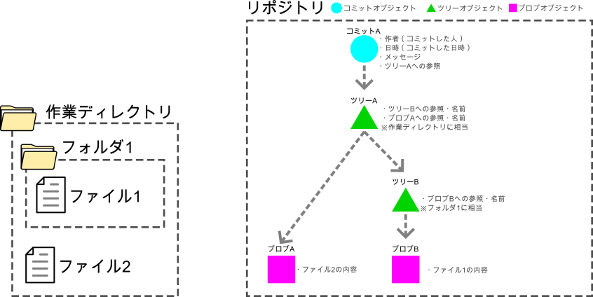

#####################################################################
コミットの図解
#####################################################################

| :ref:`ざっくりとしたコミットの構造` でざっくりとした解説をしたコミットの構造についてもうすこし詳しく図解します。
| Gitはコミット時の作業ディレクトリの状態を保存しますが、コミット毎に作業ディレクトリをリポジトリに丸々コピーしてバックアップをとっているわけではありません。もしこの方法を使っていればリポジトリの容量はあっという間に膨れ上がってしまいます。

ではGitではどのようにコミット時の作業ディレクトリの状態を記録してるかを流れに沿って見てみましょう。

まず、新しい空のリポジトリを作成し、作業ディレクトリには以下のようにファイルを追加したとします。

この状態でコミットを行うとリポジトリには以下のオブジェクトが作成され、それぞれは参照により紐づいています。
Gitではこのように参照関係によりコミット時の作業ディレクトリの状態を保存しているのです。

- コミットオブジェクト

  以下のコミットの情報が記されているオブジェクト

  - 作者情報(コミットした人のユーザー名、メールアドレス)
  - コミットした日時
  - コミット時のメッセージ
  - 変更元のコミット（親）への参照（最初のコミットでは親はない、複数の親を持つこともある）
  - トップレベルのツリーオブジェクトへの参照

- ツリーオブジェクト

  | 作業ディレクトリのディレクトリ構造が記されているオブジェクト、つまりフォルダにあたるものです。
  | 該当ディレクトリの直下のオブジェクトへの参照とファイル名、フォルダ名を持っています。

- ブロブオブジェクト

  ファイルの内容を記録するオブジェクトです、あくまで内容だけを記録し、ブロブオブジェクトはファイル名を持っていません。

.. hint::
   これらのオブジェクトは内容から SHA-1 （シャーワン）という関数で生成された英数字40桁のユニークな値を持ちこの値で識別・参照をされています。この値は ハッシュ や SHA-1ハッシュ またはそのまま SHA-1 と呼ばれます。

|
|
| ではこの状態で、 :file:`ファイル1` の内容を変更し、コミットした状況についても見てみましょう。

| 新たにコミットが行われると新たなコミットオブジェクトとツリーオブジェクトが作成され、再度コミット時の作業ディレクトリ内の状況を表す参照関係が作成されます。
| この時ブロブに着目してください、内容が変更された :file:`ファイル1` については変更後の内容で新たに :file:`ブロブC` が作成され参照されていますが、 :file:`ファイル2` についてはコミットAの状態から何も変わっていないので新たなブロブは作成されず、 :file:`ブロブA` が参照されています。このような方法によりGitは少ない容量で変更履歴を保存しています。

また、最初のコミット以外では変更元となるコミット（親）への参照も持つためどのような流れで変更してきたかも知ることができるのです。
