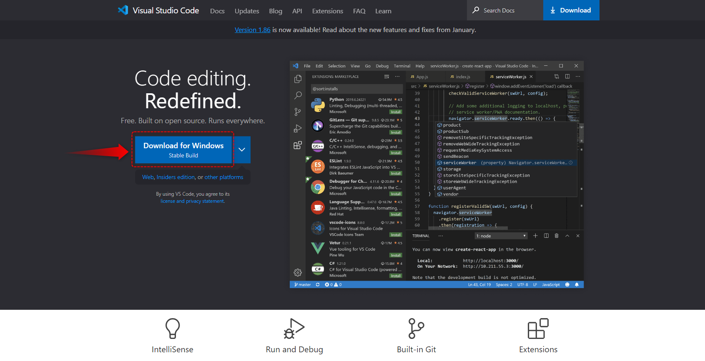

#####################################################################
インストール方法
#####################################################################

*********************************************************************
インストーラーの入手
*********************************************************************

まずは `公式サイト <https://code.visualstudio.com/>`_ にアクセスしてインストーラーをダウンロードしましょう。

公式サイト: `Visual Studio Code - Code Editing. Redefined <https://code.visualstudio.com/>`_

`公式サイト <https://code.visualstudio.com/>`_ トップページの `Download for Windows Stable Build` のリンクから最新の安定版を入手できます。

画面が `公式リファレンス <https://code.visualstudio.com/docs/?dv=win64user>`_ に切り替わり、インストーラーがダウンロードされたらブラウザは閉じても大丈夫です。

.. note:: 
    ダウンロードが自動で始まらない場合は以下の画像で示すリンクをクリック

    .. figure:: image/01/020.png
        :width: 100%

*********************************************************************
インストール
*********************************************************************

インストーラーの起動
===================================

| ダウンロードしたインストーラーを起動します。
| （ファイル名はバージョンによって異なりますので気にしないでください。）

利用規約
===================================

利用規約が表示されるので :menuselection:`同意する` にチェックをいれて :menuselection:`次へ` をクリックして次にすすみます。

インストール先の指定
===================================

| VSCodeをインストールする場所を聞かれます。
| :abbr:`デフォルトのまま (こだわりがある場合は変更してください)`  :menuselection:`次へ` をクリックして次にすすみます。

スタートメニューフォルダーの指定
===================================

| Windowsのスタートメニューに追加するフォルダの名前を聞かれます。
| :abbr:`デフォルトのまま (こだわりがある場合は変更してください)`  :menuselection:`次へ` をクリックして次にすすみます。

フォルダを作成したくなければ「スタートメニューフォルダーを作成しない」にチェックをいれます。

.. figure:: image/01/060.png

追加タスクの選択
===================================

インストール時のオプションを聞かれます。

「**エクスプローラーのファイルコンテキストメニューに[Codeで開く]アクションを追加する。**」と「**エクスプローラーのディレクトリコンテキストメニューに[codeで開く]アクションを追加する**」にチェックをいれて :menuselection:`次へ` をクリックして次にすすみます。

.. note:: 

    このふたつにチェックを入れておくとファイルやフォルダで右クリックした際にVSCodeで開くというメニューが追加されて便利です。

インストール準備完了
===================================

これまでに指定した内容が表示されます。
問題なければ :menuselection:`インストール` をクリックしてインストールを開始します。

インストール準備完了
===================================

インストールが完了しました。
 :menuselection:`完了` をクリックしてインストーラーを閉じるとVSCodeが立ち上がります。

ちゃんと起動できた事を確認できたらVScodeを終了して大丈夫です。