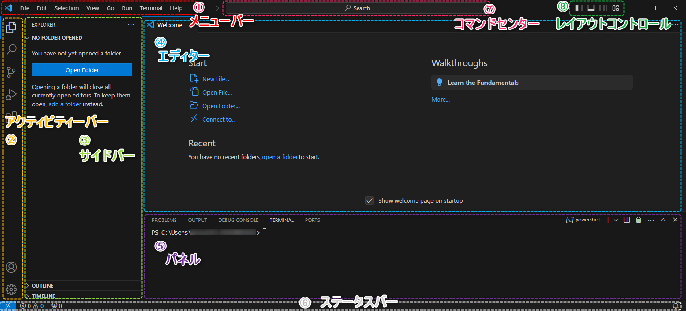

#####################################################################
UI各部名称
#####################################################################

.. glossary::

    ①メニューバー
        基本的な機能にはここからアクセスできます。

    ②アクティビティバー
        ここのアイコンをクリックするとそれに対応したサイドパネルが表示されます。

    ③サイドバー
        アクティビティバーで選択した機能が表示されます。

    ④エディター
        開いているファイルや機能の画面が表示されます。
    
    ⑤パネル
        ターミナル(コマンドプロンプトやPowerShellなど)や拡張機能の出力等様々なものが表示されます。
    
    ⑥ステータスバー
        | 現在の作業の様々なステータスが表示されます。
        | 例: エディターでのカーソルの位置（行、列）、文字コード、改行コード
    
    ⑦コマンドセンター
        ファイルを名前で検索したり、VSCodeの機能をコマンドで実行したり色々できます。

    ⑧レイアウトコントロール
        VSCodeのレイアウトを切り替え可能です。

        