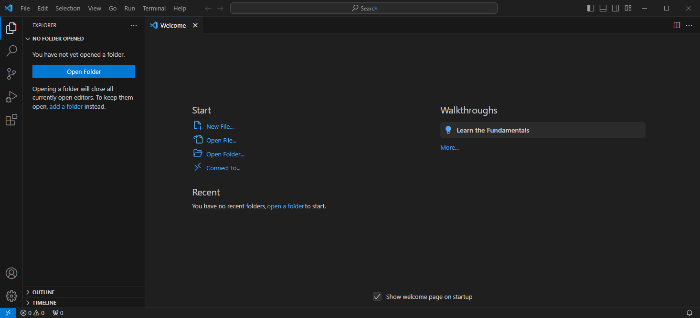
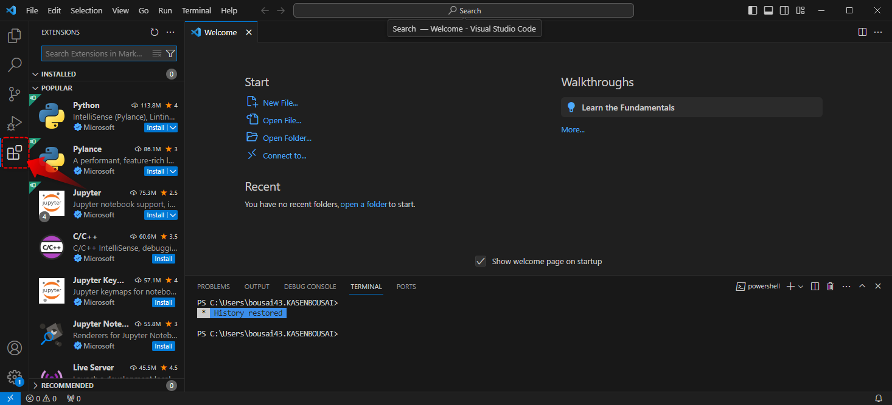
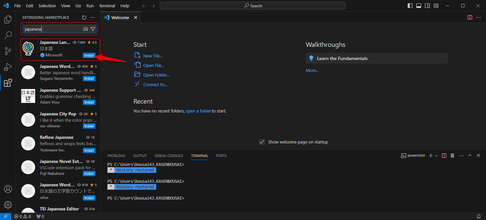
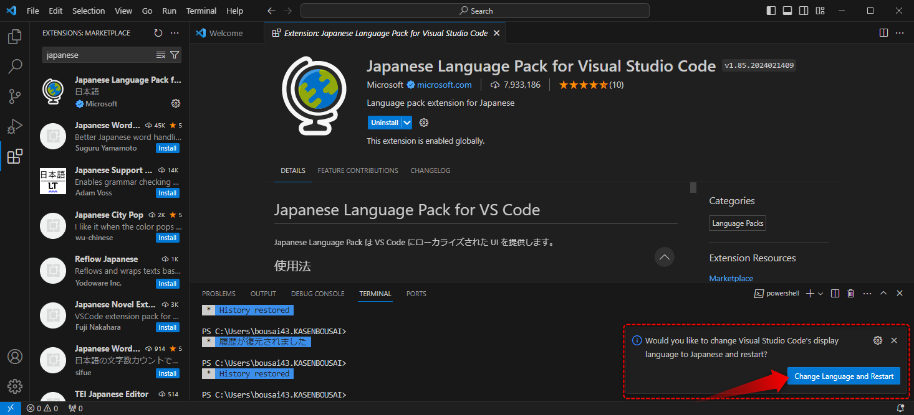
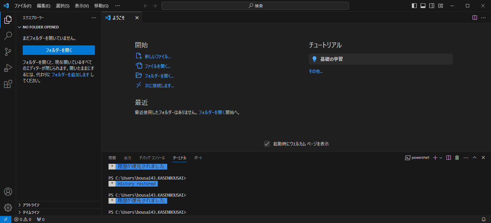

#####################################################################
日本語化
#####################################################################

VScodeはインストールしたままだと英語表記なので日本語化しましょう。

| 日本語にはVSCodeの拡張機能を使用します。
| VSCodeでは沢山の拡張機能が公開されおり、Gitの操作や文字をハイライトさせたり色々してくれます。

以下で手順を紹介します。

*********************************************************************
日本語化手順
*********************************************************************

VSCodeを起動
==============================

VSCodeを起動します。

拡張機能をインストール
==============================

アクティビティーバーの :menuselection:`拡張機能` のアイコンをクリックするとサイドバーに拡張機能の画面が表示されます。

-------------------------------------------------------------------------------

検索ボックスに 「japanese」と入力すると :code:`Japanese Language Pack for Visual Studio Code` が出てくるので、:menuselection:`Install` インストールをクリックして拡張機能をインストールします。

再起動して設定を反映
==============================
インストールが完了すると右下にダイアログが表示され「VSCodeの表示言語を日本語に変更して再起動しますか？」と聞かれるので、 :menuselection:`Change Language and Restart` をクリックします。

-------------------------------------------------------------------------------

VSCodeが自動で再起動して表記が日本語に変更されています。
これで日本語化は完了です。

