#####################################################################
オススメの拡張機能
#####################################################################

VSCodeで作業をする際に入れておくと便利な拡張機能を紹介します。

インストール方法は前項の日本語の際と同様に拡張機能タブで名前を検索してインストールするだけです。

*********************************************************************
Git History
*********************************************************************

Git History: https://marketplace.visualstudio.com/items?itemName=donjayamanne.githistory

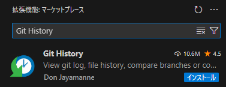

以下のような機能があります。

- 変更履歴と検索

    - 単一のブランチまたは全てのブランチのコミット履歴
    - ファイル単位の変更履歴

- 比較

    - ブランチの比較
    - コミットの比較
    - コミット間でのファイルの比較

- Gitの操作

    - ブランチのマージ
    - ブランチの作成
    - 任意のコミットの状態にリセット

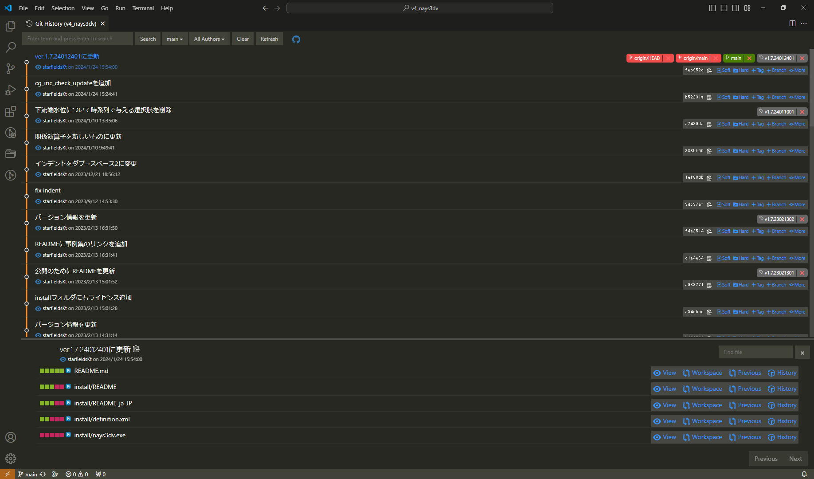

よく使う機能
==============================

コミット履歴の閲覧
------------------------------

ソース管理タブに追加されたアイコンをクリックするとコミットグラフとともにコミット履歴が表示されます。

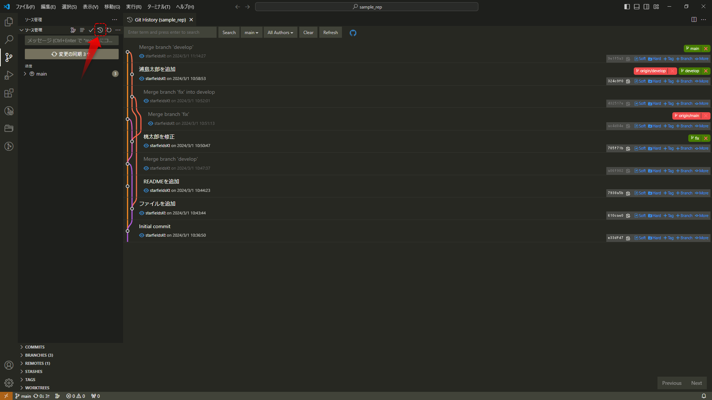

-------------------------------------------------------------------------------

上部のメニューからコミットの検索や絞り込み（ブランチ、作者）が行えます。

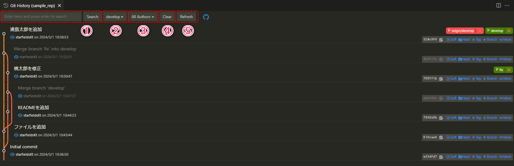

#. 検索ボックスに入力した内容でコミットを検索できます。
#. 任意のブランチまたは全ブランチのコミットに絞り込めます。
#. コミットの作者でコミットを絞り込めます。
#. 検索による絞り込みを解除します。
#. 表示されている履歴を更新します。（履歴を表示したあとにコミットした場合などは更新すると表示されます。）

ファイル単位のコミット履歴の閲覧
-----------------------------------

エクスプローラータブで任意のファイルを右クリックして「Git:View File History」をクリックします。

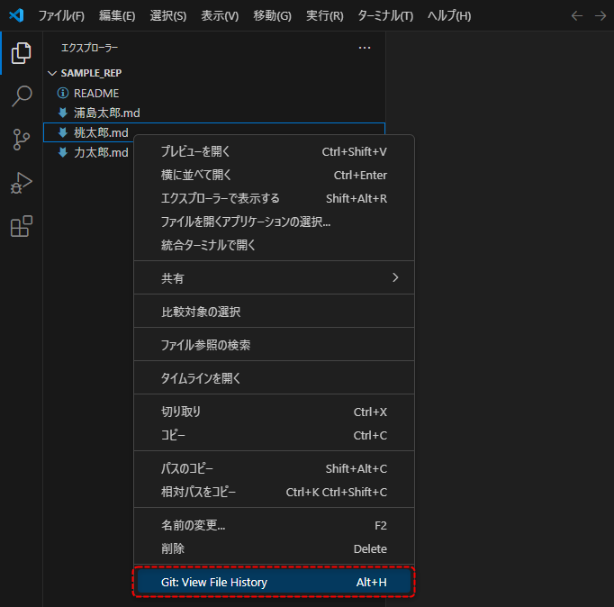

-------------------------------------------------------------------------------

任意のファイルが編集されているコミットだけの履歴が表示されます。

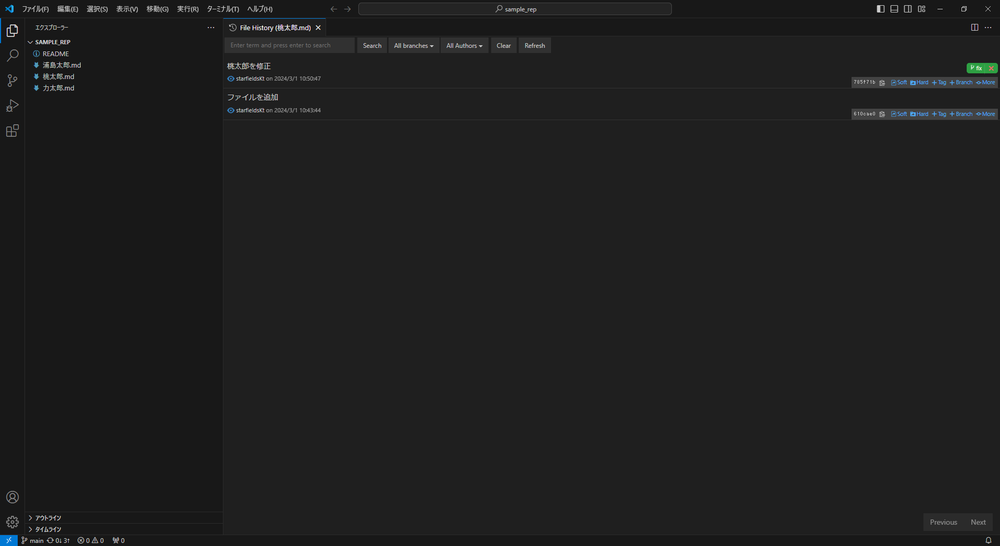

過去のファイル、差分の表示
-----------------------------------

コミット履歴で任意のコミットをクリックして選択すると、そのコミットで編集されたファイルが表示されます。
表示されたファイルの右側のメニューから差分や過去の状況を確認できます。

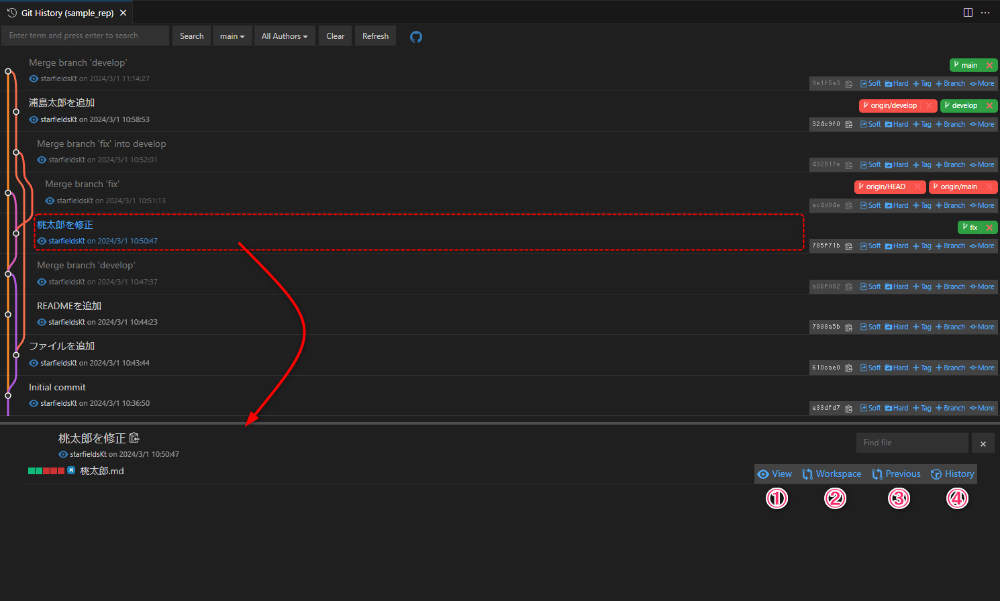

#. コミット時のファイルの内容を表示する。
#. 作業ディレクトリのファイルとコミット時のファイルの内容の差分を表示する。
#. 選択したコミット時の内容とその変更前の差分を表示する。
#. ファイルを変更したコミットのみ表示する。

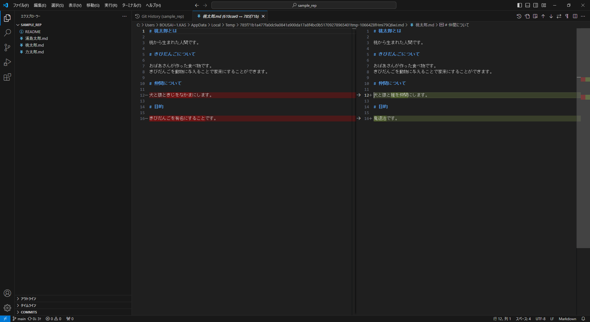

    差分表示の例

*********************************************************************
GitLens
*********************************************************************

GitLens: https://marketplace.visualstudio.com/items?itemName=eamodio.gitlens

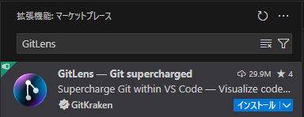

ファイル編集中に編集中の行がいつ編集されたか表示する機能と、ポップアップで差分などの情報やGitの操作のショートカットなどが表示されるのが便利です。
無料版だと機能が多少制限されますが、それでもかなり利便性が向上します。

よく使う機能
==============================

選択行の最終変更日時の確認
-----------------------------------

エディター画面でカーソルがある行の右側にその行を誰が、いつ、どのようなコミットメッセージで編集したかが表示されます。

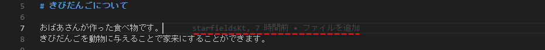

| 表示されたメッセージにマウスカーソルを重ねると、差分やどのコミットで変更されたか等、より詳細な情報がポップアップで表示されます。
| このポップアップからファイル自体の差分などを開くこともできます。

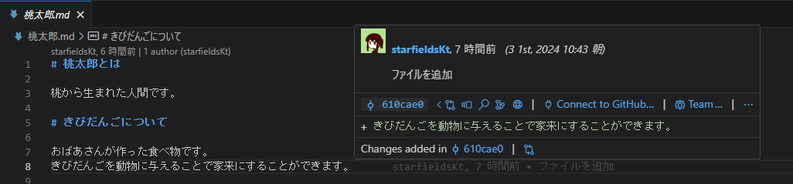

ソース管理タブでの各種情報の確認
-----------------------------------

| GitLensをインストールするとソース管理タブに以下のように様々なビューが追加されます。
| ここで様々な情報を確認したりプッシュやプルなどの操作を行うことが可能です。

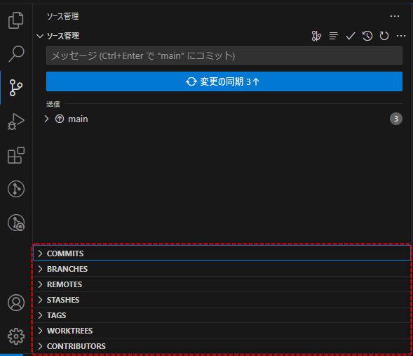

-------------------------------------------------------------------------------

| COMMITSではコミットの履歴を表示できます。
| このタブからブランチの切り替え、プッシュ、プル、フェッチ等の操作を行えます。
| 各コミットで変更のあったファイルすべての差分を表示する機能も便利です。

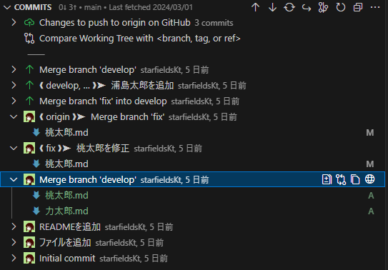

-------------------------------------------------------------------------------

| BRANCHESではローカルのブランチの一覧を表示できます。
| また、ツリー形式で各ブランチのコミット履歴を確認することもできます。
| このタブからブランチの切り替えや新しいブランチの作成も行えます。

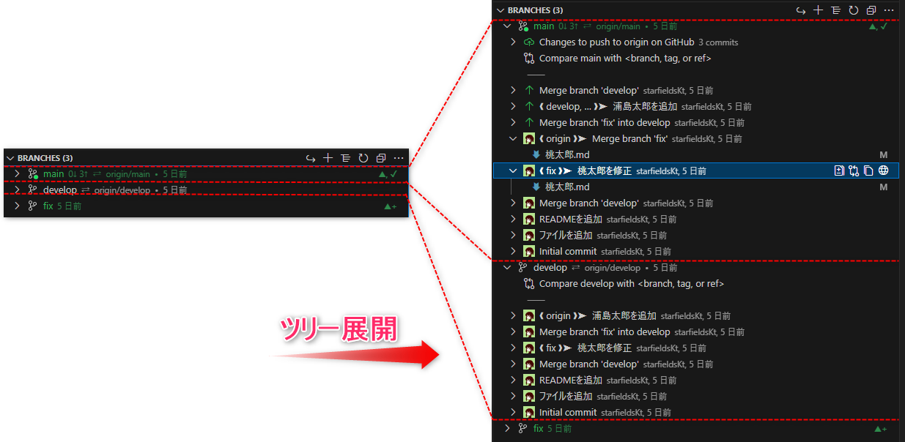

-------------------------------------------------------------------------------

| REMOTESではリモートのブランチの一覧を表示できます。
| BRANCHES同様にブランチのコミット履歴も展開できます。

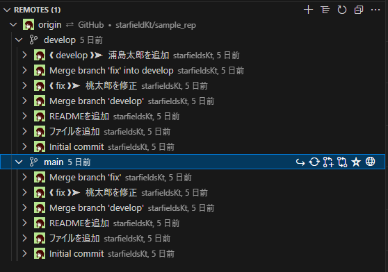

-------------------------------------------------------------------------------

| STASHESではスタッシュの一覧を表示できます。
| このタブからスタッシュの適用や削除などを行うことができます。

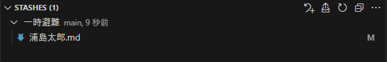

-------------------------------------------------------------------------------

| TAGSではタグの一覧を表示できます。
| ツリーを展開するとそのタグまでのコミット履歴を表示できます。
| このタブからタグの位置へのチェックアウトやタグの削除などを行うことができます。

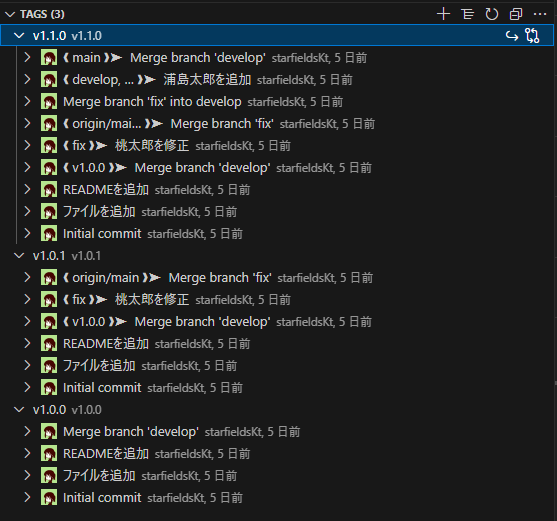
    