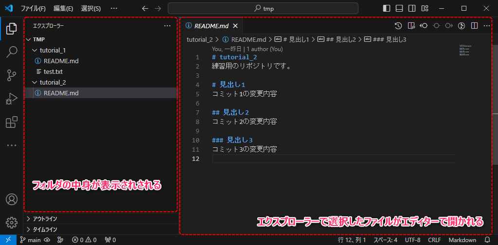
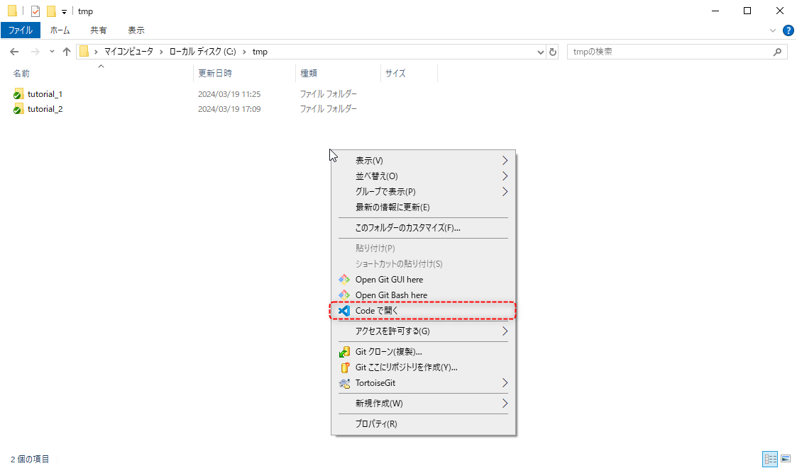
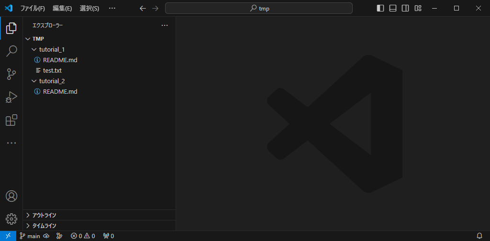
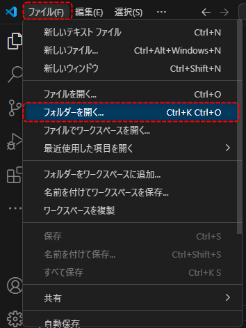
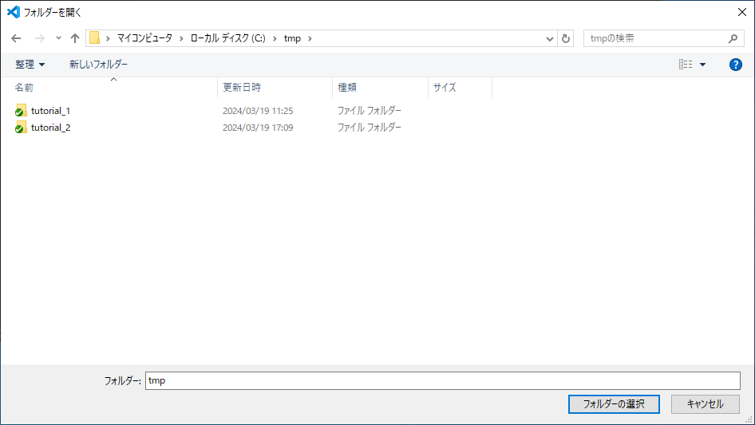
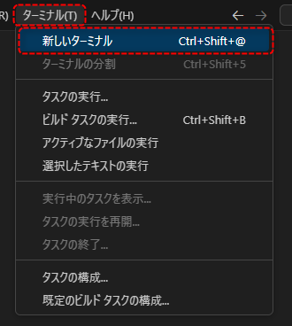
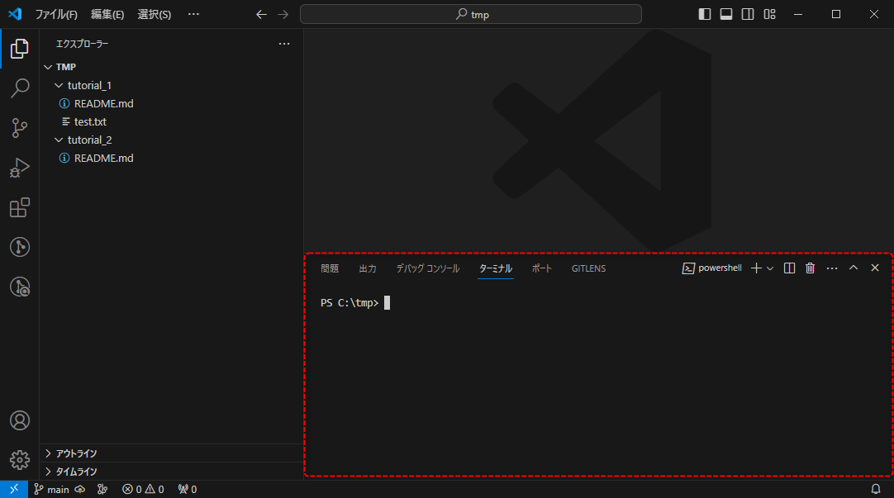
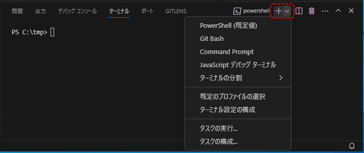
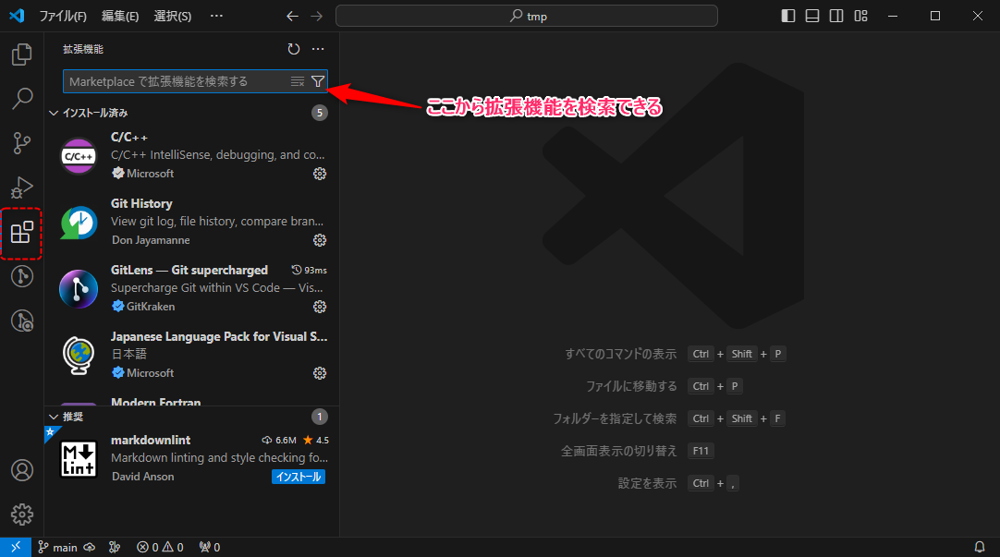
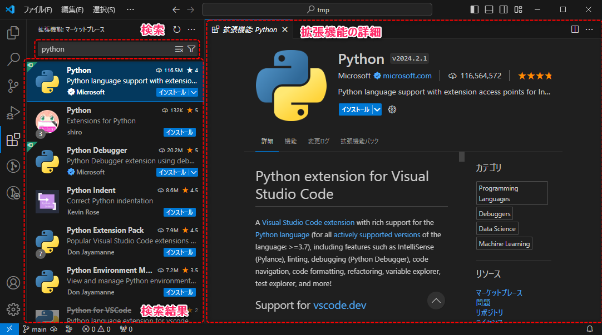

#####################################################################
使い方
#####################################################################

VSCodeは統合開発環境（ :abbr:`IDE (Integrated Development Environment)`）と呼ばれるソフトで、使い方によって様々なことができます。
ここでは基本的な使用方法を覚えましょう。

.. _VScode_フォルダを開く:

**********************************************************************
フォルダを開く
**********************************************************************

| VSCodeでフォルダを開くことで、フォルダ内のファイルをVSCodeで操作したり、簡単にファイルを開いて編集することができます。
| 開発を行う際には基本的にプロジェクトのフォルダをVSCodeで開いてコーディングすることになるかと思います。

| VSCodeで開くとフォルダの中身はサイドパネルのエクスプローラーに表示され、コピー、ペースト、移動、リネーム、新規作成、削除などが行えます。
| エクスプローラーで選択したファイルは右側のエディター画面で開かれ、編集が可能です。ファイルは複数同時に開くこともできます。

開き方はいくつかありますが簡単なものを紹介します。

|
|

右クリックメニューから開く
======================================================================

WindowsのエクスプローラーでVSCodeで開きたいフォルダを開いて、右クリックメニューから :menuselection:`Codeで開く` を選択します。

| 右クリックしたフォルダを開いた状態でVSCodeが立ち上がります。

|
|

VSCodeから開く
======================================================================

VSCodeを起動して :menuselection:`ファイル --> フォルダーを開く` またはショートカットで :kbd:`Ctrl` + :kbd:`K` -->  :kbd:`Ctrl` + :kbd:`O` でダイアログが開くので、開きたいフォルダを指定します。

| 選択したフォルダを開いた状態でVSCodeが立ち上がります。

|
|

**********************************************************************
ターミナルを開く
**********************************************************************

| VSCodeではターミナルという機能を利用してコマンドプロンプトやpowershell、GitBashなどを使用できます。
| 簡単なGitの操作はVSCodeの機能で行い、複雑なオプションなどを指定した操作を行いたい場合はこのターミナルからコマンドラインでGitの操作を行うと便利です。

メニューバーの  :menuselection:`ターミナル --> 新しいターミナル` かショートカットで :kbd:`Ctrl` + :kbd:`Shift` + :kbd:`@` でターミナル開くことができます。

VSCodeで開いているフォルダをカレントディレクトリとして起動してくれるのでとても便利です。

| 恐らくデフォルトではpowershellを開くように設定されていますが、 :guilabel:`+` アイコンのプルダウンメニューからその他のシェルも開くことができます。
| また、既定のプロファイルの選択からその他のシェルをデフォルトに設定することができます。

|
|

**********************************************************************
拡張機能のインストール
**********************************************************************

VSCodeでは多種多様な拡張機能がマーケットプレイスで公開されており、それらをインストールすることで様々な機能を使えるようになります。
拡張機能はエディターでの表示を見やすくするものや、コードを整形してくれる機能、入力補助機能など多岐にわたり、作業効率を高めてくれるものが多いので自分にあったものを探して活用しましょう。

アクティビティーバーの拡張機能アイコンをクリックすると、拡張機能画面がサイドパネルで開きます。
ここの画面でインストール済みの拡張機能の管理や、マーケットプレイスで公開されている拡張機能の検索・インストールを行えます。

拡張機能は検索バーで目当ての拡張機能を検索したら、 :guilabel:`インストール` をクリックするとインストールできます。
検索結果をクリックするとその拡張機能のページで詳細を確認することも可能です。

