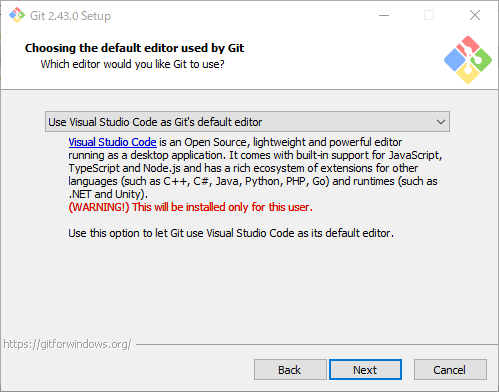
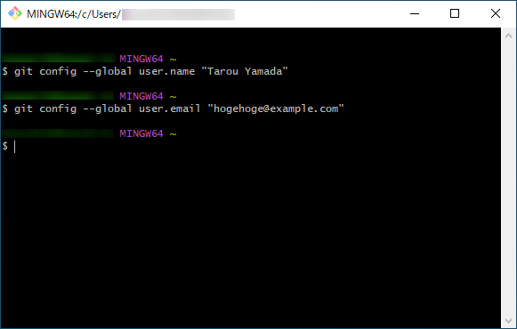

#####################################################################
導入方法
#####################################################################

*********************************************************************
インストーラーの入手
*********************************************************************

まずは以下にアクセスしてインストーラーを入手します。

公式ページ: `git for windows <https://gitforwindows.org/>`_

以下のような画面が表示されるので `Download` をクリックしてインストーラーを入手します。

*********************************************************************
インストール
*********************************************************************

インストーラーの起動
===================================

| ダウンロードしたインストーラーを起動します。
| （ファイル名はバージョンによって異なりますので気にしないでください。）

ライセンス
===================================

ライセンスが表示されるので :menuselection:`Next` をクリックして次にすすみます。

インストール先の指定
===================================

| Gitをインストールする場所を聞かれます。
| :abbr:`デフォルトのまま (こだわりがある場合は変更してください)`  :menuselection:`Next` をクリックして次にすすみます。

コンポーネントの選択
===================================

| インストール時のカスタム設定を聞かれます。
| :abbr:`デフォルトのまま (こだわりがある場合は変更してください)`  :menuselection:`Next` をクリックして次にすすみます。

.. glossary:: 

    Additional Icons
    On the Desktop
        デスクトップにGit Bashのショートカットを作成します。
    
    Windows Explorer Integration
    Git Bash Here
    Git GUI Here
        フォルダで右クリックした時のメニューに「Git Bash Here」と「Git GUI Here」を追加する。
        そのフォルダをカレントディレクトリとしてGit BashとGit GUIを開ける.
    
    Git LFS（Large File Support）
        Git LFS(サイズが大きいファイルを扱うためのもの)をインストールします。

    Associate .git* configration files with the default text editor
        :file:`.git` で始まる名前のファイルをGitのデフォルトのテキストエディタに関連付ける。

    Associate .sh files to be run with Bash
        :file:`.sh` ファイルをGit Bashで実行する。

    Ceck daily for Git for Windows updates
        毎日Git for Windowsの更新を確認する。
    
    Add Git Bash Profile to Windows Terminal
        Windows Terminal(コマンドプロンプトやpowershellをタブで複数開けるターミナル)でGit Bashも開けるようにする。
    
    Scalar (Git add-on to manage large-scale repositories)
        Scalar(大規模なリポジトリの容量最適化やコマンド高速化のためのツール)をインストールする。
    
スタートメニューフォルダーの指定
===================================

| Windowsのスタートメニューに追加するフォルダの名前を聞かれます。
| :abbr:`デフォルトのまま (こだわりがある場合は変更してください)`  :menuselection:`Next` をクリックして次にすすみます。

フォルダを作成したくなければ「Don't create a Start Menu folder」にチェックをいれます。

既定のテキストエディタの選択
===================================

| Gitで使用する既定のテキストエディタを選択します。
| プルダウンメニューから「Use Visual Studio Code as Git's default editor」を選択し :menuselection:`Next` をクリックして次にすすみます。

既定のブランチの名前の指定
===================================

| `git init` を実行した際の初期ブランチの名前を指定します。
| デフォルトでは `master` ですが、GitHub等他の環境ではではデフォルトが `main` なので、「Override the default branch name for new repositories」にチェックを入れて :menuselection:`Next` をクリックして次にすすみます。

テキストボックスの内容が `main` ではない場合は `main` に変更します。

環境変数の設定
===================================

| Gitの機能を他のソフトウェアから使用する際に影響する設定です。
| :abbr:`デフォルトのまま (こだわりがある場合は変更してください)`  :menuselection:`Next` をクリックして次にすすみます。

使用するOpen SSH認証の設定
===================================

| GitでSSHを使用して操作する際に、Gitインストール時に含まれているOpen SSHを使用するか、他のOpen SSHを使用するかを選択します。
| :abbr:`デフォルトのまま (こだわりがある場合は変更してください)`  :menuselection:`Next` をクリックして次にすすみます。

HTTPS接続時の証明書の設定
===================================

| GitでHTTPSを使用して接続する際に使用する証明書の設定です。
| :abbr:`デフォルトのまま (こだわりがある場合は変更してください)`  :menuselection:`Next` をクリックして次にすすみます。

改行コードの扱いの設定
===================================

| リポジトリからファイルを書きだす際やコミット時の改行コードの扱いについて設定します。
| 共同で開発しているチーム等で決まりが無いのであればデフォルトのまま :menuselection:`Next` をクリックして次にすすみます。

使用するコンソールの設定
===================================

| Gitで使用するコンソールを選択します。
| :abbr:`デフォルトのまま (こだわりがある場合は変更してください)`  :menuselection:`Next` をクリックして次にすすみます。

git pullの動作の設定
===================================

| Git pullを行う際のデフォルトの処理を設定します。
| 共同で開発しているチーム等で決まりが無いのであればデフォルトのまま :menuselection:`Next` をクリックして次にすすみます。

認証補助の設定
===================================

| GitHubなど他のサービスと接続する際のGitのユーザー名とパスワードの入力を補助する設定です。
| :abbr:`デフォルトのまま (こだわりがある場合は変更してください)`  :menuselection:`Next` をクリックして次にすすみます。

追加オプションの設定
===================================

| 追加のオプションを指定します。
| :abbr:`デフォルトのまま (こだわりがある場合は変更してください)`  :menuselection:`Next` をクリックして次にすすみます。

試験的な追加オプションの設定
===================================

| 試験的な追加のオプションを指定します。
| :abbr:`デフォルトのまま (こだわりがある場合は変更してください)`  :menuselection:`Install` をクリックしてインストールを開始します。

インストールの完了
===================================

| 以下の画面が表示されたらGitのインストールは完了です。
| 「View Release Note」のチェックをはずして :menuselection:`Finish` をクリックしインストーラーを終了させます。

動作確認
===================================

| 問題なくインストールできたか確認を行います。
| :menuselection:`Windowsのスタートメニュー --> Git --> Git Bash` からコンソールを開きます。
| Git BashとはWindows環境で動くように作られたGit用のBash（Unix系OS版のコマンドプロンプトのようなもの）です。

起動したら以下のような画面が開きます。

画面が表示されたら以下のコマンドを入力して :kbd:`Enter` キーを押して実行します。
Git Bashでは貼り付けは:kbd:`マウスホイール` のクリックか :kbd:`Shift + Insert` で行えます。

.. code-block:: bash

    git --version

以下のようにGitのバージョンが表示されれば動作確認完了です。

*********************************************************************
ユーザー名とEmailアドレスの設定
*********************************************************************

Gitではコミットする際にユーザー名とメールアドレスを記録するので、それに使われるものをGitに登録しましょう。

| まずは :menuselection:`Windowsのスタートメニュー --> Git --> Git Bash` からコンソールを開きます。

起動したら以下のコマンドを実行し、ユーザー名・メールアドレスを登録します。

.. code-block:: bash

    git config --global user.name "ユーザー名"

.. code-block:: bash

    git config --global user.email "メールアドレス"

    

