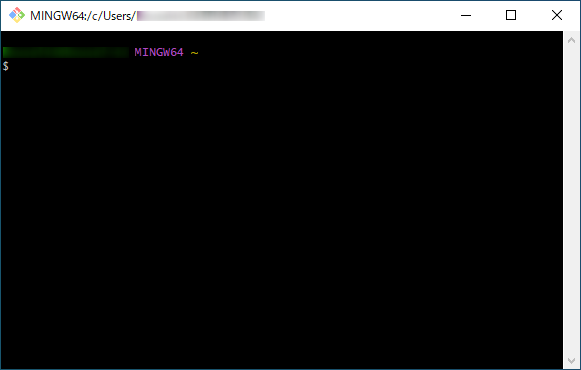
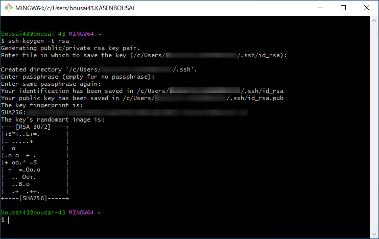
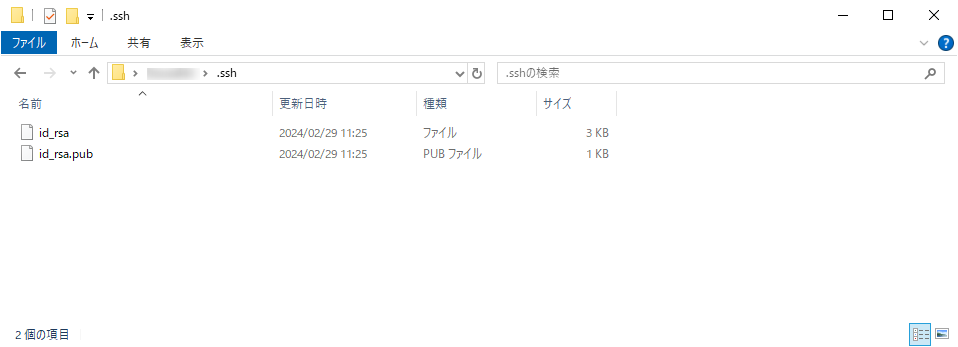

#####################################################################
SSHを使用した通信の準備
#####################################################################

| Gitを使用して自分のPCとGitHubとで通信を行うための準備をします。
| GitHubで使用できる通信規格はHTTPS形式などもありますが、SSH形式での認証の方が一般的に安全と言われており、いちいちパスワード等を入力する手間がないのでこの記事ではSSH使用を前提ですすめます。

.. note:: 
    Gitのインストールは済ませておいてください。

    :doc:`01` 

*********************************************************************
秘密鍵と公開鍵を作る
*********************************************************************

| 秘密鍵と公開鍵はSSH認証の際につかうものですペアでないと認証ができません。
| 名前のとおり、公開鍵は認証先（GitHubなど）に公開（登録）しますが、秘密鍵は絶対に他人に教えないでください。

作成はGit Bashから行います。

 :menuselection:`Windowsのスタートメニュー --> Git --> Git Bash` からコンソールを開きます。

Git Bashで以下のコマンドを実行します。

.. code-block:: 

    ssh-keygen -t rsa

| 実行すると何回か :kbd:`Enter` を押すよう求められるので押していきます。
| 以下のような表示になれば作成完了です。

デフォルトではユーザーフォルダに :file:`.ssh` というフォルダが作成され、その中に秘密鍵と公開鍵が作成されます。

- 秘密鍵: :file:`id_rsa`
- 公開鍵: :file:`id_rsa.pub`

この公開鍵は後でGitHubでSSHの設定をする際に使用するので場所を覚えておきましょう。

