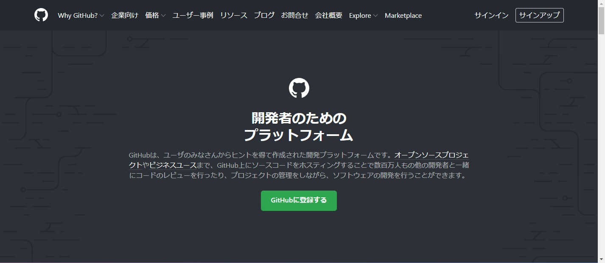
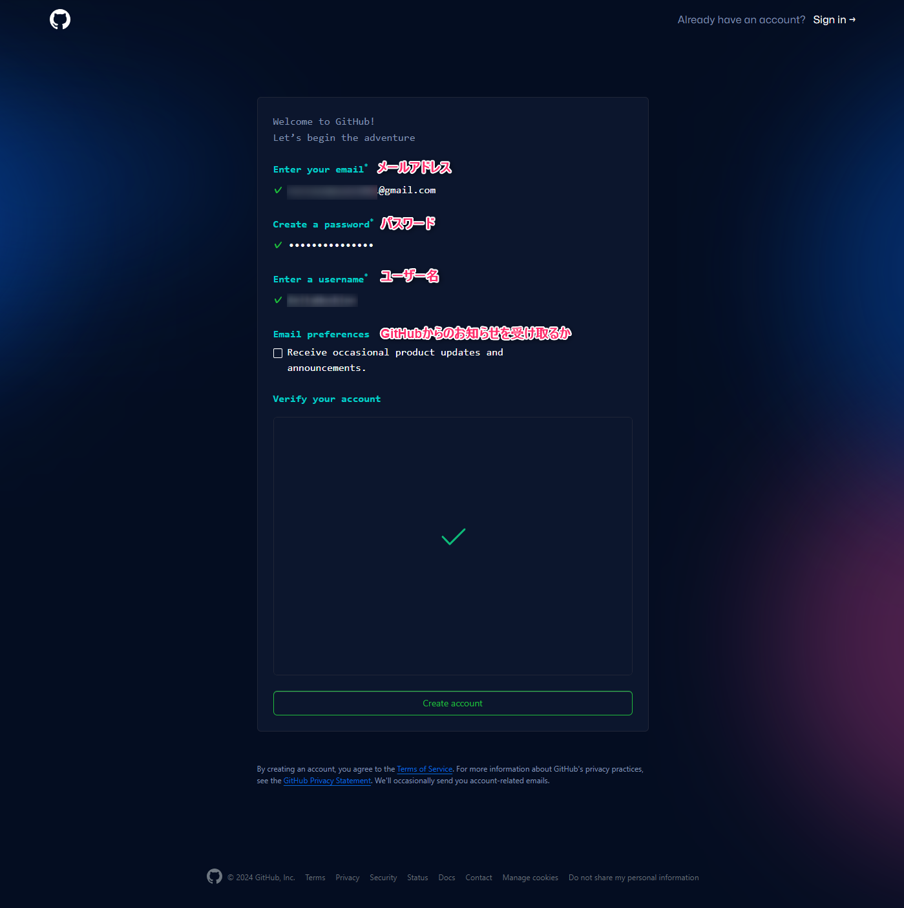
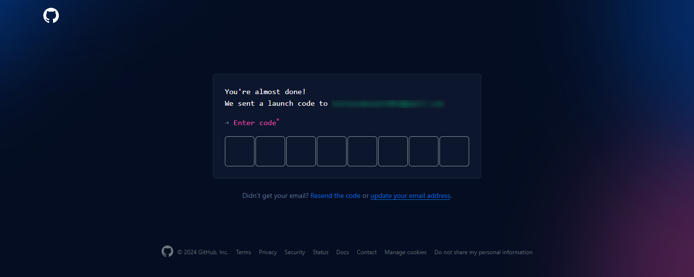

#####################################################################
GitHubのアカウント作成
#####################################################################

`GitHub <https://github.co.jp/>`_ に登録してアカウントを作成しましょう。

GitHub: https://github.co.jp/

.. warning:: 
    この記事の情報は2024年2月時点のものです。

| まずは `GitHub <https://github.co.jp/>`_ にアクセスします。
| 「GitHubに登録する」のリンクからアカウントの登録を行えます。

必用な情報を入力し「Create account」をクリックしてアカウントを作成します。

| 入力したメールアドレスに認証コードが送られてくるので入力します。
| コードはコピぺでも入力できます。

    
| 色々と聞かれますが、「Skip personalization」でスキップして問題ありません。

これでアカウント作成は完了です。