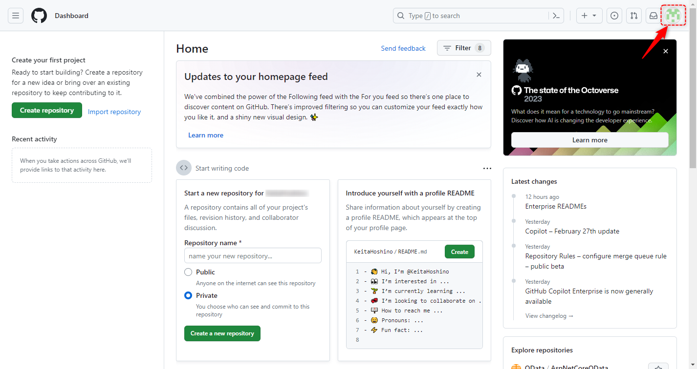
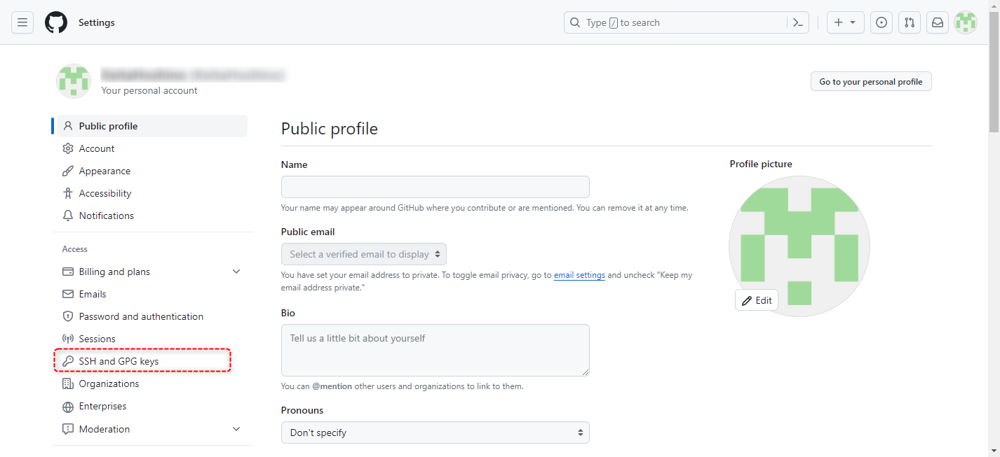
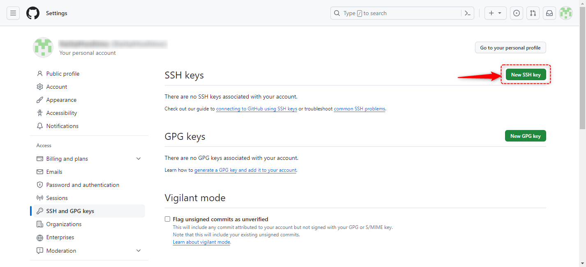
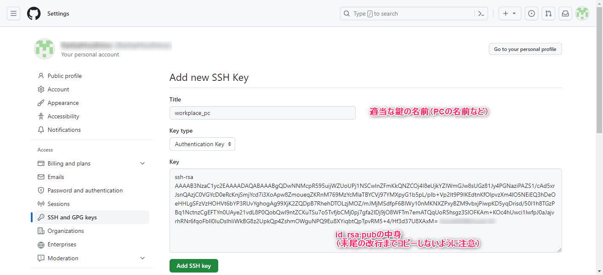
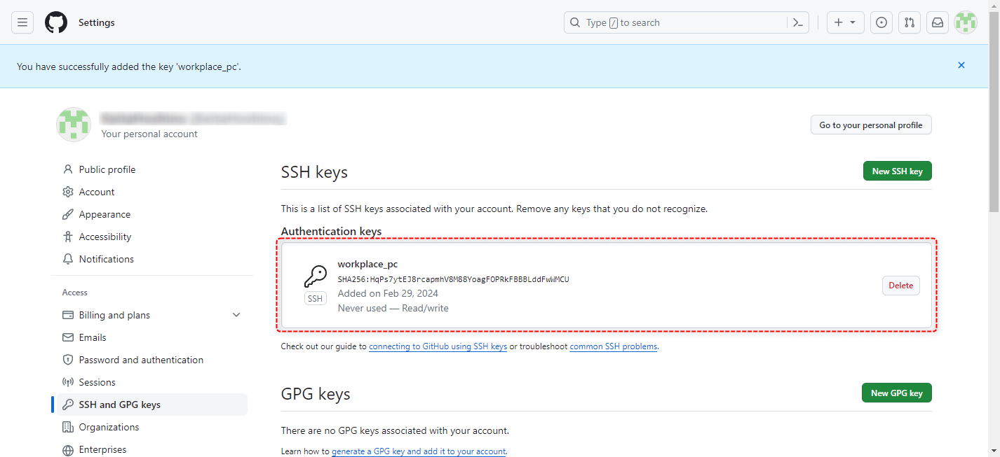

#####################################################################
SSHを使用した通信の準備
#####################################################################

| GitHubにSSH通信するための公開鍵を登録します。
| SSHの公開鍵と秘密鍵は :doc:`../02/02` で作成したものを使いますので作成をしておいてください。

まずは `GitHub <https://github.co.jp/>`_ にアクセスしてログインします。

GitHub: https://github.co.jp/

画面右上のアイコンをクリックするとメニューが表示されるので「 `Settings <https://github.com/settings>`_ 」から設定画面を開きます。

設定画面を開いたら左側の「 `SSH and GPG keys <https://github.com/settings/keys>`_ 」というリンクから公開鍵の設定画面を開きます。

「New SSH key」をクリックしてSSHの公開鍵の登録画面を開きます。

SSHの公開鍵の情報入力画面が表示されるので入力して「Add SSH key」をクリックして公開鍵を登録します。

.. glossary:: 
    
    Title
        公開鍵を識別できるように適当な名前を入力します。
        使用しているPCの名前などでよいと思います。
    
    Key
        :doc:`../02/02` で作成した公開鍵（ :file:`id_rsa.pub` ）の中身をそのままコピペします。
        :file:`id_rsa.pub` は :menuselection:`右クリック --> Codeで開く` でVSCodeで開けます。
        末尾の改行までコピペしないように気をつけましょう。
        
        .. figure:: image/02/060.png

公開鍵を登録できたら以下のような画面が表示されます。

