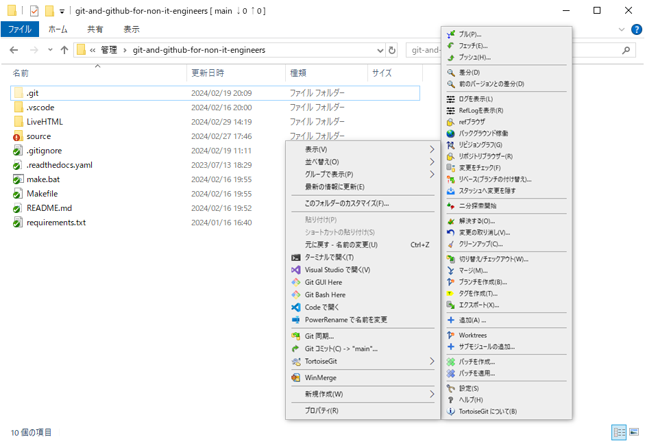

#####################################################################
TortoiseGit
#####################################################################

Gitのクライアントツールです。

| 本来コマンドで操作するGitをマウスなどで簡単に操作できるようにするツールです。
| Gitで管理しているフォルダやファイルのアイコンを分かりやすく表示してくれたり、右クリックメニューからリポジトリの作成やリポジトリのクローンなどが出来るようになるので便利です。

.. toctree:: 
    :maxdepth: 1

    04/01
    04/02