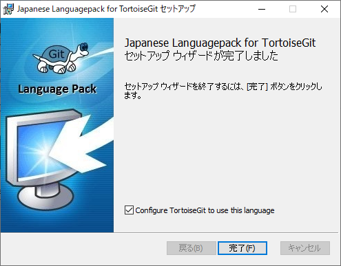

#####################################################################
導入方法
#####################################################################

*********************************************************************
インストーラーと日本語言語パックの入手
*********************************************************************

`TortoiseGitの公式サイト <https://tortoisegit.org/>`_ にアクセスしてインストーラーを入手します。

TortoiseGitの公式サイト: https://tortoisegit.org/

トップページの「Download」からダウンロードページに進みます。

ダウンロードページの「for 64-bit Windows」と書いてあるインストーラーを入手します。

ダウンロードページの下部には各言語の言語パックへのリンクがあるので、「Japanese」の行の64-Bitの言語パックのインストーラーを入手します。

*********************************************************************
インストール
*********************************************************************

インストーラーの起動
===================================
ダウンロードしたインストーラーを起動して :menuselection:`Next` をクリックして次に進みます。
ファイル名はバージョンによって異なります。

利用規約
===================================

利用規約が表示されるので :menuselection:`Next` をクリックして次にすすみます。

SSHクライアントの選択
===================================

| TortoiseGitでSSH通信を行う際に使用するSSHクライアントを選択します。
| デフォルトのまま :menuselection:`Next` をクリックして次にすすみます。

インストールフォルダの選択
===================================

| インストールするフォルダを選択します。
| デフォルトのまま :menuselection:`Next` をクリックして次にすすみます。

インストール実行
===================================

| インストールしていいか聞かれるので、 :menuselection:`Install` をクリックしてインストールを開始します。

インストール完了
===================================

| インストールが完了すると以下の画面が表示されます。
|  「Run first start wizard」のチェックを外して :menuselection:`Finish` をクリックしてインストール完了です。

*********************************************************************
日本語言語パックのインストール
*********************************************************************

言語パックインストーラーの起動・インストール
=============================================

冒頭でダウンロードした日本語の言語パックインストーラーを起動して :menuselection:`次へ` をクリックして言語パックをインストールします。

インストール完了
===================================

言語パックがインストールされると以下の画面が表示されるので、「Configure TortoiseGit to use this language」にチェックを入れて :menuselection:`完了` をクリックしてインストーラーを終了します。

日本語化されているか確認
===================================

適当なフォルダーで右クリックをしてTortoiseGitの操作が日本語で表示されていれば成功です。

