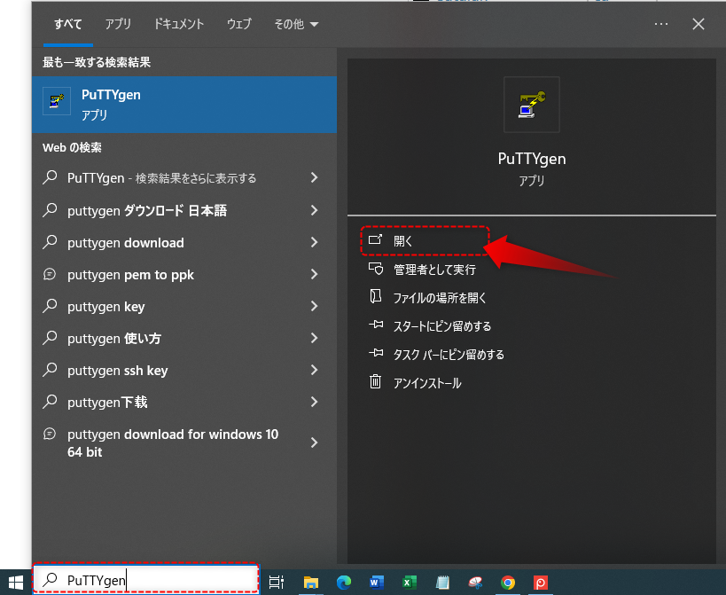
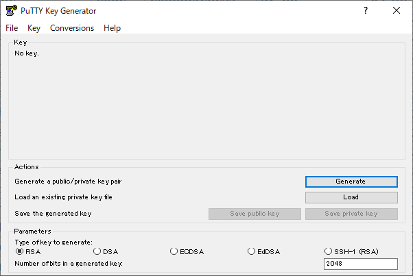
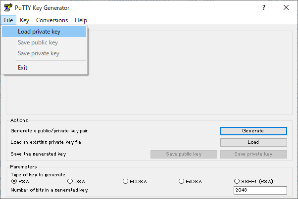
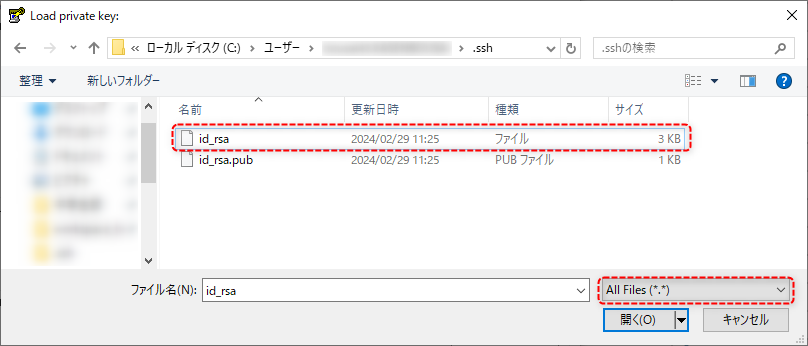
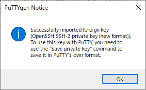
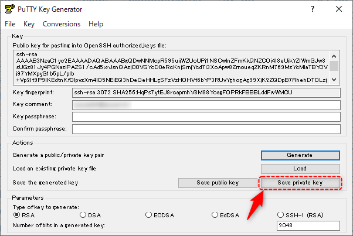
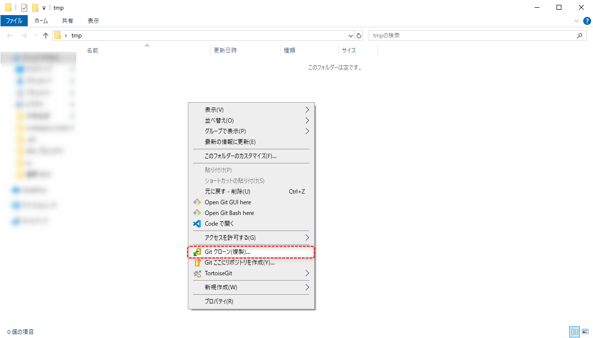
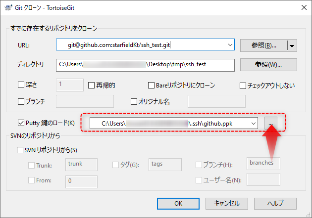
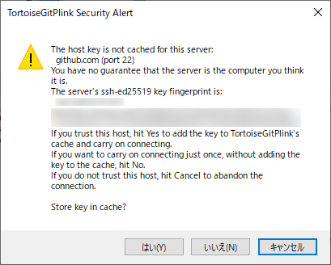
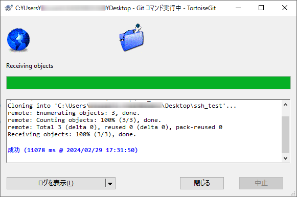

#####################################################################
SSHを使用した通信の準備
#####################################################################

| TortoiseGitでSSH通信を行うための準備をします。
| SSHの公開鍵と秘密鍵は :doc:`../02/02` で作成したものを使いますが、TortoiseGitで使用するSSHクライアントのために秘密鍵を変換する必要があります。

*********************************************************************
秘密鍵の変換
*********************************************************************

PuTTYgen.exeの起動
===================================

秘密鍵を変換するのにはTortoiseGitをインストールした際に同梱されている :file:`PuTTYgen.exe` を使用します。

Windowsのタスクバーにある検索ボックスに「PuTTYgen」と入力してPuTTYgen.exeを起動します。

秘密鍵の読み込み
===================================

:menuselection:`File --> Load private key` から変換する秘密鍵( :doc:`../02/02` で作成した :file:`id_rsa` )を読み込みます。

ファイル選択ダイアログではデフォルトで対象のファイルが「PuTTY Private Key Files(\*.ppk)」になっていて :file:`id_rsa` が見つからないので「All Files(\*,\*)」にしましょう。

読み込むとポップアップが出てくるので :menuselection:`OK` をクリックして閉じます。

秘密鍵の変換
===================================

「Save private key」をクリックして秘密鍵を任意の名前で :file:`.ppk` 形式で保存します。
保存先は :file:`id_rsa` と同じ :file:`.ssh` にして名前は :file:`github.ppk` などでよいと思います。

ファイルが保存されているのを確認したらPuTTYgen.exeは終了します。

*********************************************************************
TortoiseGitへの秘密鍵登録と動作確認
*********************************************************************

TortoiseGitに作成した秘密鍵を登録して、同時にGitHubとSSH通信できるかを確認します。

| どこか適当なフォルダで :menuselection:`右クリック --> Git クローン(複製)` からTortoiseGitを呼び出します。

画面が表示されたら以下の情報を入力して :menuselection:`OK` をクリックします。

.. glossary:: 
    URL
        以下を入力してください。

        .. code-block:: none
        
            git@github.com:starfieldKt/ssh_test.git
    
    Putty鍵のロード
        先ほど作成した :file:`github.ppk` を選択します。

警告が表示された場合は :menuselection:`はい` をクリックします。

以下のように「成功」と表示されていれば無事SSHの設定が完了しています。

作成された :file:`ssh_test` フォルダはいらないので消しましょう。

