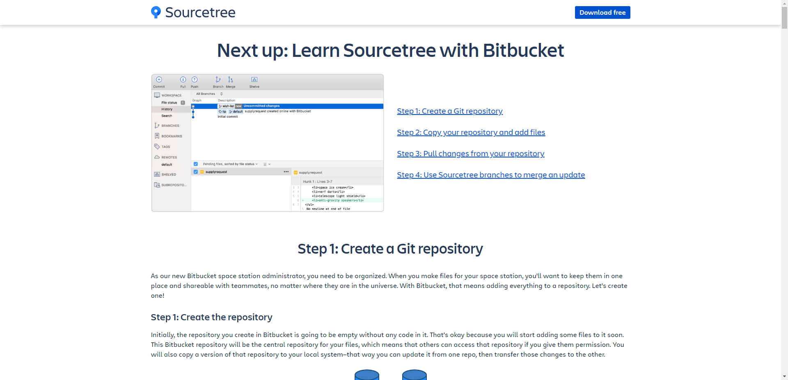

#####################################################################
導入方法
#####################################################################

*********************************************************************
インストーラーの入手
*********************************************************************

`Source Treeの公式サイト <https://www.sourcetreeapp.com/>` にアクセスします。

Source Tree: https://www.sourcetreeapp.com/

「Download for Windows」をクリックするとライセンスと利用規約を読むようにポップアップが出てくるので、「I agree to the Atlassian Software License Agreement and Privacy Policy.」にチェックを入れて :menuselection:`Download` をクリックします。

チュートリアルのページに飛ばされダウンロードが開始されます。

*********************************************************************
インストール
*********************************************************************

インストーラーの起動
===================================

ダウンロードしたインストーラーを起動します。

Bitbucketアカウントの紐付け
===================================

本稿では使用予定がないので :menuselection:`スキップ` をクリックして項目をスキップします。
（使いたい場合は後からでも連携できます。）

インストールするツールの選択
===================================

| Mercurialは本稿では使用しないのでチェックを外して :menuselection:`次へ` をクリックします。
| Gitは前項で既にインストール済みなので下記のように表示されていると思います。

ユーザー名とメールアドレスの入力
===================================

| コミット等をする時に使うユーザー名とメールアドレスを入力します。
| 前項で既にGitをインストール済みなので自動で入力されていると思います。
| 入力したら :menuselection:`次へ` をクリックします。

SSHキーの読み込み
===================================

以下のようなポップアップが表示されるので、 :menuselection:`はい` をクリックして、「 :doc:`../04/02` 」で作成した :file:`github.ppk` を選択します。

インストール完了
===================================

インストールが完了してSource Treeが立ち上がります。

