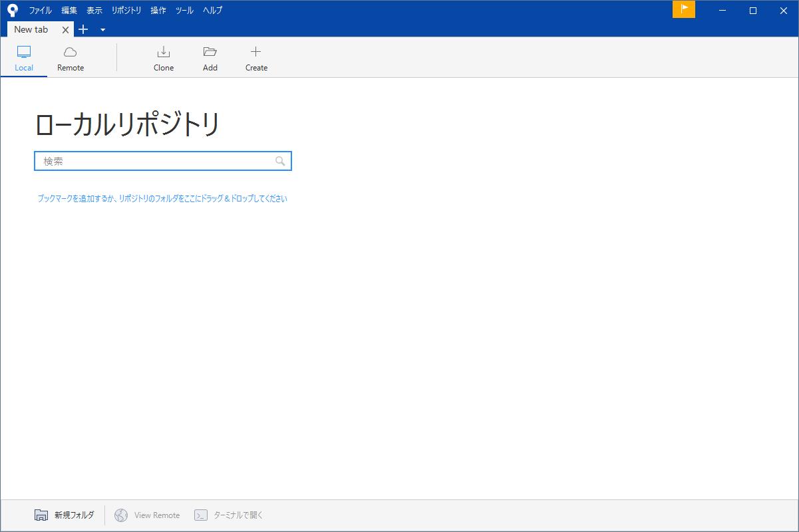
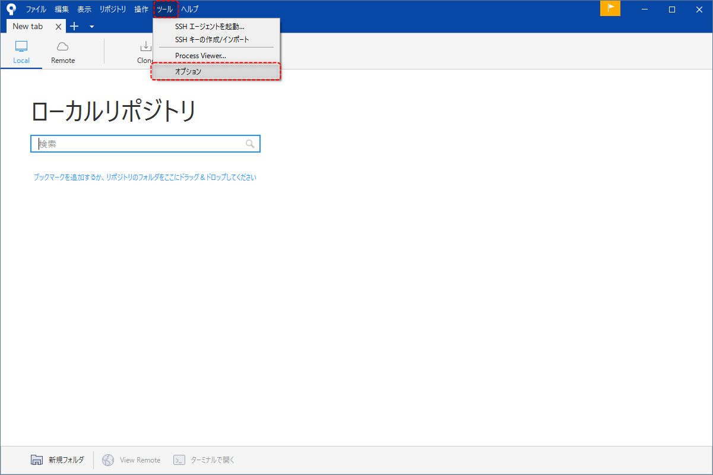
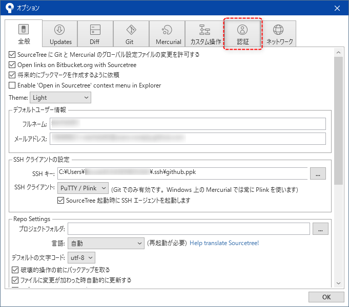
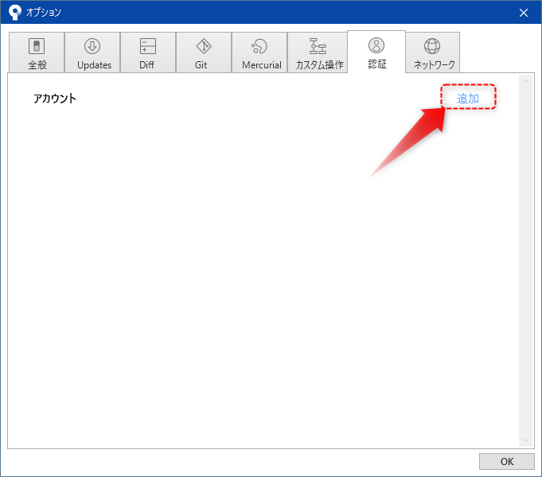
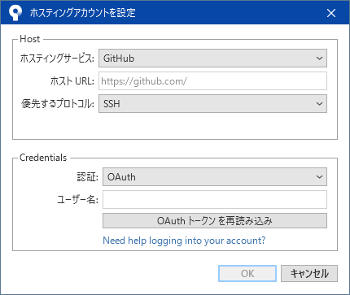
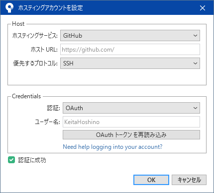

#####################################################################
GitHubとの連携
#####################################################################

Source TreeとGitHubを連携させます。

Source Tree上でGitHub上のリポジトリ一覧を表示してクローンしたりできるので便利です。

まずはSource Treeを起動します。

:menuselection:`ツール --> オプション` から設定画面を開きます。

設定画面で「認証」タブを選択します。

認証タブの「追加」をクリックします。

「ホスティングアカウントを設定」というダイアログが現れるので、以下のように設定して :menuselection:`OAuth トークンを再読み込み` をクリックします。

.. glossary:: 
    
    ホスティングサービス
        「GitHub」を選択

    優先するプロトコル
        「SSH」を選択

するとwebブラウザが立ち上がりGitHubにログインしていると以下のような画面が表示されるので :menuselection:`Authorize atlassian` をクリックします。

GitHubのパスワードを求められるので入力して :menuselection:`Confirm` をクリックします。

.. warning:: 

        GitHubで設定している認証方法によってはここの認証方法は異なります。

認証に成功するとブラウザが自動で閉じて先ほどのダイアログに「認証に成功」と表示されるので :menuselection:`OK` を押します。

| 追加されたアカウントが設定画面の認証タブに表示されているはずです。
| 確認したら :menuselection:`OK` をクリックして設定画面を閉じます。

