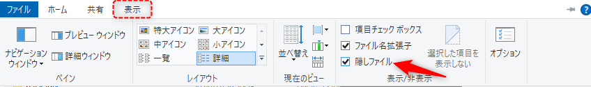

######################################################################
インストールしたSource Treeが見つからない場合
######################################################################

そういった場合は以下の場所を探してみてください。

.. code-block:: none

   C:\Users\ユーザー名\AppData\Local\SourceTree

:file:`AppData` は隠しフォルダになっているのでご注意ください。隠しフォルダを表示するにはエクスプローラーの :guilabel:`表示` タブで「隠しファイル」にチェックを入れます。

上記フォルダに入っている :file:`SourceTree.exe` を起動するとSource Treeが起動します。
デスクトップやスタートメニューにショートカットを作成しておくと次回以降起動が楽になります。

