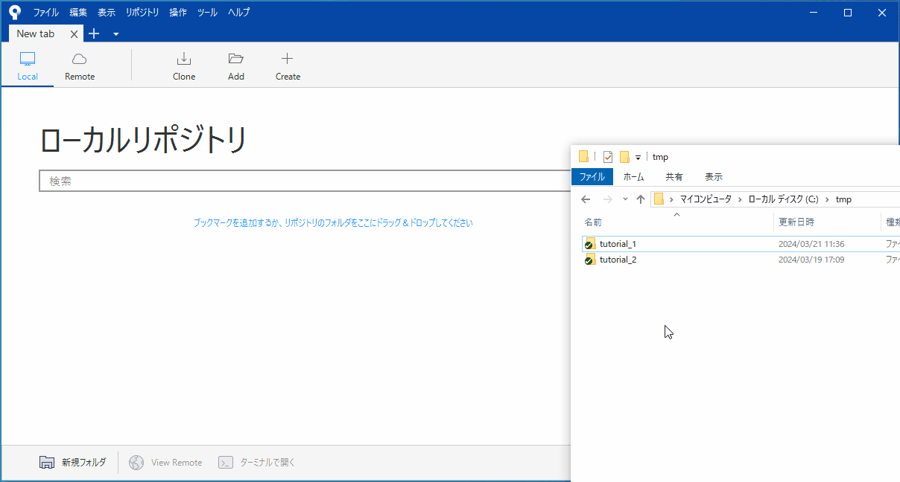

######################################################################
使い方
######################################################################

Source Treeの基本的な使い方を説明します。
細かい操作については :doc:`../../04/02` を御覧ください。

**********************************************************************
ローカルリポジトリを開く
**********************************************************************

Source Treeを起動して新しいタブを開きます。

タブ上部のフォルダのアイコンの :guilabel:`Add` をクリックして、ローカルリポジトリの場所と名前を入力して :guilabel:`追加` からローカルリポジトリを開きます。

Source Treeでローカルリポジトリを開くことができました。

|
|

**********************************************************************
ローカルリポジトリを開く（フォルダをドラッグアンドドロップ）
**********************************************************************

Source Treeを起動して新しいタブを開きます。

ローカルリポジトリのあるフォルダをSource Treeの画面にドラッグアンドドロップで追加して、追加されたブックマークをダブルクリックで開くことができます。

|
|

.. _リモートリポジトリをクローン:

**********************************************************************
リモートリポジトリをクローン
**********************************************************************

Source Treeを起動して新しいタブを開きます。

タブ上部の :guilabel:`Clone` をクリックして、リモートリポジトリのアドレス、ローカルリポジトリを保存する場所、名前を入力して :guilabel:`クローン` でクローンを実行します。

クローンされたローカルリポジトリがSource Treeで開きます。

|
|

**********************************************************************
リモートリポジトリをクローン（GitHubと連携している場合）
**********************************************************************

Source Treeを起動して新しいタブを開きます。

タブ上部の :guilabel:`Remote` をクリックするとSource Treeと連携させているGitHubのアカウントのリポジトリが表示されるので、クローンしたいリポジトリの横に表示されている :guilabel:`Clone` をクリックします。

するとリモートリポジトリのアドレスが入力された状態でClone画面が開くので、ローカルリポジトリを保存する場所、名前を入力して :guilabel:`クローン` でクローンを実行します。

クローンされたローカルリポジトリがSource Treeで開きます。

|
|

**********************************************************************
新規ローカルリポジトリを作成
**********************************************************************

Source Treeを起動します。

---------------------------------------------------------------------

「Create」タブを開いてリポジトリを作成したいディレクトリを指定して :menuselection:`作成` ボタンをクリックします。

.. figure:: ../../04/02/image/01/180.png

---------------------------------------------------------------------

画面が切り替わります。

---------------------------------------------------------------------

フォルダに :file:`.git` (リポジトリ)が作成されました。

.. figure:: ../../04/02/image/01/050.png