#####################################################################
ローカルリポジトリのみを用いたファイル管理
#####################################################################

ローカルリポジトリを新規に作成してファイルの管理を行う方法です。

| 個人で、しかもローカル環境だけでのバージョン管理として使用したいのであれば難しいことはありません。
| 個人的なプログラムの開発だけならこれでも充分です。リモートとローカル両方で管理したくなった場合あとからリモートの環境を追加することも可能です。

| 管理を始めるには
| :menuselection:`リポジトリを作成 --> 管理したいファイルを追加 --> コミット` 

| 普段の作業は以下の作業の繰り返しです。
| :menuselection:`ファイルを編集 --> 区切りのいいところでコミット` 

*********************************************************************
管理を始める
*********************************************************************

リポジトリを作成
=====================================================================

| まずはじめにGitで管理したい作業ディレクトリを作成しましょう。
| 任意の場所にフォルダを作成してエクスプローラーで開きます。

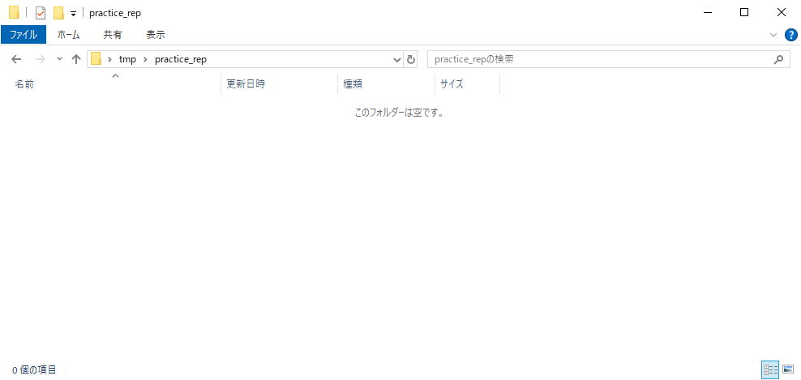

---------------------------------------------------------------------

フォルダを開いたら、フォルダの余白部分を右クックして、右クリックメニューの :menuselection:`Git ここにリポジトリを作成` を選択します。

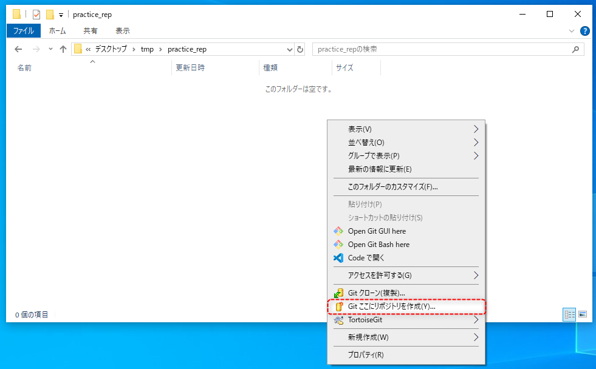

---------------------------------------------------------------------

TortoiseGitのダイアログがるので「Bareを生成(作業ディレクトリをつくりません)」のチェックを外して :menuselection:`OK` を選択します。

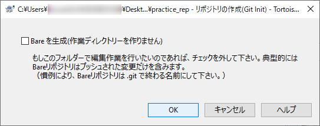

---------------------------------------------------------------------

メッセージが表示されるので :menuselection:`OK` を選択します。

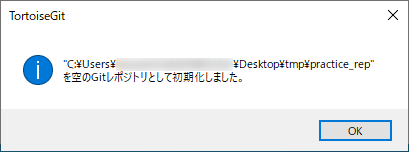

---------------------------------------------------------------------

| フォルダに :file:`.git` が作成されました。
| これでこのフォルダ( :file:`practice_rep` )はローカルリポジトリとしてGitで管理できるようになりました。

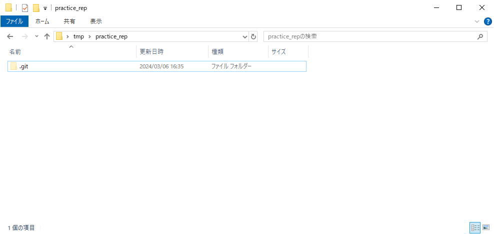

管理したいファイルを追加
=====================================================================

| リポジトリを作成できたので、さっそく管理対象のファイルを追加していきましょう。
| 追加したいファイルを先ほどのフォルダ( :file:`practice_rep` )に追加します。

コミット（ファイルを追跡できるようにする）
=====================================================================

| 作業ディレクトリにファイルを追加しましたが、この段階では追加したファイルはまだGitで追跡されていません。
| ファイルを追加したことをコミットしてリポジトリに登録します。

今回の操作はVSCodeを用いて行います。

まず、エクスプローラーで開いている :file:`practice_rep` で、右クリックメニューの :menuselection:`Code で開く` を選択します。

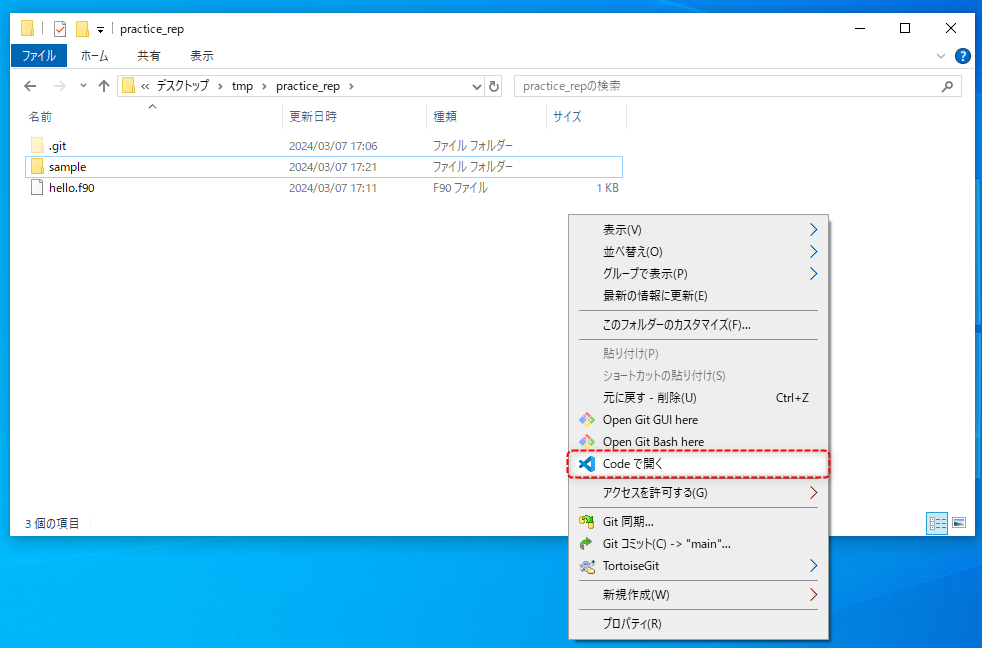

---------------------------------------------------------------------

| VSCodeが起動します。
| このようにVSCodeで作業したいフォルダで右クリックメニューからVSCodeを起動すると、簡単に作業を進められます。

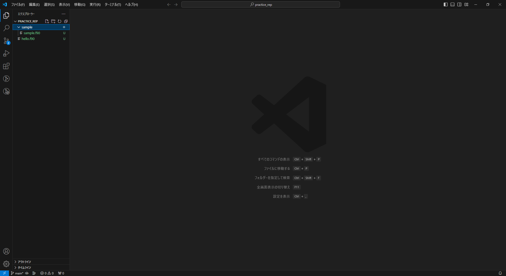

---------------------------------------------------------------------

| VSCodeが起動したらアクティビティバーからソース管理タブを開きます。
| このソース管理タブからコミットなどの操作を行えます。

| ソース管理タブを開くと「変更」ビュー内に先ほど追加したファイル名があります。ここには直近のコミットの状況から変更（追加、削除、移動も含む）があったファイルが表示される場所です。

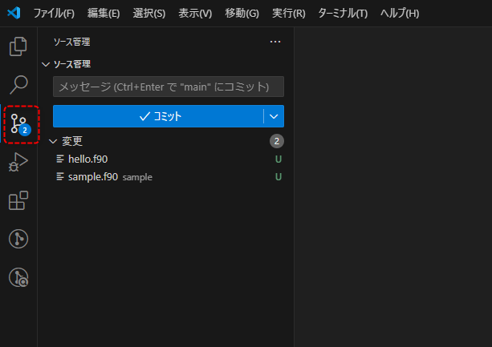

---------------------------------------------------------------------

コミットを行うにはまず、コミットする対象をステージング(add)する必要があります。

変更ビューに表示されているファイル名にカーソルを重ねると、右側にいくつかアイコンが表示され、 :menuselection:`+` アイコンをクリックすることでそのファイルをステージングすることができます。

コミットしたいファイルをステージングしましょう。

:menuselection:`+` アイコンをクリックすると、ファイルは :file:`ステージされている変更` に移動します。

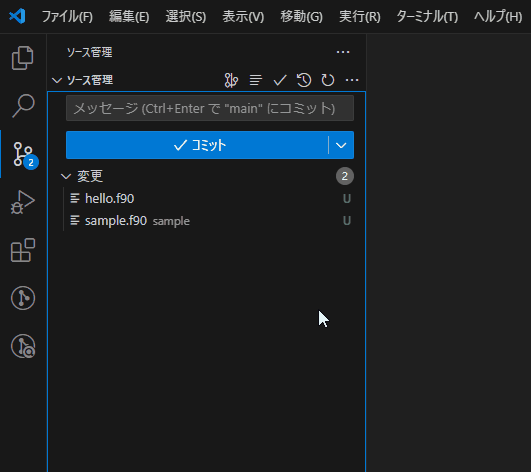

---------------------------------------------------------------------

コミットしたいファイルをステージングしたら、ソース管理タブの上部にあるテキストボックスにコミットする際のメッセージを記入します。

この時のメッセージは自分が見ても他人が見ても、何をしたのかわかるようなメッセージにすることを心がけましょう。

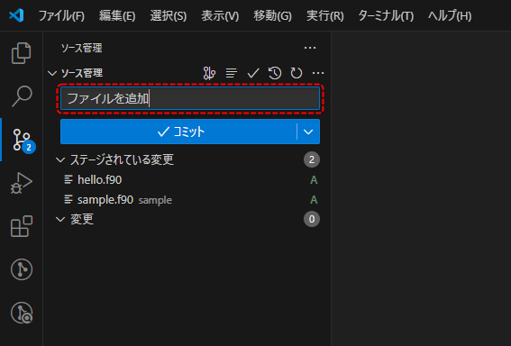

| メッセージを入力してテキストボックスの下の :menuselection:`コミット` をクリックすればコミット完了です。
| これで追加したファイルがGitで変更を追跡出来るようになりました。

*********************************************************************
普段の作業
*********************************************************************

リポジトリの用意さえできてしまえば、あとはファイルを更新してコミットの繰り返しです。

ファイルの更新（追加、変更、削除）
=====================================================================

リポジトリを作成し、管理したいファイルを追加してコミットしたら、作業ディレクトリでファイルの更新を行っていきます。
VSCodeを使用してファイルを編集してみましょう。

| まずは作業ディレクトリをVSCodeで開きます。
| アクティビティバーのエクスプローラータブでファイルを選択するとエディターにファイルの内容が表示されます。

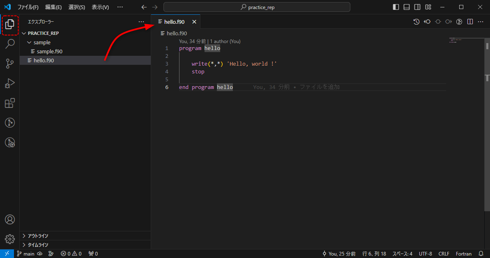

そのままエディターでファイルを編集して保存( :kbd:`Ctrl` + :kbd:`s` )します。

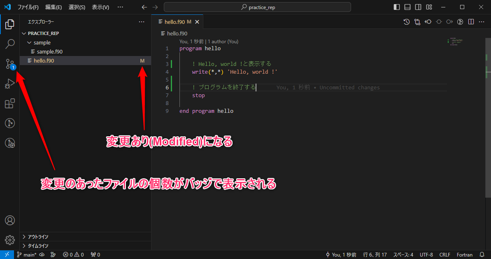

コミット
=====================================================================

| ファイルを更新したら更新の内容をコミットしてリポジトリに記録しましょう。
| 前項でもやりましたが、コミットするにはステージングが必要です。
| :menuselection:`ファイルの更新 --> ステージング --> コミット` これが基本です。

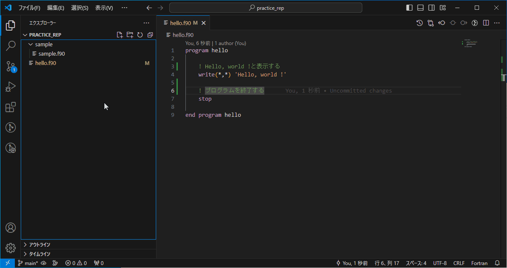