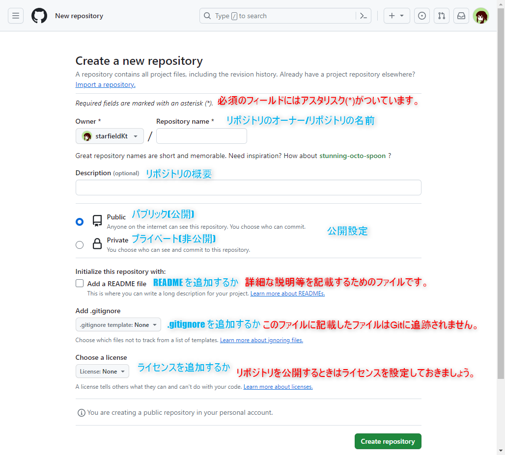
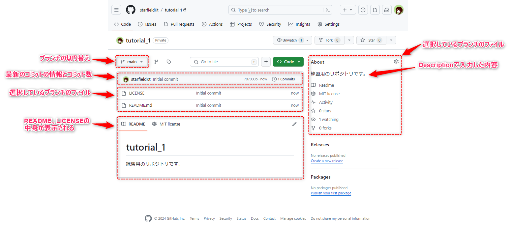
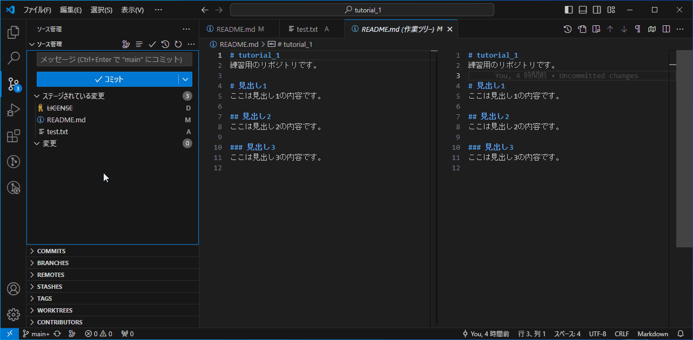

#####################################################################
Git、GitHubを用いたファイル管理
#####################################################################

今回作成したこの記事において、基本となる操作の実践編です。
リモートリポジトリはGitHubに作成して管理を行います。

作業の流れは :doc:`../../02/05` と同じです。

1. 開発するプロジェクトの中心となるリポジトリをリモートサーバー等に作成する。（プロジェクト毎に初回のみ）
2. ステップ1で作成したリポジトリをローカル（自分のPC）に複製する。（ユーザー・PC毎に初回のみ）
3. ファイルの編集・追加・削除
4. ローカルリポジトリに変更内容を記録
5. リモートの変更内容をローカルに反映させる （このページでは行いません）
6. ローカルの変更内容をリモートのリポジトリに反映させる

.. figure:: ../../02/image/05/010.png
    :width: 60%

.. caution::
   このチュートリアルは極めて基本的な操作によるものです。
   実際にGitを使ってファイルを管理する際は作業用ブランチの作成などをすることが一般的だと思いますがここでは行いません。そのような操作は個別に作成しているのでそちらのページを参照してください。

|
|

**********************************************************************
1 GitHubにリモートリポジトリを作成
**********************************************************************

まずは `GitHub <https://github.com/>`_ にリモートリポジトリを作成しましょう。

VScodeやSourceTreeなどのGitクライアントでGitHubと連携するとクライアント上でリモートリポジトリの作成などもできますが、今回はWebブラウザでGitHubにアクセスしてリポジトリを作成します。

.. figure:: ../../02/image/05/020.png
    :width: 60%

|
|

1-1 GitHubにアクセス
======================================================================

最初に `GitHub`_ にログインしましょう。

GitHub: https://github.com/

| ログイン方法は設定している認証方法によってまちまちだと思うので省略します。

|
|

1-2 新規リポジトリ作成
======================================================================

| ログインをするとダッシュボードが表示された状況になると思います。右上にある :guilabel:`+` ボタンをクリックすると新規作成メニューが開くので :guilabel:`New repository` をクリックして新規リポジトリ作成画面に移動します。

.. figure:: image/02/010.gif

|
|

----------------------------------------------------------------------

新規リポジトリ作成画面で入力する情報は以下のようになっています。

.. glossary:: 
    Owner
        リポジトリのオーナーにするアカウントを指定します。
    
    Repository name
        リポジトリの名前を入力します。中身が何かわかるような名前にしましょう。

    Description
        リポジトリの概要です。日本語も使えます。

    Public/Private
        リポジトリの公開設定です。後からでも変更できます。

    Initialize this repository with
        Add a README file
            | チェックを入れるとリポジトリ作成時にREADMEファイルを作成します。このREADMEファイルにマークダウン形式でリポジトリの説明やプログラムの使い方などを記載しておくとGitHubでリポジトリを開いた時に内容が表示されます。
            | 理由は後述しますが、作っておくことをオススメします。

        Add .gitignore
            リポジトリ作成時にプルダウンから選択したテンプレートの.gitignoreファイルをリポジトリに追加します。.gitignoreファイルで指定されているファイルはGitの追跡から無視されます。
        
        Choose a license
            リポジトリのライセンスを選択し、テンプレートから作成します。リポジトリを公開する場合はライセンスが設定されてないと使いたい側の人間が困るので好みのライセンスを設定しておきましょう。

|
|

----------------------------------------------------------------------

今回は以下のように設定してみました。内容を確認して問題なければ :guilabel:`Create repository` をクリックしてリポジトリ作成しましょう。

.. figure:: image/02/030.png

|
|

1-3 リポジトリのアドレスのコピー
======================================================================

:file:`README` 、 :file:`.gitignore` 、:file:`LICENSE` のいずれかを追加していて、リポジトリにファイルとコミットがある場合、以下のような画面が表示されると思います。

|
|

----------------------------------------------------------------------

リポジトリが作成できたことを確認できたら、次のステップに進む準備をします。 :guilabel:`<>code` と書いてあるボタンからこのリポジトリのアドレスを入手しましょう。

今回はSSHで通信を行う予定なのでSSHタブに記載されているアドレスをコピーします。

.. hint:: 
    | 上記のようにファイルを追加しておらず、リポジトリにコミットがひとつもない場合以下のような画面が表示されます。
    | この画面が表示された場合でもリポジトリの作成が失敗したわけではないので、焦らなくても大丈夫です。「Quick setup～」と書かれている場所のSSHのアドレスをコピーしてください。
    | 既にローカルで作ってあったリポジトリをリモートにも作成する際などはこのように空のリポジトリを作ってローカルの内容をプッシュします。

    .. figure:: image/02/050.png
        :width: 60%

|
|

**********************************************************************
2 リポジトリをローカル（自分のPC）に複製
**********************************************************************

ファイル編集などは基本的にローカルで行うので、先ほどGitHubで作成したリポジトリをローカルに複製します。
方法は様々ですが、TortoiseGitを使用するのが楽なので今回はTortoiseGitを使用します。

2-1 プロジェクトを保存したい場所をエクスプローラーで開く
======================================================================

プロジェクトのフォルダ（作業ディレクトリ）を作成したいフォルダをエクスプローラーで開きます。場所は任意です。

2-2 TortoiseGitでリモートリポジトリを複製する
======================================================================

先ほど開いたフォルダで :menuselection:`右クリック -> Git ここにリポジトリを作成` からTortoiseGitを立ち上げます。

|
|

----------------------------------------------------------------------

| 以下のようなダイアログが立ち上がるので入力内容を確認して :guilabel:`OK` をクリックします。
| ただクローンするだけであればデフォルトのままで大丈夫です。ディレクトリ名はデフォルトだとリモートリポジトリの名前でフォルダが作成されます。

|
|

----------------------------------------------------------------------

| ダイアログが切り替わり以下のように「成功」と表示されればクローンは成功です。 :guilabel:`閉じる` をクリックしてTortoiseGitを終了させます。
| 失敗した場合はSSHキーの設定などを見直しましょう

|
|

----------------------------------------------------------------------

| クローンが成功していれば先程のフォルダにプロジェクトのフォルダ（作業ディレクトリ）が作成されています。
| フォルダの中を見るとローカルリポジトリ（ :file:`.git` ）と :file:`README` 、 :file:`LICENSE` が複製されています。

.. hint:: 
    デフォルトのオプションで複製（クローン）を行った場合、リモートリポジトリのデフォルトブランチからローカルのブランチが作成され、そのローカルブランチにチェックアウトした状態になります。（リモートリポジトリのデフォルトブランチのスナップショットが作業ディレクトリに書き出された状態）

**********************************************************************
3 ファイルの編集・追加・削除
**********************************************************************

| ローカルリポジトリが作成できたのでさっそく作業ディレクトリのファイルを編集したり、追加、削除したりしてみましょう。
| ここはかなり自由で、どのように作業ディレクトリでファイルを追加、削除しようが、どんなテキストエディタを使おうがペイントソフトを使おうが関係ありません。

今回はVScodeを使用してみます。理由としてはVSCodeを使えば、コーディングなどファイルの編集からデバッグからGitの操作まで行えるからです。

|
|

3-1 VSCodeで作業ディレクトリを開いてファイルを編集
======================================================================

先程のプロジェクトフォルダーで :menuselection:`右クリック -> Code で開く` から、VSCodeでプロジェクトフォルダを開きます。

.. figure:: image/02/120.png

|
|

----------------------------------------------------------------------

エクスプローラータブで :file:`README.md` をクリックして開きます。

|
|

----------------------------------------------------------------------

エディターでファイルの内容を任意に編集して :kbd:`Ctrl` +  :kbd:`s` で保存しましょう。

|
|

3-2 ファイルを追加
======================================================================

| 次はファイルを追加してみましょう。ファイルの追加は作業ディレクトリにファイルを新しく追加するだけです。
| 今回はVSCode上でファイルを新規に作成してみます。

| VSCodeのアクティビティバーでエクスプローラーを選択し、サイドバーのアイコンからファイルやフォルダを追加することができます。
| :file:`test.txt` というテキストファイルを作成してみましょう。

.. hint::
   ファイル名は拡張子まで記入してください。

|
|

3-2 ファイルを削除
======================================================================

| 最後にファイルを削除してみましょう。これも簡単で、作業ディレクトリ内のファイルを削除するだけです。
| なお、この方法で削除しても過去の履歴には存在します。

| このチュートリアルでは :file:`LICENSE` は特に使わないので削除してしましましょう。
| 今回はVSCodeのエクスプローラー上で消してみましょう。

| サイドバーのエクスプローラーで消したいファイル（今回は :file:`LICENSE` ）を :menuselection:`右クリック -> 削除` か、選択して :kbd:`Delete` でファイルを削除できます。

|
|

**********************************************************************
4 ローカルリポジトリに変更内容を記録
**********************************************************************

| ファイルを変更したら変更内容をリポジトリにコミット（記録）します。
| 複数のファイルを変更した場合、ファイル単位で変更をコミットすることもできます。

今回は :file:`README.md` の変更、 :file:`test.txt` の追加、  :file:`LICENSE` の削除をまとめてコミットしてみます。
複雑な操作ではないので、ファイルの編集から引き続きVSCode上で作業していきましょう。

4-1 コミットするファイルをステージングエリアに追加（ステージング）
======================================================================

| まず、コミットしたいファイルをインデックスに追加します。
| VSCodeのアクティビティバーで :guilabel:`ソース管理` のアイコンをクリックしましょう。

|
|

----------------------------------------------------------------------

| するとサイドバーの内容がソース管理に切り替わります。
| 先ほど編集・追加・削除したファイルが :guilabel:`変更` タブに表示されてることを確認してください。

.. hint::
    この時、ファイル名の右側に表示されているアルファベットはファイルの状態を表しています。
    
    .. csv-table::
        :widths: 1,2,3
        :header-rows: 1

        表示される文字, 単語, 意味
        A, added, インデックスに追加された
        M, modified, 変更された
        U, untracked, Gitに追跡されていない
        D, deleted, 削除された
        C, conflict, コンフリクト発生中
        R, renamed, 名前が変更された
        S, submodule, サブモジュール

|
|

----------------------------------------------------------------------

| ファイルをクリックすると、エディター部に変更の差分が表示されるのでステージングの前に内容を一度確認しておきましょう。

|
|

----------------------------------------------------------------------

| :guilabel:`変更` タブに表示されているファイルにマウスカーソルを重ねると右側に出てくるアイコンがの :guilabel:`+` をクリックするとファイルが :guilabel:`ステージされている変更` に移動します。
| VSCodeではこの操作でステージングを行うことが出来ます。また、:guilabel:`変更` に表示される :guilabel:`+` をクリックすると、変更タブにある全てのファイルがステージングされます。

|
|

4-2 コミット
======================================================================

コミットしたいファイルをステージングしたら、コミットメッセージを入力して :guilabel:`✓コミット` をクリックしてコミットします。

|
|

----------------------------------------------------------------------

コミットができているかコミット履歴を見て確認してみましょう。ソース管理画面の時計のようなアイコンをクリックするとコミット履歴がエディター画面に開きます。（アドオンの機能です）

| これで今回のコミットが履歴にもしっかり追加されていることが確認できました。
| 各コミットをクリックすると、そのコミット更新されたファイルの一覧が表示され、この画面から差分やそのコミット時のファイルを確認することが出来ます。

|
|

----------------------------------------------------------------------

また、右側に表示されている :file:`main` 、 :file:`origin/main` はブランチの位置を示しています。「origin/」がついているものはリモートリポジトリのブランチ、ついていないものがローカルのブランチです。
今回のコミットで、ローカルのブランチ :file:`main` の先頭のコミットは今回のコミットになっています。まだ、リモートへは変更を反映していないので :file:`origin/main` は最初のコミットが先頭のままです。

|
|

**********************************************************************
5 ローカルの変更内容をリモートのリポジトリに反映
**********************************************************************

ここまでで変更履歴をローカルリポジトリにコミットすることができましたが、そのコミットはまだローカルにしかない状態です。
手順4、5の流れを繰り返し、ローカルの変更履歴をリモートに反映できる状態になったらプッシュを実行します。

5-1 プッシュする
======================================================================

VSCodeでは、選択しているブランチでリモートにないコミットがある場合はソース管理画面の :guilabel:`変更の同期` からプッシュを行えます。
クリックして先ほどのコミットをプッシュしましょう。

送信タブを展開するとプッシュする対象のコミットを確認することができます。

.. figure:: image/02/240.gif

|
|

----------------------------------------------------------------------

プッシュしたらGitHubにも反映されているか確認してみましょう。
webブラウザでリモートリポジトリのページを開くと以下のようになっていました。

コミットの数が増えて変更も反映されているので問題なさそうですね。

|
|

----------------------------------------------------------------------

以上が基本の操作の流れになります。

実際に作業をする場合は手順3のファイルの編集をする際に作業用のブランチを作成したりなど必用に応じて操作を追加してください。
各種操作については :doc:`../02` にて個別に操作手順を整理しています。