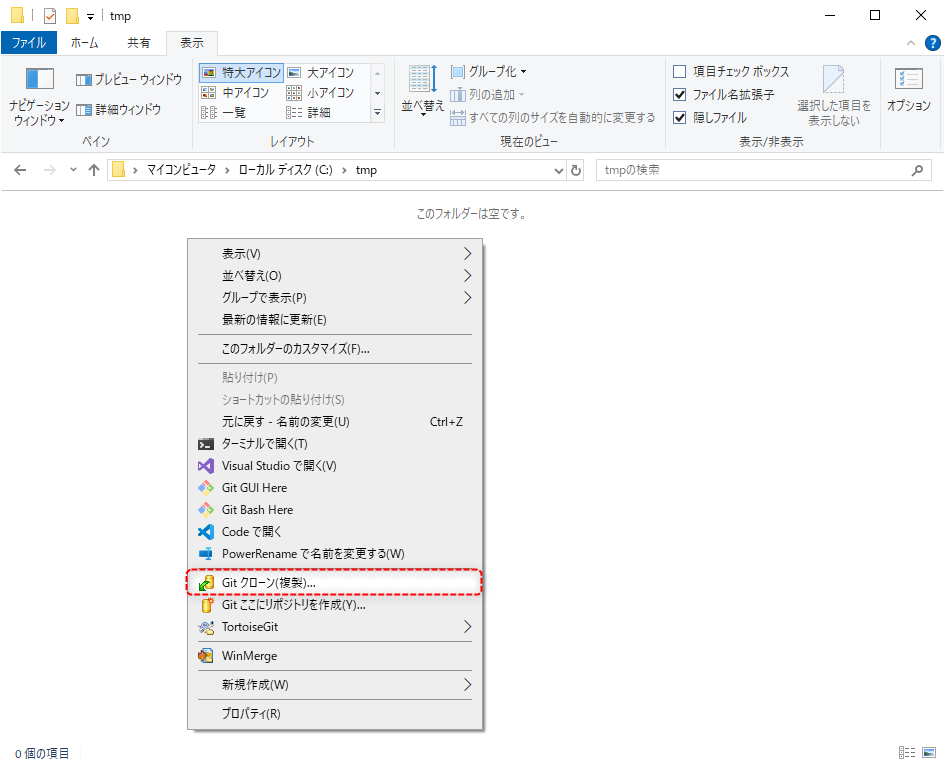
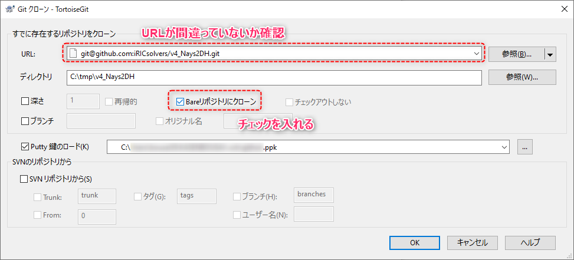
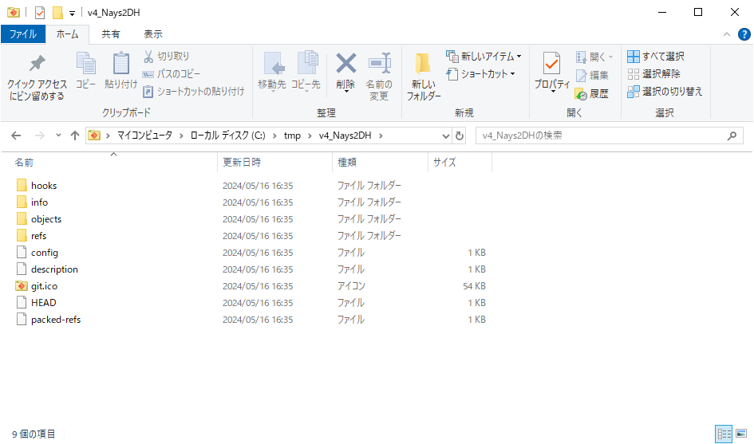

#####################################################################
リモートリポジトリを自分のリモートリポジトリとして複製する
#####################################################################

| 自分、または他人のリモートリポジトリを開発履歴やすべてのブランチ、タグごと別の自分のリモートリポジトリとして複製する方法です。
| 公開されているプログラムを自分用に編集して使用したい場合などに使います。

GitHubにはフォーク(Fork)という機能があり、これをつかうと簡単にリポジトリの複製が可能で元のリポジトリからの変更の取得も可能とかなり便利なのですが以下の特徴があります。

* リポジトリの持ち主にフォークをしたことが伝わる
* フォークはそのリポジトリへ貢献するという意思表示になる場合がある
* 公開されているリポジトリを非公開(Private)にすることはできない（ `フォークの可視性について <https://docs.github.com/ja/pull-requests/collaborating-with-pull-requests/working-with-forks/about-permissions-and-visibility-of-forks#about-visibility-of-forks>`_ ）

そこでこのページでは上記を無視してリモートリポジトリを複製する方法をまとめます。
最終的な状態のイメージ図を以下に示します。

**********************************************************************
全体の流れ
**********************************************************************

1. 複製元リポジトリをベアリポジトリとしてローカルにクローン
2. 空のリポジトリを作成（複製されたリポジトリの場所となる）
3. ローカルにクローンしたベアリポジトリを1.で作成した空リポジトリにプッシュ
4. ローカルにノンベアリポジトリをクローン
5. 複製元リポジトリから変更を取得できるようにする

今回はiRIC softwareに同梱されている `Nays2DH`_ というソルバーのリポジトリを複製してみます。

.. _Nays2DH: https://github.com/iRICsolvers/v4_Nays2DH

**********************************************************************
1 複製元リポジトリをベアリポジトリとしてローカルにクローン
**********************************************************************

まずはローカル（＝自分のPC）の任意のフォルダに複製元のリポジトリをベアリポジトリとしてクローンします。

.. hint::
   | **ベアリポジトリ** とは作業ディレクトリを持たないリポジトリを指します。
   | 普段ローカルで作業する際にクローンして作成されるローカルリポジトリは作業ディレクトリを持ち **ノンベアリポジトリ** といいます。

複製元のリポジトリのURLをコピー
======================================================================

| まずは複製したいリポジトリのページにアクセスします。
| 今回は `Nays2DH`_ のリポジトリにアクセスします。

Nays2DH `https://github.com/iRICsolvers/v4_Nays2DH <https://github.com/iRICsolvers/v4_Nays2DH>`_

リポジトリのページにアクセスしたら　:guilabel:`Code` からリポジトリのURLを表示して、コピーします。

複製元のリポジトリをクローン
======================================================================

| URLをコピーしたらリポジトリのクローンを行います。今回はTortoiseGitを使用してクローンを行います。
| 任意のフォルダをエクスプローラーで開いて右クリックメニューから　:menuselection:`Gitクローン(複製)...` を選択してTortoiseGitを起動します。

----------------------------------------------------------------------

TortoiseGitの画面が出てきたら :guilabel:`Bareリポジトリにクローン` にチェックをいれ、 :guilabel:`URL` の欄に先ほどコピーしたURLが入っていることを確認して :guilabel:`OK` をクリックしてクローンを実行してください。

----------------------------------------------------------------------

問題なくクローンできたら以下のように「成功」と表示されます。

----------------------------------------------------------------------

先ほどのフォルダの中にリポジトリが作成されています。

----------------------------------------------------------------------

中身を見てみるとベアリポジトリなので、普段のノンベアリポジトリでは :file:`.git` フォルダの中に入っているものが直接入っていることがわかります。

**********************************************************************
2 GitHubで空のリモートリポジトリを作成
**********************************************************************

次に先ほどクローンしたリポジトリをプッシュするためのリポジトリをGitHubに新しく作成します。作り方は :doc:`../02/02` をご確認下さい。

リポジトリを作成
======================================================================

今回はリポジトリの名前を複製元と同じNays2DHにしました。この名前は任意で入力して問題ありませんが、複製したものだと分かるようにしておくと事故が起きにくいかと思います。

.. figure:: image/04/090.png
    :width: 60%

----------------------------------------------------------------------

| リポジトリが作成されるとこのような画面に切り替わります。
| 水色の部分に表示されているリポジトリのURLをコピーしておきましょう。

GitHub Actionをオフにする
======================================================================

| 複製元のリポジトリによってはGitHub Actionsが設定されている場合があります。（今回のNays2DHにも設定されています）
| 予期せぬ動作を招いてもいやなので予めGit Actionを実行しない設定にしておきましょう。

.. hint::
   GitHub ActionsとはGitHub上でプログラムのビルドなど様々なことを自動でしてくれる機能です。

* 先ほどのリポジトリのページ右上にある歯車アイコンの :guilabel:`Settings` から設定画面を開く
* 設定画面左側のメニューの　:menuselection:`Actions --> General` からGit Actionの設定項目を表示
* :guilabel:`Actions Permissions` で　:guilabel:`Disable actions` を選択して下部の :guilabel:`Sav` をクリックして設定を保存

**********************************************************************
3 ローカルにクローンしたベアリポジトリを空リポジトリにプッシュ
**********************************************************************

手順1でローカルにクローンした複製元のベアリポジトリを手順2で作成した自分のリポジトリにプッシュします。

まずは手順1でクローンしたリポジトリをエクスプローラーで開き、右クリックメニューの :menuselection:`Git Bash Here` でGit Bashを開きます。

----------------------------------------------------------------------

Git Bashが起動したら以下のコマンドを入力し :kbd:`Enter` で実行します。

.. code-block:: bash

   git push --mirror [push先のリモートリポジトリのURL]

| <push先のリモートリポジトリのURL>には先ほど手順2でコピーしておいたリポジトリのURLを入力します。
| よって私の場合以下のようになります。

.. code-block:: bash

   git push --mirror git@github.com:starfieldKt/Nays2DH.git

.. hint::
   
   Git Bashにコマンドをペーストする方法は以下があります。

   * マウスホイールを押し込み  
   * :menuselection:`右クリック --> paste`
   * :kbd:`Shift` + :kbd:`Insert`  

----------------------------------------------------------------------

コマンドを実行して以下のように表示されれば成功です。

----------------------------------------------------------------------

手順2で作成したリポジトリのページを開いていましょう。複製元と同じ内容になっていることが確認できるかと思います。

----------------------------------------------------------------------

コミットもしっかり複製されています。

**********************************************************************
4 ローカルにノンベアリポジトリをクローン
**********************************************************************

手順3まででリポジトリの複製自体は終了です。ですがこのままだと作業が出来ないので複製したリモートリポジトリをローカルにクローンしましょう。
クローンの方法は :doc:`../02/04` を確認してください。

手順1でローカルにクローンした複製元のベアリポジトリはもう使わないので消してしまいましょう。

**********************************************************************
5 複製元リポジトリから変更を取得できるようにする
**********************************************************************

リポジトリを複製後に複製元のリポジトリに変更があった時などにコミットを複製元リポジトリから複製後のリポジトリに持ってこれるように設定をします。

| Gitではひとつのローカルリポジトリに対して複数のリモートリポジトリを設定し、任意のリモートリポジトリと情報の取得や登録を行うことができます。
| 手順4でクローンしたローカルリポジトリは現在、複製後のリモートリポジトリのみと紐づいている状態なので、複製元のリモートリポジトリへの設定も追加してあげます。

| まずは手順4でローカルにクローンしたローカルリポジトリをエクスプローラーで開きます。
| 開いたら :menuselection:`右クリック --> TortoiseGit --> 設定` からTortoiseGitの設定画面を開きます。

----------------------------------------------------------------------

| 設定画面を開いたら :guilabel:`リモート` 画面を表示します。
| リモート画面には恐らく :guilabel:`origin` と表示されていると思います。この :guilabel:`origin` をクリックすると右側の :guilabel:`リモート` 、 :guilabel:`URL` に情報が表示されます。

----------------------------------------------------------------------

| このリモートというものは他のリポジトリとの接続情報を保存したもので、ブックマークのようなものです。
| このリモートにリモートリポジトリのURLを登録しておくと、プッシュやフェッチの際にURLではなくそのリモートリポジトリの名前を指定することが出来るようになります。

| それではリモートに複製元のリポジトリのリポジトリを追加で設定しましょう。
| :guilabel:`リモート` に任意の名前、 :guilabel:`URL` に複製元リポジトリのURLを入力して :guilabel:`新規追加/保存` ボタンを押します。

.. hint::
   複製元のリポジトリ（上流のリポジトリ）のリモートの名前は upstream とするのが一般的だそうですが、区別できる名前であればなんでもよいです。

----------------------------------------------------------------------

ダイアログが出てきますが、タグの方は :guilabel:`いいｒ` 、フェッチの方は :guilabel:`はい` で大丈夫です。

----------------------------------------------------------------------

フェッチをするための画面が出てくるので :guilabel:`OK` をクリックして実行します。 

----------------------------------------------------------------------

成功と表示されればOKです。 :guilabel:`閉じる` で画面を閉じます。

----------------------------------------------------------------------

これで複製元のリポジトリのをupstreamという名前で登録することができました。
今後はupstreamを対象に指定してフェッチを実行すれば複製元のリポジトリから変更を取得することが出来ます。

**********************************************************************
おまけ コマンドラインで行う手順
**********************************************************************

今回はコマンドラインでの操作が苦手な人向けに極力Gitクライアントを使用しましたが、コマンドラインを使用した方が慣れると早いです。
今回の一連の操作をコマンドラインで行う手順を紹介します。

手順2の新規リモートリポジトリの作成は予め終わらせているものとします。

1 GitBashでリポジトリを作成したいディレクトリを開きます。

.. code-block:: bash

   git clone --bare [複製元のリポジトリURL]

2 クローンしたリポジトリのディレクトリに移動して複製先リポジトリにプッシュします。

.. code-block:: bash

   cd [クローンした複製元リポジトリのディレクトリ]
   git push --mirror [複製先リポジトリのURL]

3 ひとつ上の階層に戻って複製元のローカルベアリポジトリを消します。

.. code-block:: bash

    cd ..
    rm -rf [クローンした複製元リポジトリのディレクトリ] 

4 複製先のリポジトリをクローンします

.. code-block:: bash

    git clone [複製先リポジトリのURL]

5 複製先のローカルリポジトリのリモートに複製元リポジトリを追加

.. code-block:: bash

    cd [クローンした複製先のリポジトリのディレクトリ]
    git remote add [追加するリモートリポジトリ名] [追加したいリポジトリ]

6 複製元リポジトリからフェッチ

.. code-block:: bash

   git fetch [複製元リポジトリのリモート名]