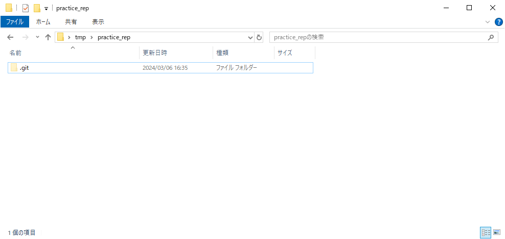
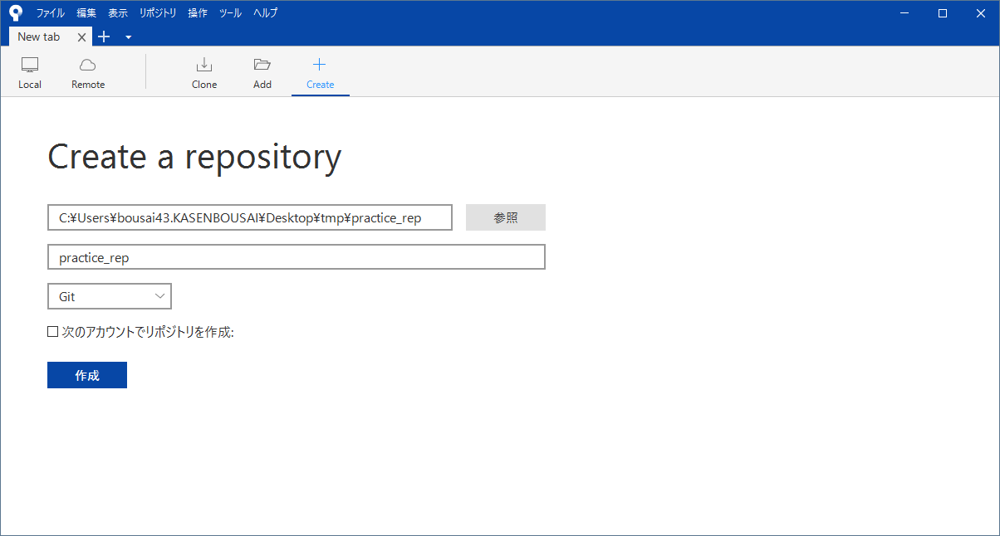

#####################################################################
ローカルリポジトリの作成
#####################################################################

ローカルリポジトリを作成します。

「TortoiseGitを使用する方法」が楽でお勧めですが、慣れると「VSCodeを使用する方法2」もお勧めです。

*********************************************************************
GitBashを使用する方法
*********************************************************************

Gitで管理したいフォルダを開きます。

.. figure:: image/01/010.png

---------------------------------------------------------------------

右クリックメニューの :menuselection:`Open Git Bash here` を選択します。

---------------------------------------------------------------------

GitBashが起動します。

---------------------------------------------------------------------

以下のコマンドを入力して :kbd:`Enter` で実行します。

.. code:: 

    Git init

---------------------------------------------------------------------

フォルダに :file:`.git` (リポジトリ)が作成されました。

*********************************************************************
VSCodeを使用する方法1
*********************************************************************

Gitで管理したいフォルダを開きます。

.. figure:: image/01/010.png

---------------------------------------------------------------------

右クリックメニューの :menuselection:`Code で開く` を選択します。

---------------------------------------------------------------------

VSCodeが立ち上がります。

---------------------------------------------------------------------

:menuselection:`メニューバー --> ターミナル --> 新しいターミナル` からターミナルを開きます。
( :kbd:`Ctrl` + :kbd:`Shift` + :kbd:`P` でも開けます)

---------------------------------------------------------------------

コマンドパレットが開きました。

---------------------------------------------------------------------

:code:`Git Initialize Repository` と入力し出てきたコマンドをクリックして実行します。

.. figure:: image/01/090.png

---------------------------------------------------------------------

| リポジトリを作成する作業ディレクトリの場所を聞かれます。
| VSCodeで開いているフォルダが一番上に開かれていると思いますので選択します。(表示されていない場合は :menuselection:`フォルダーを選択...` からフォルダを指定してください。)

.. figure:: image/01/090.png

---------------------------------------------------------------------

フォルダに :file:`.git` (リポジトリ)が作成されました。

*********************************************************************
VSCodeを使用する方法2
*********************************************************************

Gitで管理したいフォルダを開きます。

.. figure:: image/01/010.png

---------------------------------------------------------------------

右クリックメニューの :menuselection:`Code で開く` を選択します。

---------------------------------------------------------------------

VSCodeが立ち上がります。

---------------------------------------------------------------------

:menuselection:`メニューバー --> ターミナル --> 新しいターミナル` からターミナルを開きます。
( :kbd:`Ctrl` + :kbd:`Shift` + :kbd:`@` でも開けます)

---------------------------------------------------------------------

| ターミナルが開きます。
| デフォルトではPowerShellが立ち上がっているかと思います。

---------------------------------------------------------------------

ターミナルに以下のコマンドを入力して :kbd:`Enter` で実行します。

.. code:: 

    Git init

---------------------------------------------------------------------

フォルダに :file:`.git` (リポジトリ)が作成されました。

*********************************************************************
TortoiseGitを使用する方法
*********************************************************************

Gitで管理したいフォルダを開きます。

.. figure:: image/01/010.png

---------------------------------------------------------------------

右クリックメニューの :menuselection:`Git ここにリポジトリを作成` を選択します。

.. figure:: image/01/140.png

---------------------------------------------------------------------

TortoiseGitのダイアログがるので「Bereを生成(作業ディレクトリをつくりません)」のチェックを外して :menuselection:`OK` を選択します。

.. figure:: image/01/150.png

---------------------------------------------------------------------

メッセージが表示されるので :menuselection:`OK` を選択します。

.. figure:: image/01/160.png

---------------------------------------------------------------------

フォルダに :file:`.git` (リポジトリ)が作成されました。

*********************************************************************
Source Treeを使用する方法
*********************************************************************

Source Treeを起動します。

---------------------------------------------------------------------

「Create」タブを開いてリポジトリを作成したいディレクトリを指定して :menuselection:`作成` ボタンをクリックします。

---------------------------------------------------------------------

画面が切り替わります。

.. figure:: image/01/190.png

---------------------------------------------------------------------

フォルダに :file:`.git` (リポジトリ)が作成されました。

