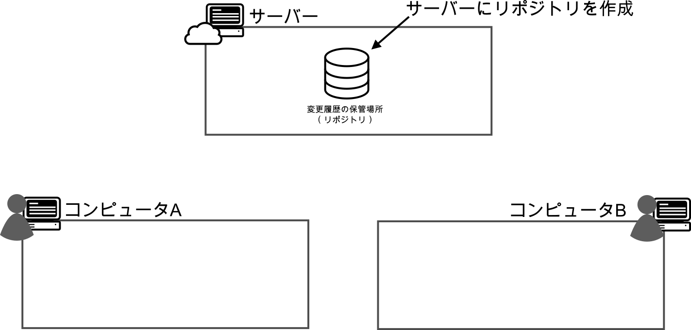
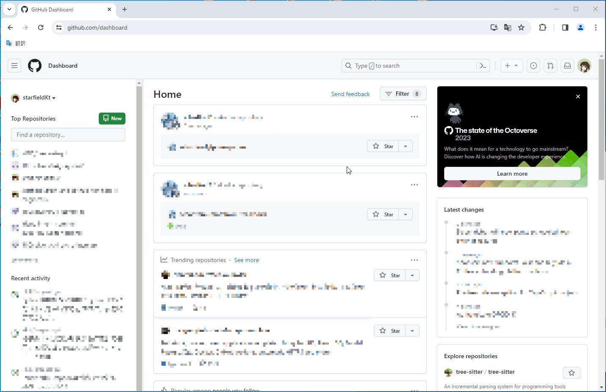
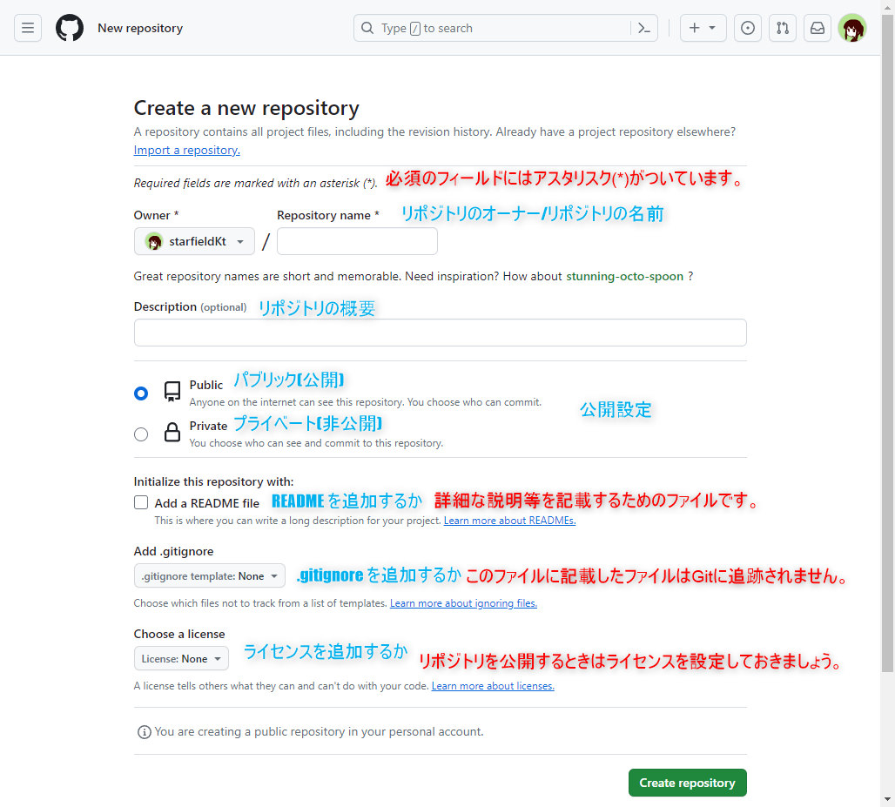
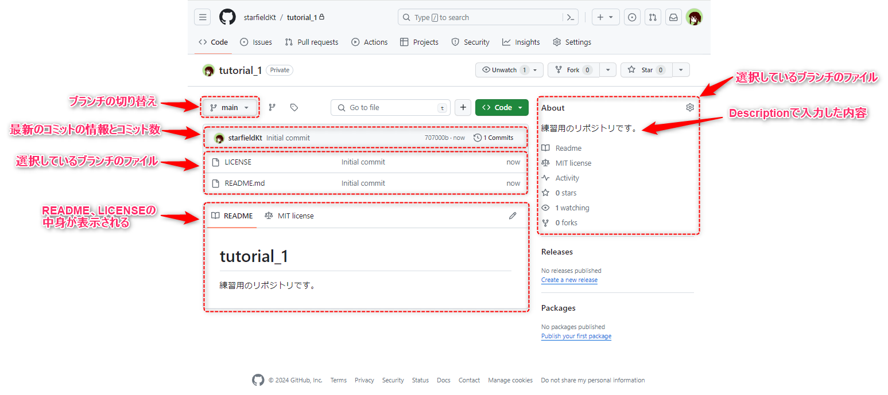

#####################################################################
新規リモートリポジトリの作成
#####################################################################

リモートリポジトリを作成します。
GitHubで作成することを前提としています。

**********************************************************************
GitHubで作成する方法
**********************************************************************

最初に `GitHub <https://github.com/>`_ にログインしましょう。

GitHub: https://github.com/

| ログイン方法は設定している認証方法によってまちまちだと思うので省略します。

|
|

----------------------------------------------------------------------

| ログインをするとダッシュボードが表示された状況になると思います。右上にある :guilabel:`+` ボタンをクリックすると新規作成メニューが開くので :guilabel:`New repository` をクリックして新規リポジトリ作成画面に移動します。

|
|

----------------------------------------------------------------------

新規リポジトリ作成画面で入力する情報は以下のようになっています。

.. glossary:: 
    Owner
        リポジトリのオーナーにするアカウントを指定します。
    
    Repository name
        リポジトリの名前を入力します。中身が何かわかるような名前にしましょう。

    Description
        リポジトリの概要です。日本語も使えます。

    Public/Private
        リポジトリの公開設定です。後からでも変更できます。

    Initialize this repository with
        Add a README file
            | チェックを入れるとリポジトリ作成時にREADMEファイルを作成します。このREADMEファイルにマークダウン形式でリポジトリの説明やプログラムの使い方などを記載しておくとGitHubでリポジトリを開いた時に内容が表示されます。
            | 理由は後述しますが、作っておくことをオススメします。

        Add .gitignore
            リポジトリ作成時にプルダウンから選択したテンプレートの.gitignoreファイルをリポジトリに追加します。.gitignoreファイルで指定されているファイルはGitの追跡から無視されます。
        
        Choose a license
            リポジトリのライセンスを選択し、テンプレートから作成します。リポジトリを公開する場合はライセンスが設定されてないと使いたい側の人間が困るので好みのライセンスを設定しておきましょう。

.. hint::
    ::doc:`03` のように既にあるローカルリポジトリをリモートリポジトリにプッシュしたい場合は空のリモートリポジトリを作りたいので「Initialize this repository with」の各項目でファイルを追加しないようにしましょう。

|
|

----------------------------------------------------------------------

今回は以下のように設定してみました。内容を確認して問題なければ :guilabel:`Create repository` をクリックしてリポジトリ作成しましょう。

.. figure:: ../01/image/02/030.png

|
|

----------------------------------------------------------------------

:file:`README` 、 :file:`.gitignore` 、:file:`LICENSE` のいずれかを追加していて、リポジトリにファイルとコミットがある場合、以下のような画面が表示されると思います。

