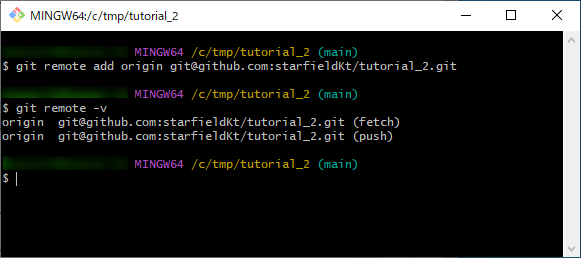
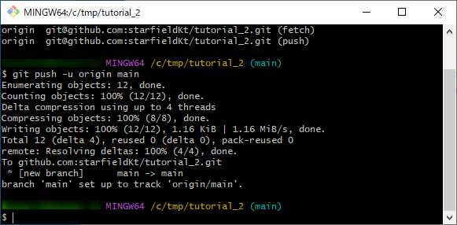
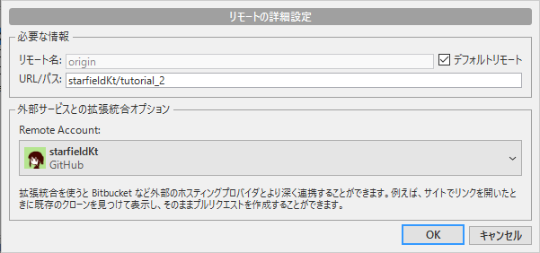

#####################################################################
ローカルリポジトリを新規リモートリポジトリにプッシュする
#####################################################################

| ローカルで管理していたリポジトリを新規リモートリポジトリにプッシュしたくなった際の手順です。
| ローカルだけで管理していたリポジトリを公開したり他人と共有したいような状況での使用を想定しています。

VSCodeかSourceTreeでの操作が簡単かと思います。

**********************************************************************
コマンドライン（GitBash） + GitHubを使用する方法
**********************************************************************

作業の流れは以下です。

1. GitHubで空のリモートリポジトリを作成
2. GitBashでローカルリポジトリと空のリモートリポジトリを紐付け
3. GitBashでローカルリポジトリの内容をプッシュ

1 GitHubで空のリモートリポジトリを作成
======================================================================

| GitHubに空のリモートリポジトリを作成します。
| 手順は「 :doc:`02` 」で説明しています。
| 空のリポジトリを作成したらリポジトリのアドレスをコピーしておきます。

.. warning::
    | リポジトリ作成の際に :file:`README` などを追加する設定にしていると自動でリポジトリにコミットが追加されてしまします。
    | プッシュ時に上書きを強制しないといけなくなってしまうので :guilabel:`Add a README file` 、 :guilabel:`Add .gitignore` 、 :guilabel:`Choose a license` の項目でファイルを追加しないように気をつけてください。 

2 GitBashでローカルリポジトリと空のリモートリポジトリを紐付け
======================================================================

GitBashでGitのコマンドを使用してローカルとリモートのリポジトリを紐付けます

| まずはローカルリポジトリのあるプロジェクトフォルダでGitBashを開きます。
| エクスプローラーでプロジェクトフォルダを開き、 :menuselection:`右クリック --> Open Git Bash here` で開くのが簡単かと思います。

| 紐付けは :code:`remote` という他のリポジトリとの接続を管理するコマンドで行います。
| 以下のコマンドは :file:`origin` という名前で、指定したアドレスのリモートリポジトリとの接続の設定を追加しますという内容です。

.. code-block:: bash

    git remote add origin リモートリポジトリのアドレス

| 「リモートリポジトリのアドレス」を先程コピーしておいたアドレスに置き換えて実行してください。
| 私の場合は先程作成したリポジトリと紐付けたいので以下のようなコマンドで実行します。

.. code-block:: bash

    git remote add origin git@github.com:starfieldKt/tutorial_2.git

実行したら以下のコマンドでローカルリポジトリと紐づいているリモートリポジトリのアドレスを確認してください。

.. code-block:: bash

    git remote -v

以下のように設定したアドレスが表示されていれば成功です。

3 GitBashでローカルリポジトリの内容をプッシュ
======================================================================

リモートリポジトリと紐付けが完了したのでローカルリポジトリの中身を空のリモートリポジトリにプッシュします。

| プッシュする際は :code:`push` というコマンドを使用します。
| 以下のコマンドでローカルのブランチをリモートの同じ名前のブランチにプッシュできます。

.. code-block:: bash

    git git push -u リモートリポジトリ ローカルブランチの名前

ローカルリポジトリのデフォルトブランチ :file:`main` をリモートリポジトリ :file:`origin` にプッシュしたい場合は以下のようになります。

.. code-block:: bash

    git git push -u origin main

実行して処理の内容が以下のように表示されれば終了です。

.. hint::
    
    :code:`-u` をつけておくことでリモートに作られたブランチをローカルブランチが追跡するようになり、以後このブランチで作業している時にプッシュやプルした場合のブランチの指定を省略できます。

.. hint::

    ローカルブランチを違う名前のリモートリブランチにプッシュしたい場合は以下のように指定します。

    .. code-block:: bash

        git git push -u リモートリポジトリ ローカルブランチの名前:リモートブランチの名前

    :file:`origin` というリモートリポジトリの :file:`main` というブランチに、ローカルリポジトリの :file:`master` という名前のブランチをプッシュしたい場合は以下のようになります。

    .. code-block:: bash

        git git push -u origin master:main

**********************************************************************
VSCodeを使用する方法
**********************************************************************

簡単なのでオススメです。

まずはリモートリポジトリにプッシュしたいローカルリポジトリのあるプロジェクトフォルダをVSCodeで開いて、アクティビティバーからでソース管理画面を開きます。
現在作業しているブランチがデフォルトブランチであることを確認しておいてください。

----------------------------------------------------------------------

| ソース管理画面の :guilabel:`Branchの発行` をクリックします。

.. hint::
    | 初めてこの方法を使用する場合、以下のようにGitHubへのサインインを要求してくるので許可してください。
    | :guilabel:`許可` を押すとwebブラウザが立ち上がりログインと連携の許可を求められます。

    .. figure:: image/03/050.png
    

すると、GitHubに作成するリモートリポジトリの名前の入力を要求され、「公開設定で作成する」と「非公開設定で作成する」のコマンドが表示されるので、好きな名前を入力し、好きな方の公開設定のコマンドをクリックします。

----------------------------------------------------------------------

エラーが出なければ以上で完了です。

**********************************************************************
TortoiseGitを使用する方法
**********************************************************************

作業の流れは以下です。

1. GitHubで空のリモートリポジトリを作成
2. Source Treeでローカルリポジトリと空のリモートリポジトリを紐付け
3. Source Treeでローカルリポジトリの内容をプッシュ

1 GitHubで空のリモートリポジトリを作成
======================================================================

| GitHubに空のリモートリポジトリを作成します。
| 手順は「 :doc:`02` 」で説明しています。
| 空のリポジトリを作成したらリポジトリのアドレスをコピーしておきます。

.. warning::
    | リポジトリ作成の際に :file:`README` などを追加する設定にしていると自動でリポジトリにコミットが追加されてしまします。
    | プッシュ時に上書きを強制しないといけなくなってしまうので :guilabel:`Add a README file` 、 :guilabel:`Add .gitignore` 、 :guilabel:`Choose a license` の項目でファイルを追加しないように気をつけてください。 

2 TortoiseGitでローカルリポジトリと空のリモートリポジトリを紐付け
======================================================================

リモートにプッシュしたいローカルリポジトリのプロジェクトフォルダをエクスプローラーで開いて、 :menuselection:`右クリック --> TortoiseGit --> 設定` でTortoiseGitの設定画面を開きます。

----------------------------------------------------------------------

:guilabel:`Git` --> :guilabel:`リモート` の設定を開き、 :guilabel:`URL` にリモートリポジトリのアドレスを入力、 :guilabel:`Putty鍵` に :doc:`../../03/04/02` で作成した公開鍵を設定して :guilabel:`新規追加/保存` をクリックして追加します。（URLを入力すると :guilabel:`リモート` にはoriginが自動で入力されます。）

.. figure:: image/03/150.png

----------------------------------------------------------------------

追加するとフェチするか聞かれますが、ここは自由です。
今回はしませんので :guilabel:`いいえ` をクリックして閉じます。

追加できたらOKを押して設定画面を閉じてください。

3 TortoiseGitででローカルリポジトリの内容をプッシュ
======================================================================

ローカルリポジトリのプロジェクトフォルダから :menuselection:`右クリック --> TortoiseGit --> プッシュ` でプッシュの画面を開き、 :guilabel:`OK` をクリックします。

----------------------------------------------------------------------

以下のように表示されてばプッシュは成功です。 :guilabel:`閉じる` で閉じてください。

**********************************************************************
Source Treeを使用する方法
**********************************************************************

作業の流れは以下です。

1. GitHubで空のリモートリポジトリを作成
2. Source Treeでローカルリポジトリと空のリモートリポジトリを紐付け
3. Source Treeでローカルリポジトリの内容をプッシュ

1 GitHubで空のリモートリポジトリを作成
======================================================================

| GitHubに空のリモートリポジトリを作成します。
| 手順は「 :doc:`02` 」で説明しています。
| 空のリポジトリを作成したらリポジトリのアドレスをコピーしておきます。

.. warning::
    | リポジトリ作成の際に :file:`README` などを追加する設定にしていると自動でリポジトリにコミットが追加されてしまします。
    | プッシュ時に上書きを強制しないといけなくなってしまうので :guilabel:`Add a README file` 、 :guilabel:`Add .gitignore` 、 :guilabel:`Choose a license` の項目でファイルを追加しないように気をつけてください。 

2 Source Treeでローカルリポジトリと空のリモートリポジトリを紐付け
======================================================================

まずはSource TreeでリモートにPushしたいローカルリポジトリを開いて、右上の歯車アイコン :guilabel:`設定` をクリックしてリポジトリの設定画面を開きます。

----------------------------------------------------------------------

| :guilabel:`追加` をクリックしてリモート接続の名前と、アドレスを入力して、 :guilabel:`OK` を選択します。
| GitHubとSource Treeを連携させていれば :guilabel:`Remote Account` でアカウントを選択しておきましょう。

----------------------------------------------------------------------

これでリポジトリにリモートの設定が保存されました。 :guilabel:`OK` をクリックして設定ウィンドウを閉じます。 

3 Source Treeでローカルリポジトリの内容をプッシュ
======================================================================

| リモートの欄にも追加したリモート名が表示されていることが確認できたら、リモートリポジトリにローカルの内容をプッシュしましょう。
| 上向き矢印アイコンの :guilabel:`プッシュ` をクリックします。

----------------------------------------------------------------------

リモートにプッシュしたいブランチにチェックマークをつけて :guilabel:`プッシュ` をクリックして実行します。

----------------------------------------------------------------------

プッシュが成功するとリモートの欄にプッシュしたブランチが表示されます。

