#####################################################################
リモートリポジトリをクローンする
#####################################################################

| リモートリポジトリをローカルにクローンする方法です。
| TortoiseGitを使うのが簡単です。

**********************************************************************
コマンドライン（GitBash）を使用する方法
**********************************************************************

まずはクローンしたいリポジトリのアドレスをコピーします。

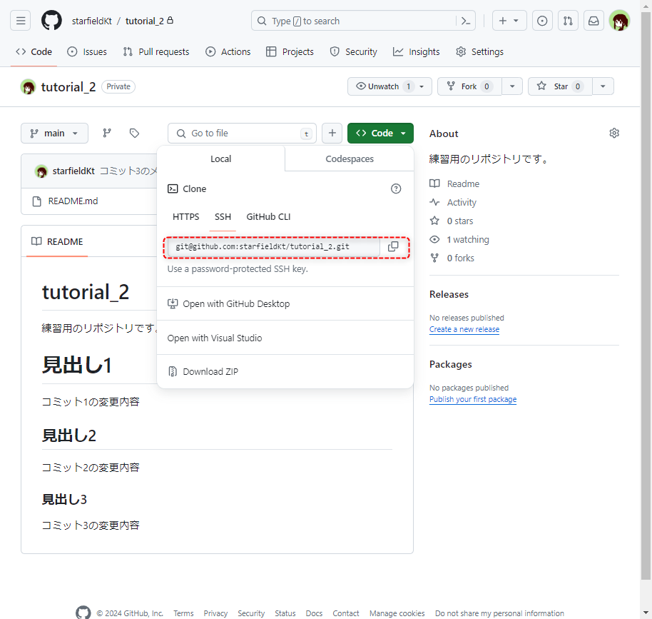

|
|

----------------------------------------------------------------------

ローカルリポジトリを保存したいフォルダで :menuselection:`右クリック --> Open Git Bash here` からGitBashを開きます。

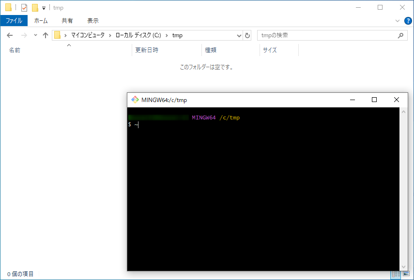

|
|

----------------------------------------------------------------------

以下のコマンドでクローンを実行します。

.. code-block:: bash

    # 基本のコマンド
    Git clone [リポジトリのアドレス]

    # ローカルリポジトリのフォルダ名を指定する場合
    Git clone [リポジトリのアドレス] [フォルダのパス]

    # ローカルリポジトリのフォルダ名を指定する場合
    Git clone -b [ブランチ名] [リポジトリのアドレス]

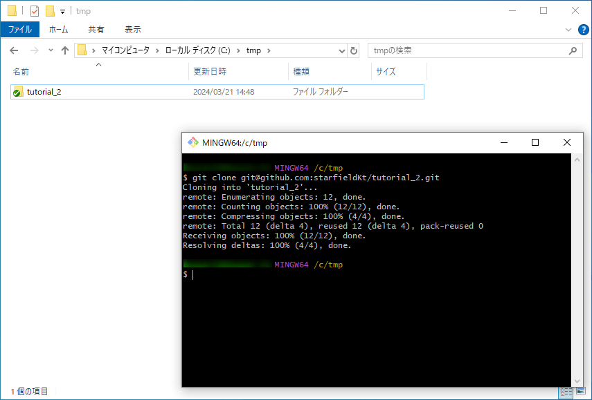

|
|

**********************************************************************
VSCodeを使用する方法
**********************************************************************

まずはクローンしたいリポジトリのアドレスをコピーします。

|
|

----------------------------------------------------------------------

VSCodeを開きます。

開いたら、メニューバーの :menuselection:`表示 --> コマンドパレット` か、ショートカットの :kbd:`Ctrl` + :kbd:`Shift` +  :kbd:`P` 、またはコマンドセンターから :menuselection:`コマンドの表示と実行` でコマンドパレットを開き、「Git clone」と入力します。

コマンドの候補が出てくるので :guilabel:`Git: クローン` をクリックまたは選択してエンターで実行します。

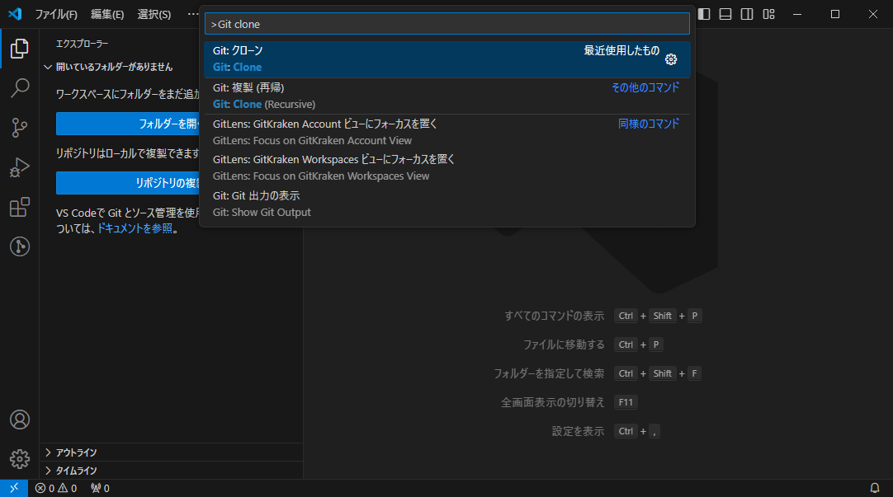

|
|

----------------------------------------------------------------------

すると、「リポジトリURLを指定するか、リポジトリソースを選択します。」と表示されるので、先程コピーしておいたリモートリポジトリのアドレスを貼り付けてエンターキーで実行します。

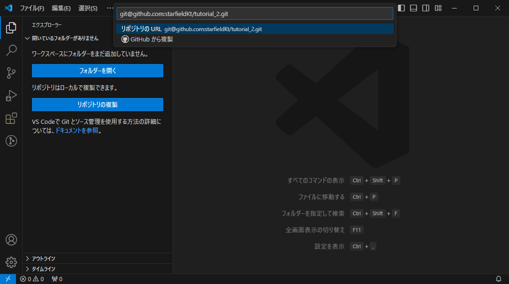

|
|

.. hint::
   VSCodeでGitHubにログインしていると、 :guilabel:`GitHubから複製` からGitHubの自分の管理しているリポジトリの一覧を表示して、そこから選んでcloneすることも可能です。
   
   .. figure::  image/04/051.png
   

|
|

----------------------------------------------------------------------

フォルダ選択ダイアログが立ち上がるのでローカルリポジトリを保存したいフォルダを指定します。

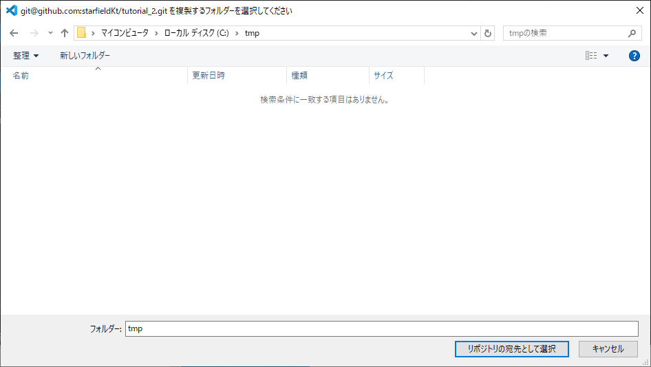

|
|

----------------------------------------------------------------------

クローンしたリポジトリをVSCodeで開くか聞かれるので、 :guilabel:`開く` を選択するとVSCodeでそのままローカルリポジトリを開くことができます。

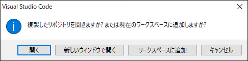

|
|

**********************************************************************
TortoiseGitを使用する方法
**********************************************************************

まずはクローンしたいリポジトリのアドレスをコピーします。

|
|

----------------------------------------------------------------------

ローカルリポジトリを保存したいフォルダをエクスプローラーで開いて :menuselection:`右クリック --> Git クローン(複製)` からTortoiseGitのクローンウィンドウを呼び出します。

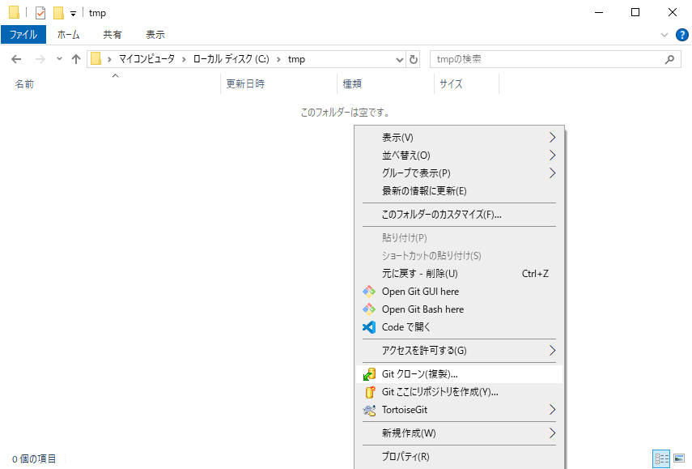

|
|

----------------------------------------------------------------------

クローンのオプション等を指定して :guilabel:`OK` をクリックします。

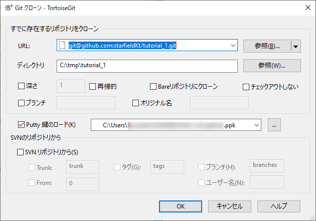

.. glossary::

    URL
        リモートリポジトリのアドレスを入力します。クリップボードにコピーしている場合自動で入力されます。
    
    ディレクトリ
        ローカルリポジトリのディレクトリを指定します。デフォルトでは右クリックで開いたフォルダにリモートリポジトリの名前で作成するようになっています。
    
    ブランチ
        ブランチを指定してクローンしたい場合に入力します。
    
    オリジナル名
        リモート名をoriginから変更したい場合に入力します。
    
    Putty 鍵のロード
        :doc:`../../03/04/02` で作成した公開鍵を指定します。一度設定したことがあれば自動で入力されていると思います。

|
|

----------------------------------------------------------------------

以下のように表示されれば成功です。

フォルダにローカルリポジトリが作成されています。

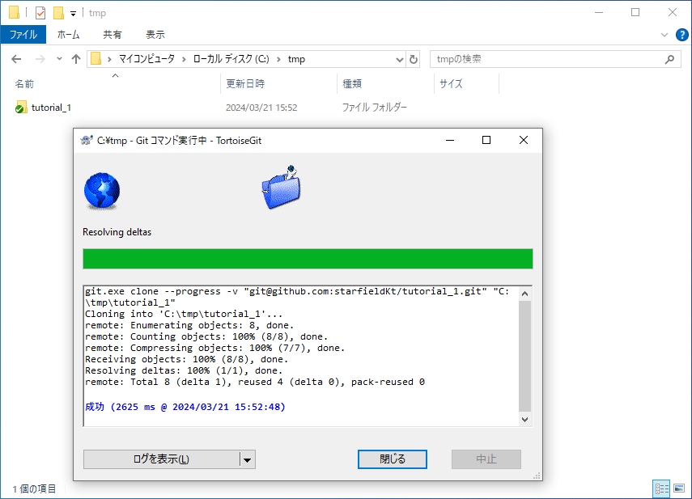

|
|

**********************************************************************
SourceTreeを使用する方法
**********************************************************************

まずはクローンしたいリポジトリのアドレスをコピーします。

|
|

----------------------------------------------------------------------

SourceTreeで新しいタブを開いて :guilabel:`clone` をクリックします。

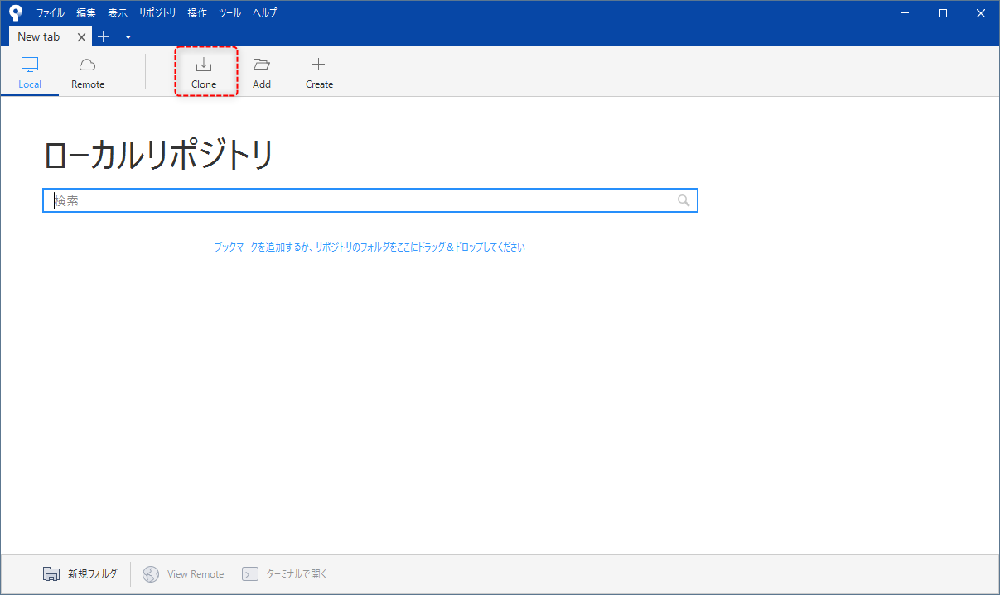

|
|

----------------------------------------------------------------------

リモートリポジトリのアドレス、クローン先のディレクトリ、SourceTreeで表示されるローカルリポジトリ名を入力して :guilabel:`クローン` をクリックして実行します。
詳細オプションからクローンするブランチを指定することも可能です。

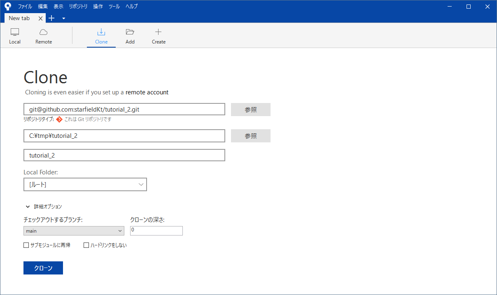

|
|

----------------------------------------------------------------------

Source Treeでクローンしたリポジトリが開かれます。

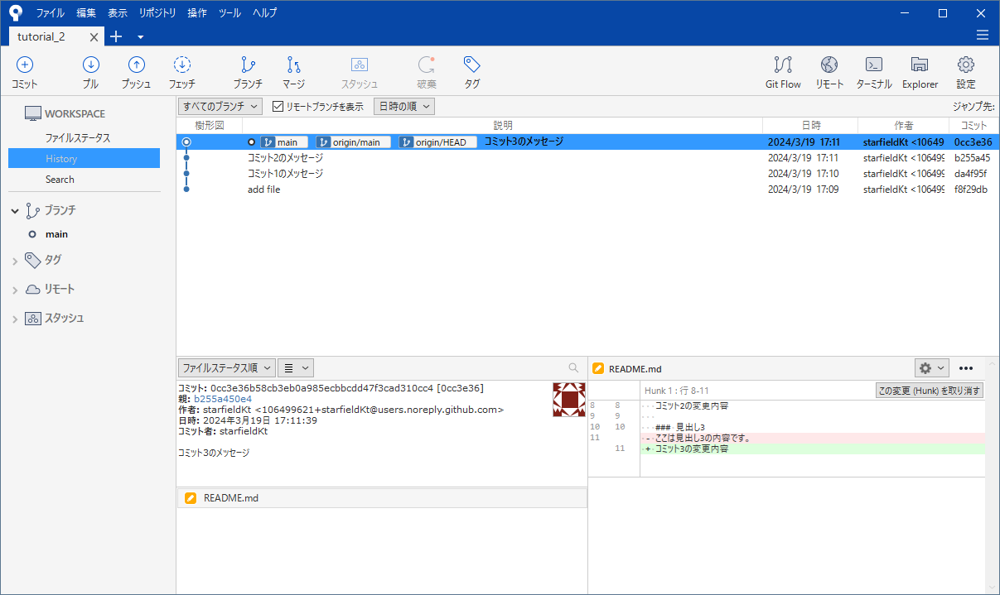

.. hint::
   Source TreeとGitHubを連携させている場合、 :guilabel:`Remote` からGitHubで自分の管理しているリモートリポジトリ一覧を表示して、そこからクローンすることも可能です。

    .. image:: image/04/150.png
