#####################################################################
ファイルをインデックスに追加する（ステージング）
#####################################################################

ステージングはコミットしたいファイルをインデックスに追加する操作です。
ステージングされたファイルがコミットの対象となります。

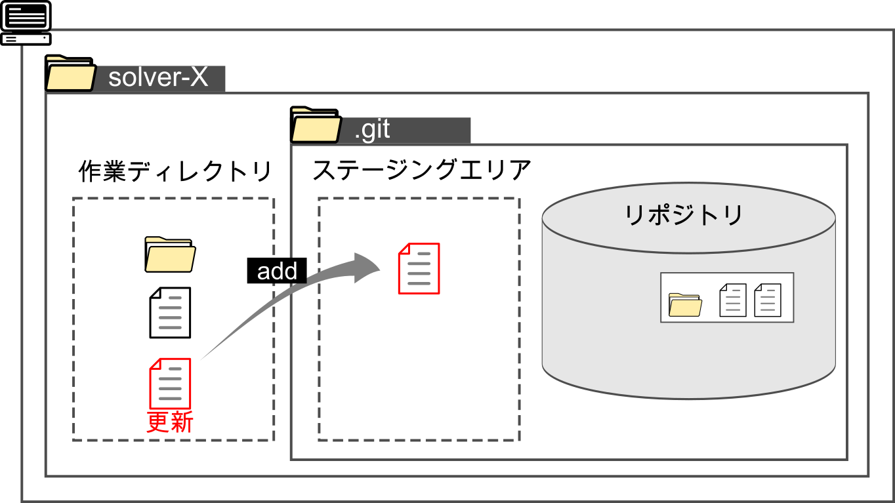

例として以下のような状況での操作を想定してみます。

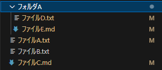
    
| 作業ディレクトリには :file:`ファイルA` ～ :file:`ファイルE` があり、 :file:`ファイルD` ～ :file:`ファイルE` はフォルダに入っています。
| :file:`ファイルB` 以外は変更された状態です。

VSCodeかSource Treeでの操作が簡単だと思います。

**********************************************************************
コマンドライン（GitBash）を使用する方法
**********************************************************************

GitBashでローカルリポジトリを開いた状態を想定して行います。

基本のコマンド
======================================================================

ステージングは :code:`add` コマンドを使用して行います。

基本のコマンドとしては以下のコマンドで指定したファイルをステージングします。

.. code-block:: bash

    git add [ファイル名]

| 実際に :file:`ファイルA` をステージングしてみましょう。
| :code:`git add ファイルA` を実行します。

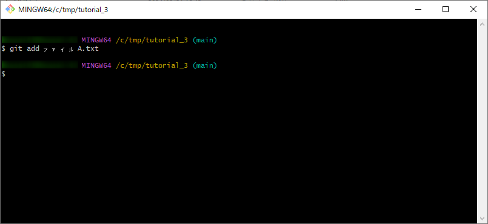

| :code:`git status` でファイルの状況を確認してみましょう。
| ステージングした :file:`ファイルA` が「Changes to be committed」の欄に表示されていることがわかります。

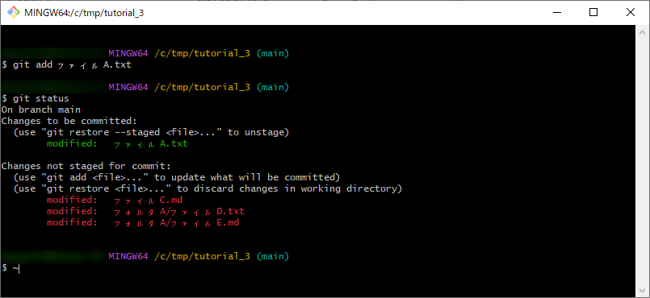

同様に :file:`ファイルD` もステージングして確認してみます。
ステージングした :file:`ファイルA` が「Changes to be committed」の欄に移動しましたね。

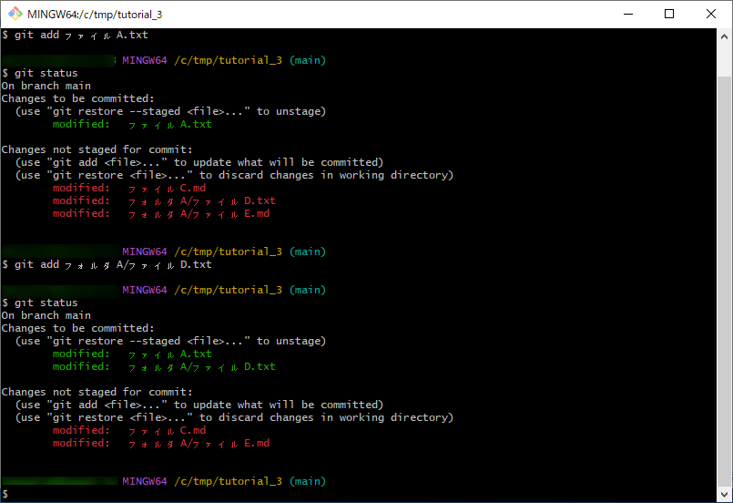

ファイルをまとめてステージング
======================================================================

ディレクトリを指定したり、ワイルドカード使うことでファイルをまとめてステージングすることもできます。

ファイル全て
----------------------------------------------------------------------

:code:`-A` オプションを追加すると全ての変更や新規追加されたファイルを追加します。

.. code-block:: bash

    # ファイルすべて
    git add -A

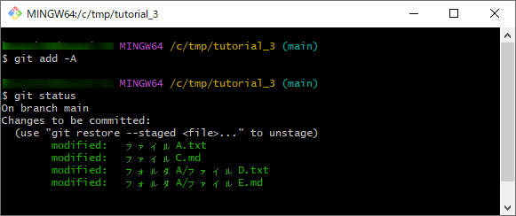

変更のあったファイル全て（新規追加除く）
----------------------------------------------------------------------

:code:`-U` オプションでは :code:`-A` と異なり新規追加されたファイルは追加されません。

.. code-block:: bash

    # 変更のあったファイルすべて
    git add -u

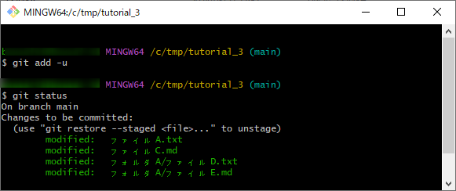

カレントディレクトリ内のファイル全て
----------------------------------------------------------------------

コマンドを実行した時のカレントディレクトリ以下の全ての変更や新規追加されたファイルを全てステージングします。

.. code-block:: bash

    # カレントディレクトリ内のファイル全て
    git add .

指定したディレクトリ以下のファイル全て
----------------------------------------------------------------------

指定したフォルダ以下の全ての変更や新規追加されたファイルを全てステージングします。

.. code-block:: bash

    # 指定したディレクトリ以下の全て
    git add [ディレクトリのパス]

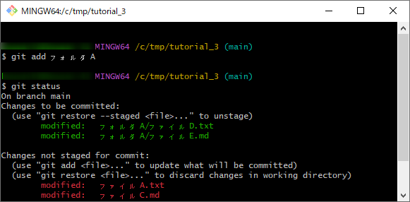

ワイルドカードを使ったファイル指定
----------------------------------------------------------------------

ワイルドカード :code:`*` を使って任意のディレクトリのファイルをステージングします。

.. code-block:: bash

    # 指定したディレクトリ直下のフォルダのワイルドカードで指定されたファイル
    git add [ディレクトリのパス]/*.txt

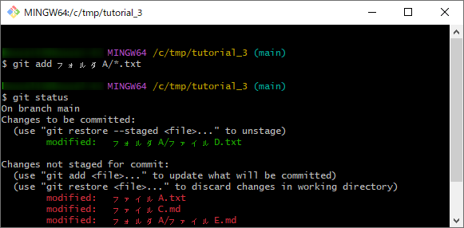

ファイルの一部をステージング
======================================================================

:code:`-p` または :code:`-patch` オプションを使用することでファイルの変更箇所を一部だけステージングすることができます。

.. code-block:: bash

    git add -p
    # または
    git add --patch

    # ファイルを指定する場合
    git add -p [ファイルのパス]
    # または
    git add -patch [ファイルのパス]

コマンドを実行すると、変更箇所の塊(Hunk)毎に差分が表示され、そこの区間の処理を聞かれるので、処理を選択していきます。

+------------+----------------------------------------------------+
| アクション | 説明                                               |
+============+====================================================+
| y          | ハンクをステージングする                           |
+------------+----------------------------------------------------+
| n          | ハンクをステージングしない                         |
+------------+----------------------------------------------------+
| q          | 対話形式でのステージングを終了する（Quit）         |
+------------+----------------------------------------------------+
| a          | 現在のハンクと残りすべてのハンクをステージングする |
+------------+----------------------------------------------------+
| d          | 現在のハンクと残りのハンクをステージしない         |
+------------+----------------------------------------------------+
| s          | 現在のハンクを更に小さなハンクに分割する           |
+------------+----------------------------------------------------+
| e          | 現在のハンクの範囲を手動で編集する                 |
+------------+----------------------------------------------------+
| ?          | ヘルプを表示する                                   |
+------------+----------------------------------------------------+

以下のような差分の :file:`ファイルC.md` でためし1行目と7行目の変更のみをステージングしてみましょう。

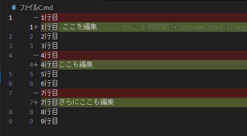

----------------------------------------------------------------------

まずは以下のコマンドで対話モードを始めます。

.. code-block:: bash

    git add -p ファイルC.md

表示されたハンクを見てみると、変更した箇所同士が近いので1つのハンクとGitに認識されています。

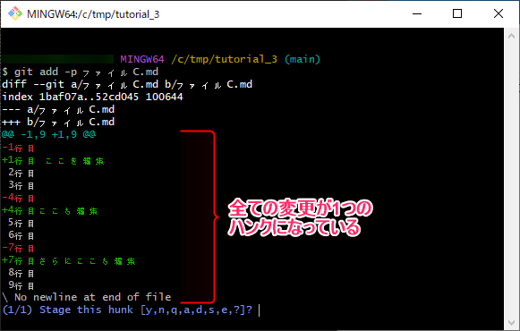

----------------------------------------------------------------------

| なので、:code:`s` と入力してハンクを更に小さく分割してもらいましょう。
| いい感じに3つに分割されたようです。

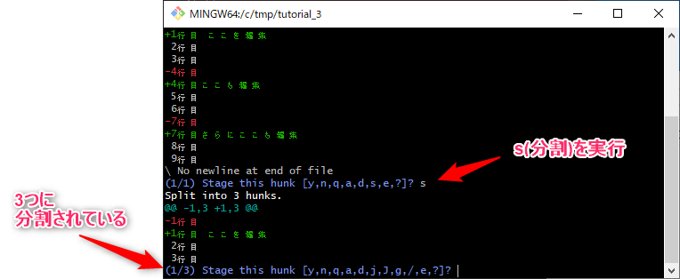

----------------------------------------------------------------------

1行目と7行目だけステージングしたいので、ハンク(1/3)と(3/3)では :code:`y` をハンク(2/3)では :code:`n` を返していきます。
最後のハンクまで処理を行えばステージング完了です。全体を以下に示します。

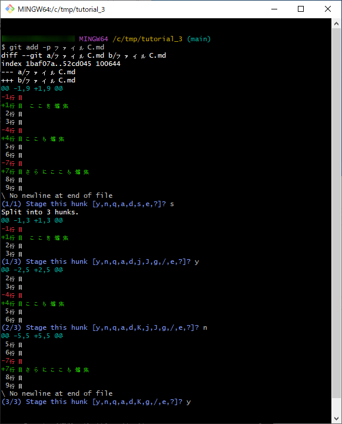

**********************************************************************
VSCodeを使用する方法
**********************************************************************

| リポジトリをVSCodeで開いて、アクティビティバーからソース管理画面を開きます。
| ソース管理画面では変更タブに変更等のあったファイルが表示されています。

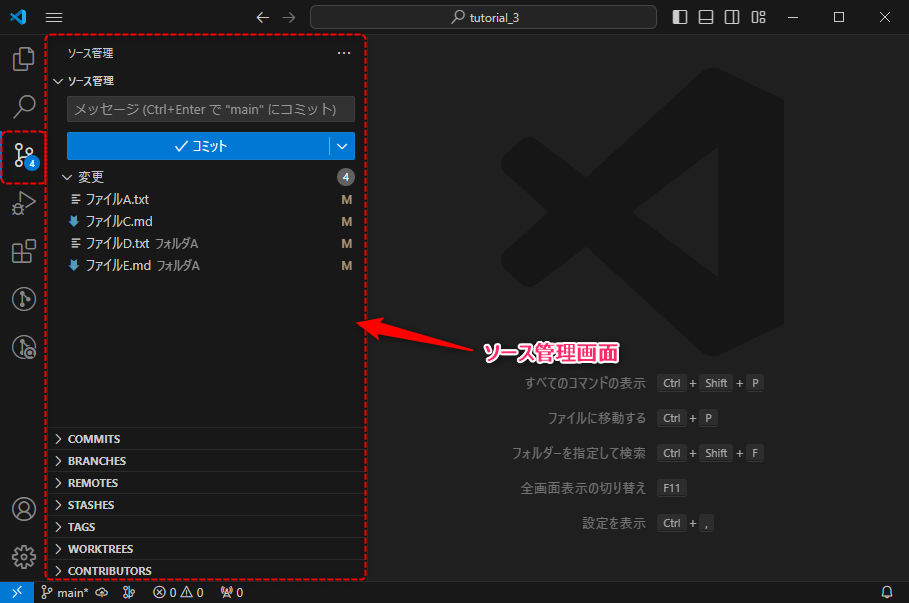

- ファイルにマウスカーソルを重ねると右側に出てくるアイコンの :guilabel:`+` をクリックするとステージングできます。
- ファイルは :kbd:`Ctrl` や :kbd:`Shift` を押しながら複数選択してステージングすることも可能です。
- 「変更」にマウスカーソルを重ねて出てくる :guilabel:`+` をクリックすると全てのファイルをステージングできます。

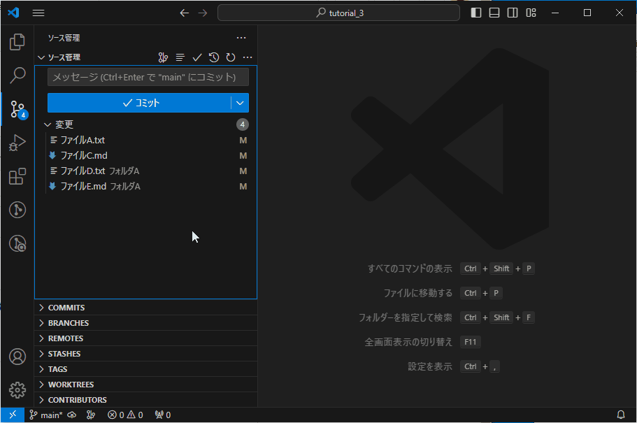

指定した範囲のみステージングする
======================================================================

.. note::
    VSCodeの拡張機能「GitLens」の機能を使用します。

| ファイルに複数の変更がある際に一部の変更だけをステージングすることができます。

1. VSCodeのエディターでステージングしたいファイルを開きます。 
2. 変更された範囲（行）の行番号の右側にあるラインをクリックします。
3. その箇所の変更の差分が表示されるので :guilabel:`+` アイコンを押してその範囲をステージングします。

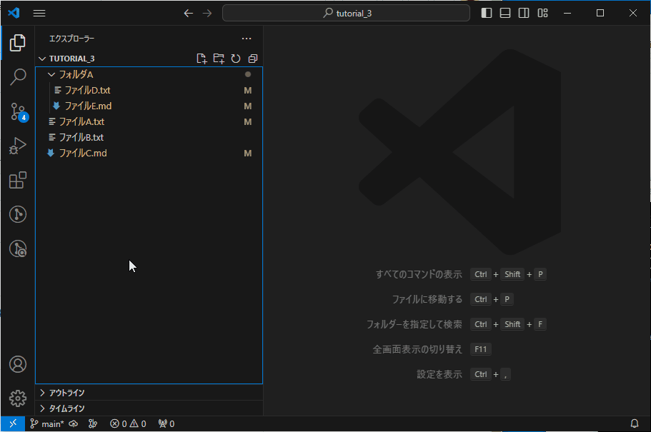

**********************************************************************
SourceTreeを使用する方法
**********************************************************************

| リポジトリをSource Treeで開いて ::guilabel:`ファイルステータス` 画面を開きます。
| :guilabel:`作業ツリーのファイル` に変更等のあったファイルが表示されており、ファイルをクリックすると右側に変更の差分が表示されます。

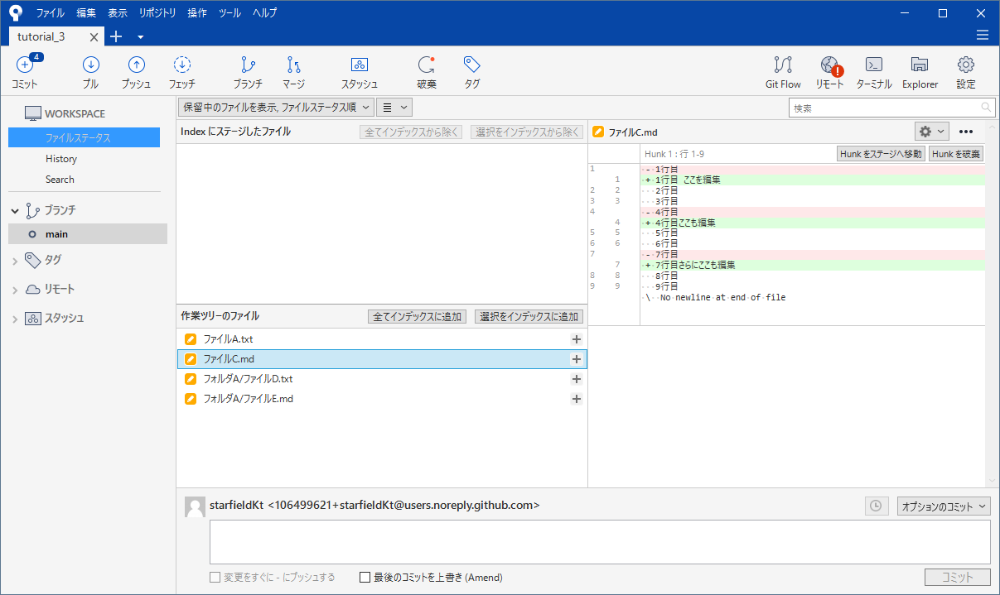

----------------------------------------------------------------------

- ファイル名の右側の :guilabel:`+` をクリックするとそのファイルをステージングできます。
- ファイルは :kbd:`Ctrl` や :kbd:`Shift` を押しながら複数選択して :guilabel:`選択をインデックスに追加` でまとめてステージングすることも可能です。
- :guilabel:`全てインデックスに追加` で全てのファイルをステージングできます。

指定した範囲のみステージングする
======================================================================

1. ファイルを選択して右側に差分を開きます。
2. 差分画面でステージングしたい変更の行を選択します。
3. :guilabel:`選択した行をステージへ移動` をクリックします。

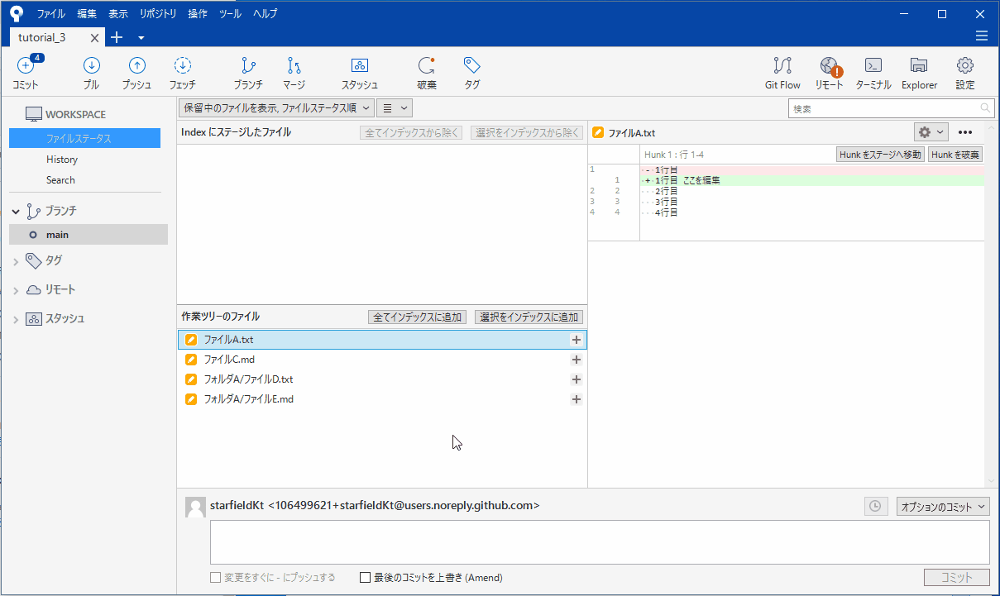

