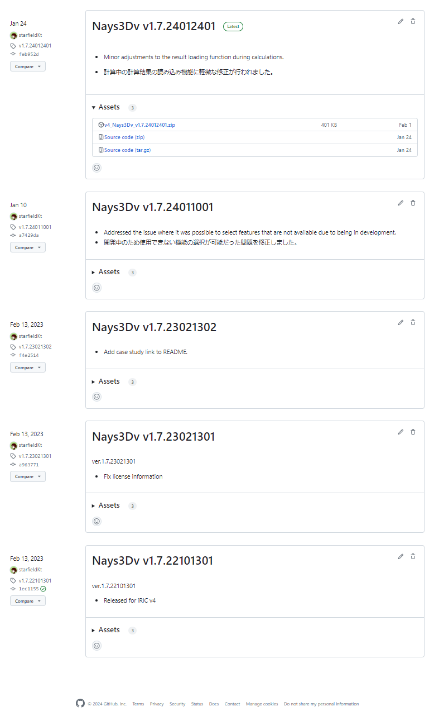
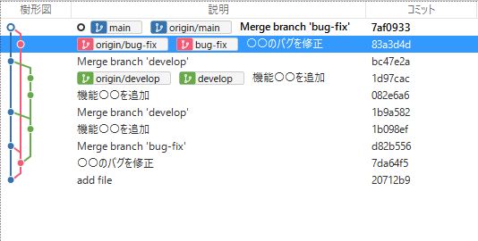
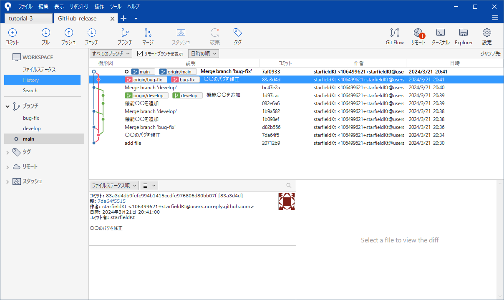
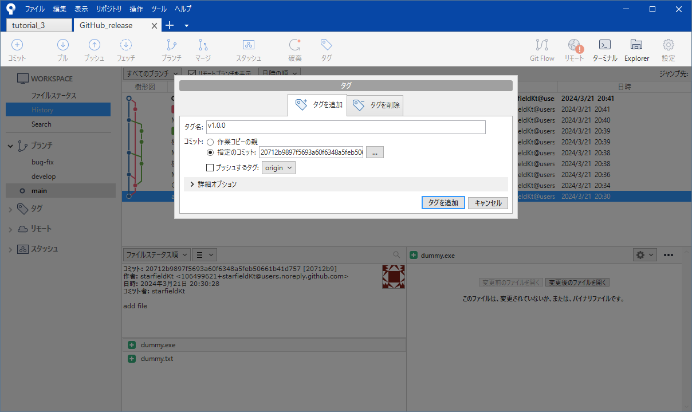
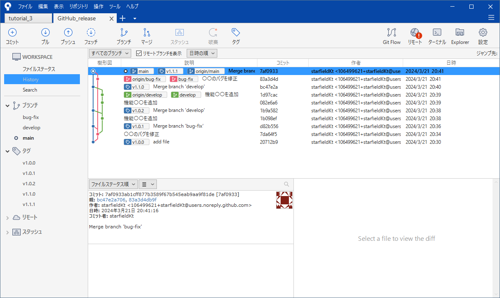

######################################################################
GitHubのリリース機能を使用してプログラムの公開&バージョン管理を行う
######################################################################

GitHubにはリリースという、自分が作成したプログラムなどを各リリース(バージョン)毎パッケージ化して、公開する機能があります。
また、パッケージを公開しなくてもリリースノートとして使用したりとバージョンの管理がより分かりやすくなります。

こちらは私が管理をお手伝いしているiRICのNays3Dvというソルバーのリポジトリです。
ここではソルバーのバージョンアップの度にリリースを作成し、どのような変更をしたかのコメントを残し、そのバージョンのプログラム一式をzipにまとめたものをDL出来るようにしています。

https://github.com/iRICsolvers/v4_nays3dv/releases

**********************************************************************
手順
**********************************************************************

リリースを作成する際にはGitのタグが必要となります。

そのため、全体の手順としては以下のようになります。

- リリースを作成したい時点のコミットにタグを作成
- タグに対してGitHubでリリースを作成

はじめに
======================================================================

お手頃なリポジトリをご用意ください。

私は中身はダミーデータですが、以下のようなコミットログのあるリポジトリを用意しました。
mainにマージしているコミットがバージョンアップのタイミングのイメージです。

|
|

タグを作成
======================================================================

| リリースを作成するために、リリースを作成したい時点のコミットにタグを作成します。
| 主にバージョンアップのタイミングでリリースを作成することがメインだと思います。
| タグ作成は今回は視覚的に操作ができて簡単なSource Treeを使用します。

|
|

対象のローカルリポジトリをSource Treeで開く
----------------------------------------------------------------------

| リリースを作成したいプロジェクトを管理しているローカルリポジトリをSource Treeで開いてください。

|
|

コミットにタグを作成する
----------------------------------------------------------------------

| タグを作成したいコミットを右クリックして、:menuselection:`タグ...` を選択し、タグ作成ダイアログを開きます。

:guilabel:`タグ名` にタグの名前を記入します。名前は分かりやすくリリース時のバージョン番号などをつけるとよいかと思います。

----------------------------------------------------------------------

名前を入力したら :guilabel:`タグを追加` をクリックしてタグを追加します。

タグが追加されるとコミットログにもタグが表示されています。

.. figure:: image/Release/060.png

----------------------------------------------------------------------

この手順を繰り返してリリースを作成したいコミット全てにタグをつけましょう。

