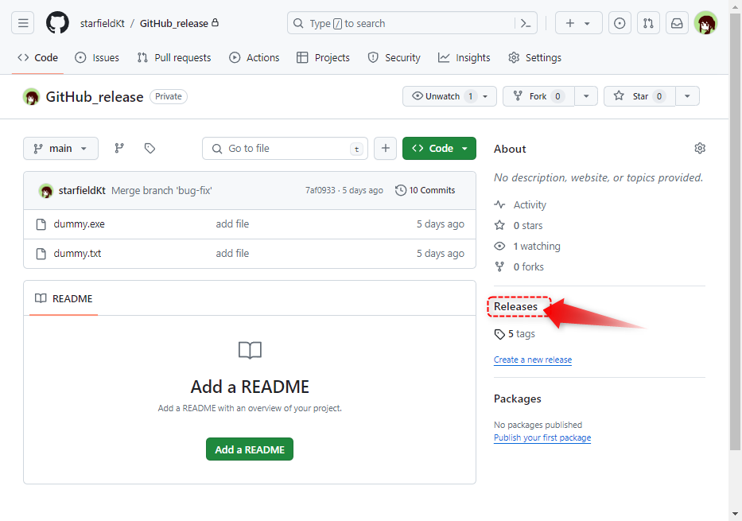
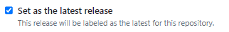

######################################################################
GitHubのリリース機能を使用してプログラムの公開&バージョン管理を行う
######################################################################

GitHubにはリリースという、自分が作成したプログラムなどを各リリース(バージョン)毎パッケージ化して、公開する機能があります。
また、パッケージを公開しなくてもリリースノートとして使用したりとバージョンの管理がより分かりやすくなります。

こちらは私が管理をお手伝いしているiRICのNays3Dvというソルバーのリポジトリです。
ここではソルバーのバージョンアップの度にリリースを作成し、どのような変更をしたかのコメントを残し、そのバージョンのプログラム一式をzipにまとめたものをDL出来るようにしています。

https://github.com/iRICsolvers/v4_nays3dv/releases

**********************************************************************
手順
**********************************************************************

リリースを作成する際にはGitのタグが必要となります。

そのため、全体の手順としては以下のようになります。

- リリースを作成したい時点のコミットにタグを作成
- タグに対してGitHubでリリースを作成

はじめに
======================================================================

お手頃なリポジトリをご用意ください。

私は中身はダミーデータですが、以下のようなコミットログのあるリポジトリを用意しました。
mainにマージしているコミットがバージョンアップのタイミングのイメージです。

タグを作成
======================================================================

| リリースを作成するために、リリースを作成したい時点のコミットにタグを作成します。
| 主にバージョンアップのタイミングでリリースを作成することがメインだと思います。
| タグ作成は今回は視覚的に操作ができて簡単なSource Treeを使用します。

対象のローカルリポジトリをSource Treeで開く
----------------------------------------------------------------------

| リリースを作成したいプロジェクトを管理しているローカルリポジトリをSource Treeで開いてください。

.. figure:: image/Release/040.png

コミットにタグを作成する
----------------------------------------------------------------------

| タグを作成したいコミットを右クリックして、:menuselection:`タグ...` を選択し、タグ作成ダイアログを開きます。

:guilabel:`タグ名` にタグの名前を記入します。名前は分かりやすくリリース時のバージョン番号などをつけるとよいかと思います。

.. figure:: image/Release/050.png

----------------------------------------------------------------------

名前を入力したら :guilabel:`タグを追加` をクリックしてタグを追加します。

タグが追加されるとコミットログにもタグが表示されています。

.. figure:: image/Release/060.png

----------------------------------------------------------------------

この手順を繰り返してリリースを作成したいコミット全てにタグをつけましょう。

.. figure:: image/Release/070.png

----------------------------------------------------------------------

| タグを作成したらリモートリポジトリにタグをプッシュします。
| :guilabel:`プッシュ` アイコンをクリックしてプッシュダイアログを開いたら左下の :guilabel:`全てのタグをプッシュ` にチェックが入っていることを確認してから :guilabel:`プッシュ` をクリックして実行します。

----------------------------------------------------------------------

リモートリポジトリにタグがプッシュされると、GitHubのリポジトリのページから作成されたタグを確認することができます。

リリースを作成
======================================================================

| タグの準備ができたら、タグに対してリリースを作成していきます。
| まずはGitHubのリポジトリのページにアクセスして、 :guilabel:`Release` のリンクを開きます。

----------------------------------------------------------------------

| リリースが1つもない場合、以下のような画面が表示されます。 :guilabel:`Create a new release` をクリックしてリリースの編集画面に移動してください。

.. admonition:: 既にリリースがある場合

    既にリリースがある場合には以下のようにリリースの一覧が表示されるので ::guilabel:`Draft a new release` をクリックします。

    .. figure:: image/Release/120.png

----------------------------------------------------------------------

リリースの編集画面が表示されるので、内容を入力して :guilabel:`Publish release` でリリースを作成します。
リリース画面の詳細は :ref:`リリース編集画面の説明` を読んでください。

----------------------------------------------------------------------

リリースが作成されました。
同様の手順を繰り返してリリースを作成してください。

.. _リリース編集画面の説明:

**********************************************************************
リリース編集画面の説明
**********************************************************************

.. _Choose_a_tag:

Choose a tag
======================================================================

| プルダウンでリリースを作成するタグを選択します。
| テキストボックスに入力してタグを検索することもできます。

.. figure:: image/Release/170.png

----------------------------------------------------------------------

| また、直近数件のコミットに対してであれば、ここから新たなタグを作成することも可能です。
| テキストボックスに作成したいタグの名前を入力して :guilabel:`+ Create new tag: 〇〇 on publish` をクリックします。 

Target
======================================================================

.. figure:: image/Release/190.png

| :ref:`Choose_a_tag` で新しくタグを作成する場合に、タグをつけるコミットを選択する項目です。
| ブランチか直近のコミットから選択することが可能です。

ブランチの場合はブランチの指しているコミットにタグを作成します。

直近のコミットタブでは直近のコミット10件程度の中からコミットを選択可能です。それより前のコミットは選択できません。

.. _Previous_tag:

Previous tag
======================================================================

| :ref:`Choose_a_tag` でタグを選択または作成をすると表示される項目です。 :ref:`Generate_release_note` の機能で自動でリリースノートを作成したい場合に選択します。
| 選択したタグより前のバージョンのタグをここで選択してください。

.. _Generate_release_note:

Generate release note
======================================================================

| クリックすると自動でリリースノートを作成してくれます。 :ref:`Previous_tag` で選択したタグから :ref:`Choose_a_tag` で選択したタグまでの差分でリリースノートが作成されます。
| リリースノートの自動作成には :file:`.github` に :file:`release.yml` の作成とプルリクエストを利用したマージをしておく必要があります。

詳しくは公式ドキュメントをご確認ください。

| 自動生成リリース ノート
| https://docs.github.com/ja/repositories/releasing-projects-on-github/automatically-generated-release-notes

Release title
======================================================================

リリースのタイトルを入力します。

Describe this release
======================================================================

| リリースの説明文を記入します。 主に前回からどのような変更があったかなどのリリースノートを書くことが多いかと思います。
| マークダウン記法を使用した記述可能で写真や動画をドラッグアンドドロップで埋め込むことも可能です。マークダウン記法がよくわからなくてもエディタ上部のアイコンから見出し作成、ボールドなどの編集が行えます。

GitHubで使用できる記法などの詳細は公式ドキュメントをご覧ください。

    | GitHub での執筆
    | https://docs.github.com/ja/get-started/writing-on-github

絵文字も使用できます。

    公式ドキュメント

        `絵文字の使用 <https://docs.github.com/ja/get-started/writing-on-github/getting-started-with-writing-and-formatting-on-github/basic-writing-and-formatting-syntax#using-emojis>`_ ：絵文字の使用方法が記載されています。

        `絵文字チートシート <https://github.com/ikatyang/emoji-cheat-sheet/blob/master/README.md>`_ ：使用できる絵文字と絵文字の名前が確認できます

    外部サイト

        `Emoji Cheat Sheet <https://www.webfx.com/tools/emoji-cheat-sheet/>`_ ：絵文字をクリックするとその絵文字をコピー出来るので便利です

Attach binaries by dropping them here or selecting them
======================================================================

| この領域をクリックしてダイアログでファイルを選択するか、この領域にドラッグアンドドロップするかでリリースにファイルを添付できます。
| このリリース時点のビルドしたプログラムの一式のzipファイルやインストーラーを添付することでユーザーにプログラムを配布することが可能です。ユーザーには作成したリリースのページのリンクを教えて下さい。
| 過去バージョンのアーカイブとしても利用できるので非常に便利です。

Set as a pre-release
======================================================================

作成するリリースが正式公開版ではい場合にチェックを入れます。

Set as the latest release
======================================================================

作成するリリースが最新のリリースの場合にチェックを入れます。
チェックを入れない場合GitHub側が自動でリリースの順番を設定します。

Publish release
======================================================================

編集中のリリースを作成します。

Save draft
======================================================================

編集中のリリースを下書きとして保存します。
